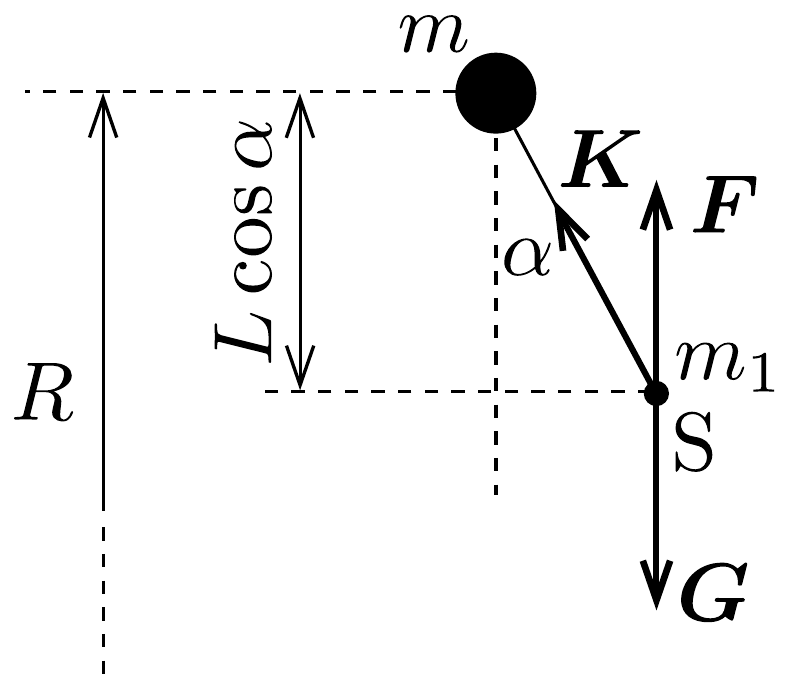

## Megoldás 2

a) Az $m_{\mathrm{F}}$ tömegú Föld körül $R$ sugarú körpályán egyenletes $\Omega$ szögsebességgel keringő ürrepülőgép mozgásegyenlete (a szonda tömege sokkal kisebb, mint az úrrepülőé, ezért az Atlantis állandó szögsebességú keringését nem befolyásolja):
\[
m \Omega^{2} R=f \frac{m m_{\mathrm{F}}}{R^{2}},
\]
ahonnan
\[
\Omega^{2}=\frac{f m_{\mathrm{F}}}{R^{3}} .
\]

Az $m_{1}$ tömegú szonda az Atlantisszal együtt kering a Föld körül (és esetleg az Atlantis körül is forog). Vizsgáljuk meg a szondára ható erőket az Atlantis úrrepülőgéppel együttmozgó, forgó koordináta-rendszerből nézve. A 134. ábrán látható helyzetben a $G$ gravitációs eró nagysága
\[
G=\frac{f m_{1} m_{\mathrm{F}}}{(R-L \cos \alpha)^{2}},
\]
az $F$ centrifugális eró
\[
F=m_{1}(R-L \cos \alpha) \Omega^{2},
\]
ezeken kívül fellép még valamekkora $K$ nagyságú rúderć ${ }^{12}$, valamint mozgó szonda esetében a Coriolis-erő; ez utóbbi a további vizsgálódás során nem játszik szerepet,

\footnotetext{
${ }^{12}$ A rúdnak elhanyagolható a tömege, ezért úgy viselkedik, mint egy fonál, azaz csak rúdirányú erót képes kifejteni. A fonállal ellentétben azonban ez az eró lehet nyomóeró is.

mivel rúdirányú. Tekintettel arra, hogy a rúd hossza sokkal kisebb, mint a Föld sugara, $\boldsymbol{G}$ és $\boldsymbol{F}$ irányának változásától eltekinthetünk.

A szonda egyensúlyának feltétele az, hogy $\boldsymbol{G}$ és $\boldsymbol{F}$ eredőjének ne legyen $K$-ra merőleges komponense:
\[
(G-F) \sin \alpha=0,
\]
amiben felhasználva $\Omega^{2}$-re kapott összefüggést:
\[
\left[\frac{1}{(R-L \cos \alpha)^{2}}-\frac{R-L \cos \alpha}{R^{3}}\right] \sin \alpha=0 .
\]
A fenti egyenletnek $\alpha_{1}=0$ és $\alpha_{2}=180^{\circ}$ nyilván megoldása, a zárójelben álló mennyiség pedig $\cos \alpha=0$ esetén, azaz $\alpha_{3}=90^{\circ}$-nál és $\alpha_{4}=270^{\circ}$-nál válik nullává.

A szondának tehát négy egyensúlyi helyzete van. Könnyen belátható, hogy ezek közül az „alsó” és a „felső“ helyzet stabil, míg a két „oldalsó” helyzet instabil egyensúlynak felel meg. Ha például az $\alpha_{3}$ helyzetből egy kicsit kitérítjük a szondát lefelé, akkor a gravitációs erő nőni, a centrifugális erő pedig csökkenni kezd, tehát $\boldsymbol{G}-\boldsymbol{F}$ lefelé mutat, és így egyre jobban el akarja távolítani a szondát az egyensúlyi helyzetétől. Ugyanez érvényes az $\alpha_{4}$-nek megfelelő helyzetre is. Mivel az alsó oldalon csak az $\alpha_{1}=0$, a felsó oldalon pedig az $\alpha_{2}=180^{\circ}$-os helyzetekben valósul meg az erőegyensúly, ezek nyilván stabilak kell legyenek.
b) Az alsó egyensúlyi helyzet közelében (ahol $\cos \alpha \approx 1$ ) $\boldsymbol{G}$ és $\boldsymbol{F}$ eredójének nagysága:
\[
G-F=f m_{1} m_{\mathrm{F}}\left[\frac{1}{(R-L \cos \alpha)^{2}}-\frac{R-L \cos \alpha}{R^{3}}\right]=
\]
\[
=\frac{f m_{1} m_{\mathrm{F}}}{R^{2}}\left[\left(1-\frac{L \cos \alpha}{R}\right)^{-2}-\left(1-\frac{L \cos \alpha}{R}\right)\right] \approx \frac{3 f m_{1} m_{\mathrm{F}} L \cos \alpha}{R^{3}} \approx 3 m_{1} L \Omega^{2} .
\]
(Az utolsó előtti lépésnél kihasználtuk, hogy $L \ll R$ és így az $(1+x)^{n} \approx 1+n x$, ha $x \ll 1$ közelítést.) Látható, hogy a szondára a rúderőn kívül egy a tömegével arányos nagyságú, függőleges irányú eró hat, éppen olyan, amilyen egy $g^{*}=3 L \Omega^{2}$
gravitációs gyorsulású homogén nehézségi erốtérben hatna. Ez utóbbiban viszont egy $L$ hosszúságú matematikai inga lengésideje:
\[
T^{\prime}=2 \pi \sqrt{\frac{L}{g^{*}}}=2 \pi \sqrt{\frac{1}{3}\left(\frac{T}{2 \pi}\right)^{2}}=\frac{T}{\sqrt{3}},
\]
ahol $T$ az Atlantis keringési ideje.
Úgy is eljárhatunk, hogy felírjuk a szonda mozgásegyenletét rúdirányra merőlegesen. Az $\alpha=0$ egyensúlyi helyzettől való $\alpha$ szögkitérés legyen pozitív. Ekkor
\[
-G \sin \alpha+F \sin \alpha=m_{1} a,
\]
amit átírhatunk a (90-1) egyenlet szerint a
\[
-3 m_{1} L \Omega^{2} \sin \alpha \cos \alpha=m_{1} a
\]
alakba. Kis kitérések esetén $\sin \alpha \approx \alpha=x / L$ és persze $\cos \alpha \approx 1$. ezzel tehát az $x$ kitéréssel ellentétes irányú, azzal arányos visszatérítő erőt kapunk, azaz a kialakuló mozgás harmonikus rezgőmozgás, melynek körfrekvenciája $\Omega \sqrt{3}$.
c) A Föld mágneses tere a mozgó vezetőben feszültséget indukál, és ennek hatására a rúdban - a jobbkéz-szabály alapján, illetve hogy az áram megegyzés szerint a pozitív potenciálú ponttól a negatív felé folyik - a szondától az úrrepülógép felé áram folyik.
d) Ha az áramerősséget ellentétes irányú, $I$ nagyságúra változtatjuk, akkor a mágneses mező
\[
F_{\mathrm{L}}=I B L=0,1 \mathrm{~N}
\]
nagyságú eróvel „gyorsítja” a rendszert. Az idézőjel arra figyelmeztet, hogy annak ellenére, hogy az erón a sebességgel azonos irányba mutat, a gyorsítás a sebesség nagyságának nem a növekedését, hanem éppen ellenkezőleg, a csökkenését eredményezi (asztronautikai paradoxon).

A körpályán, vagy ahhoz közeli pályán keringő ürrepülőgép összenergiája ( $v=$ $R \Omega$ felhasználásával):
\[
E=\frac{1}{2} m v^{2}-f \cdot \frac{m \cdot m_{F}}{R}=-\frac{1}{2} \cdot \frac{f m m_{\mathrm{F}}}{R} .
\]
Ez az energia $\Delta t$ ideig ható $F$ nagyságú erő következtében $\Delta E=F \cdot v \cdot \Delta t$ értékkel változik meg, feltéve, hogy $\boldsymbol{F}$ és $\boldsymbol{v}$ azonos irányú vektorok; esetünkben ez teljesül. Másrészt
\[
\Delta E=-\frac{1}{2} f m m_{\mathrm{F}}\left(\frac{1}{R+\Delta R}-\frac{1}{R}\right) \approx \frac{f m m_{\mathrm{F}}}{2 R^{2}} \Delta R,
\]
ahol $\Delta R$ a pálya sugarának megváltozása. Látható, hogy a teljes energia növekszik, azaz $\Delta R>0$, tehát a pályasugár megnövekszik. A növekedő pályasugárral az $\frac{1}{2} m v^{2}=\frac{1}{2} \frac{f m m_{\mathrm{F}}}{R}$ mozgási energia csökken, míg a $-\frac{f m m_{\mathrm{F}}}{R}$ gravitációs potenciális energia növekszik.

A $\Delta R=10$ m-es megemelkedéshez szükséges időt az
\[
\frac{f m m_{\mathrm{F}}}{2 R^{2}} \Delta R=I L B \cdot R \Omega \Delta t
\]
összefüggésből $\Omega$ kifejezésével kapjuk:
\[
\Delta t=\frac{m \Omega}{2 I L B} \Delta R=\frac{\pi m}{I L B T} \Delta R \approx 5,8 \cdot 10^{3} \mathrm{~s},
\]
ami egy kicsit több, mint az ürrepülő keringési ideje.
