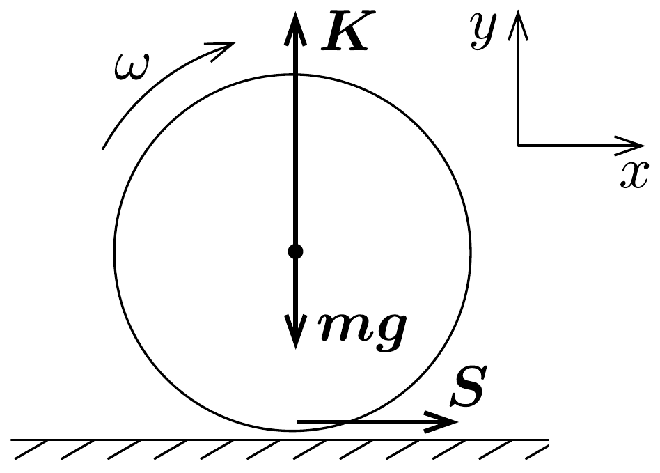
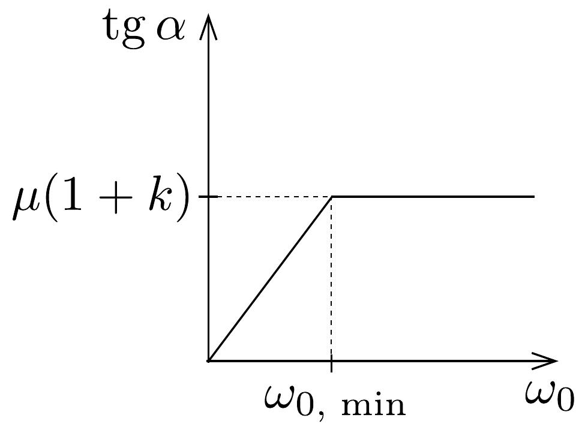

## Megoldás 1

A golyó $v_{0}=\sqrt{2 g h}$ sebességgel érkezik a talajra, majd visszapattan. Ekkor a függőleges sebességkomponense $v_{y}=\sqrt{2 g \alpha h}=k v_{0}$, ahol $k=\sqrt{\alpha}$ az ütközési szám, míg a vízszintes sebességkomponens legyen $v_{x}$.

A 141. ábrán látható erók segítségével írjuk fel a lendület és a perdület megváltozását az ütközés ideje alatt:
\[
\begin{gathered}
\Delta I_{x}=\int_{t_{1}}^{t_{2}} S(t) \mathrm{d} t=m v_{x} \\
\Delta I_{y}=\int_{t_{1}}^{t_{2}} K(t) \mathrm{d} t=m v_{0}+m v_{y}=m(1+k) \sqrt{2 g h} \\
\Delta N=\int_{t_{1}}^{t_{2}} S(t) R \mathrm{~d} t=\int_{t 1}^{t_{2}} S(t) \mathrm{d} t=\Theta\left(\omega_{0}-\omega_{1}\right)
\end{gathered}
\]
ahol $\omega_{1}$ az ütközés utáni szögsebesség, míg $t_{1}$ és $t_{2}$ az ütközés kezdő-, illetve végső pillanata. A második egyenletben felhasználtuk, hogy $m g \ll K$. Két eset lehetséges:
I. A teljes ütközési idő alatt csúszik a golyó.
II. Egy bizonyos $t \in\left(t_{1}, t_{2}\right)$ időpontban a golyó talajjal érintkező pontjának sebessége nullává válik; ettő̌l kezdve megszúnik a csúszás, nem lép fel súrlódási eró, a golyó tiszta gördüléssel halad.
I. eset. a) Az ütközés minden időpillanatában a súrlódási erő:
\[
S(t)=\mu K(t),
\]
amit a fenti összefüggésekbe behelyettesítve a következó egyenletekhez jutunk:
\[
\Delta I_{x}=\mu \int_{t_{1}}^{t_{2}} K(t) \mathrm{d} t=\mu \cdot \Delta I_{y}=\mu m(1+k) \sqrt{2 g h}=m v_{x},
\]
és
\[
\Delta N=\mu R \int_{t_{1}}^{t_{2}} K(t) \mathrm{d} t=\mu m R(1+k) \sqrt{2 g h}=\Theta\left(\omega_{0}-\omega_{1}\right),
\]
melyekből a $v_{x}$ vízszintes sebességkomponens és az $\omega_{1}$ végső szögsebesség kiszámítható:
\[
\begin{aligned}
v_{x} & =\mu(1+k) \sqrt{2 g h}, \\
\omega_{1}=\omega_{0} & -\frac{\mu m R(1+k)}{\Theta} \cdot \sqrt{2 g h} .
\end{aligned}
\]

A kívánt tangensérték a visszapattanási sebesség komponenseinek hányadosaként állítható elő:
\[
\operatorname{tg} \varphi=\frac{v_{x}}{v_{y}}=\frac{\mu(1+k) \sqrt{2 g h}}{k \sqrt{2 g h}}=\mu \frac{(1+k)}{k},
\]
azaz a $\varphi$ szög $\omega_{0}$-tól is, $h$-tól is független.
b) A golyó emelkedési és esési ideje együtt:
\[
t_{\mathrm{e}}=2 \frac{v_{y}}{g}=\frac{2 k \sqrt{2 g h}}{g}=2 k \sqrt{\frac{2 h}{g}},
\]
így a kívánt távolság:
\[
d_{1}=v_{x} \mathrm{t}_{e}=\mu(1+k) \sqrt{2 g h} \cdot 2 k \sqrt{\frac{2 h}{g}}=4 \mu(1+k) k h,
\]
ami nem függ $\omega_{0}$-tól.
c) Ahhoz, hogy az ütközés során végig a csúszási súrlódási eró hasson, azaz hogy a golyó ne gördüljön tisztán, a $v_{x}$ sebességnek nem szabad elérnie az $\omega_{1} R$ értéket: $\omega_{1} R>v_{x}$. Ebben felhasználva (91-1) és (91-2) egyenleteket, a kezdeti szögsebességre a következó feltételnek kell teljesülnie:
\[
\omega_{0}>\frac{\mu \sqrt{2 g h}(1+k)}{R}\left(\frac{m R^{2}}{\Theta}+1\right)=\frac{7}{2} \frac{\mu \sqrt{2 g h}(1+k)}{R}=\frac{7}{2} \frac{v_{x}}{R} .
\]
II. eset. d) Ekkor $t_{1}$ és $t_{2}$ között valamikor tiszta gördülés indul meg, melynek kinematikai feltétele: $\omega_{1} R=v_{x}$. Az előző egyenlőtlenségből:
\[
v_{x}=\frac{2}{7} \omega_{0} R, \quad \text { és } \quad \omega_{1}=\frac{2}{7} \omega_{0},
\]
vagyis ezek a mennyiségek ebben az esetben csak a kezdeti $\omega_{0}$-tól függnek, a $h$ indítási magasságtól nem.

Az I. esethez hasonló módon eljárva:
\[
\operatorname{tg} \varphi=\frac{v_{x}}{v_{y}}=\frac{2 \omega_{0} R}{7 k \sqrt{2 g h}},
\]
azaz $\operatorname{tg} \varphi$ fordítottan arányos $\sqrt{h}$-val, míg $\omega_{0}$-lal egyenesen arányos.

A $t_{\mathrm{e}}$ emelkedési és esési idő ebben az esetben is ugyanakkora, míg $v_{x}$ kifejezése eltérő. Így a kívánt távolság:
\[
d_{2}=v_{x} t_{e}=\frac{4}{7} k \sqrt{\frac{2 h}{g}} R \omega_{0} .
\]
Ebben az esetben a második ütközési pont távolsága $\omega_{0}$-val egyenesen arányos.
- $e$ ) Láttuk, hogy az I. esetben $\operatorname{tg} \varphi$ nem függ $\omega_{0}$-tól, de ehhez bizonyos minimális $\omega_{0}$ értéket el kell érni. Ez az érték a $c$ ) rész alapján
\[
\omega_{0, \min }=\frac{7}{2} \frac{\mu \sqrt{2 g h}(1+k)}{R} .
\]

A II. esetben pedig lineáris a kapcsolat, ha $\omega_{0}$ a minimális érték alatt van. A vázlatos grafikon a 142. ábrán látható.

