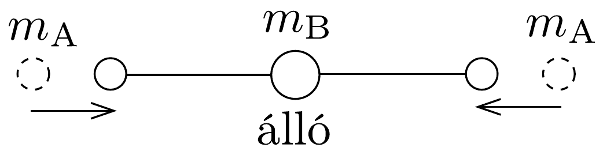
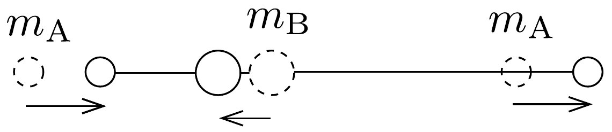

## Megoldás 2

a) Az egyes atomokra ható erók:
\[
\begin{aligned}
F_{1} & =k_{1}\left(x_{2}-x_{1}\right), \\
F_{2} & =k_{2}\left(x_{3}-x_{2}\right)-k_{1}\left(x_{2}-x_{1}\right), \\
F_{3} & =k_{3}\left(x_{3}-x_{2}\right)-k_{2}\left(x_{3}-x_{2}\right), \\
& \vdots \\
F_{i} & =k_{i}\left(x_{i+1}-x_{i}\right)-k_{i-1}\left(x_{i}-x_{i-1}\right), \\
& \vdots \\
F_{N} & =-k_{N-1}\left(x_{N}-x_{N-1}\right) .
\end{aligned}
\]

Látható, hogy
\[
F_{1}+F_{2}+\ldots+F_{N}=0 .
\]
Ez az összefüggés azt fejezi ki, hogy a rendszer részeire csak belső erők hatnak, és ezeket összegezve Newton III. törvénye értelmében nullát kell kapjunk.

A rendszer mozgásegyenletei:
\[
F_{i}=m_{i} a_{i} \quad(i=1,2, \ldots, N),
\]
ahonnan (92-9) alapján
\[
m_{1} a_{1}+m_{2} a_{2}+\ldots+m_{N} a_{N}=0,
\]
innen
\[
m_{1} v_{1}+m_{2} v_{2}+\ldots+m_{N} v_{N}=M V_{0}=\text { állandó, }
\]
valamint
\[
m_{1} x_{1}+m_{2} x_{2}+\ldots+m_{N} x_{N}=M\left(V_{0} \cdot t+X_{0}\right)
\]
adódik, ahol $M$ a rendszer össztömege, $V_{0}$ a tömegközéppont sebessége, $X_{0}$ pedig a tömegközéppont helyzete a kezdőpillanatban. Alkalmasan választott - a tömegközépponttal együttmozgó - koordináta-rendszerből nézve $V_{0}=0$ és $X_{0}=0$, ebben a koordináta-rendszerben tehát
\[
m_{1} x_{1}+m_{2} x_{2}+\ldots+m_{N} x_{N}=0 .
\]
b) Ebben az egyszerú esetben (a kitérés irányával ellentétesen ható, visszatérítőerőt negatívnak véve)
\[
\begin{aligned}
& F_{\mathrm{A}}=-k\left(x_{\mathrm{A}}-x_{\mathrm{B}}\right)=m_{\mathrm{A}} a_{\mathrm{A}} \\
& F_{\mathrm{B}}=-k\left(x_{\mathrm{B}}-x_{\mathrm{A}}\right)=m_{\mathrm{B}} a_{\mathrm{B}}=-F_{\mathrm{A}} .
\end{aligned}
\]
A tömegközépponti rendszerből nézve $m_{\mathrm{A}} x_{\mathrm{A}}+m_{\mathrm{B}} x_{\mathrm{B}}=0$, ahonnan pl. $x_{\mathrm{B}}$-t kifejezve és az A test mozgásegyenletébe helyettesítve
\[
a_{\mathrm{A}}=-\frac{k}{m_{\mathrm{A}}}\left(1+\frac{m_{\mathrm{A}}}{m_{\mathrm{B}}}\right) x_{\mathrm{A}}
\]
adódik. Ez egy olyan harmonikus rezgőmozgás egyenlete, melynek körfrekvenciája
\[
\omega=\sqrt{k \frac{m_{\mathrm{A}}+m_{\mathrm{B}}}{m_{\mathrm{A}} m_{\mathrm{B}}}} .
\]
Mivel ez a kifejezés a két részecske tömegadatait szimmetrikusan tartalmazza, a másik részecske rezgési frekvenciája is ugyanekkora. A különböző tömegü testek azonos nagyságú eró hatására azért mozoghatnak ugyanakkora frekvenciával, mert a rezgési amplitúdójuk - és ezzel együtt a gyorsulásuk - a tömegükkel fordítottan
arányos. (Megjegyezzük, hogy az $m_{\mathrm{A}} m_{\mathrm{B}} /\left(m_{\mathrm{A}}+m_{\mathrm{B}}\right)$ kifejezést a két részecskéből álló rendszer redukált tömegének nevezik.)

A két atom helyzete általánosan az
\[
\begin{aligned}
& x_{\mathrm{A}}(t)=V_{0} t+X_{0}+C \cos (\omega t-\alpha) \\
& x_{\mathrm{B}}(t)=V_{0} t+X_{0}-C \frac{m_{\mathrm{A}}}{m_{\mathrm{B}}} \cos (\omega t-\alpha)
\end{aligned}
\]
függvényekkel adható meg, ahol $V_{0}, X_{0}, C$ és $\alpha$ a kezdeti feltételektől függő állandók.
c) A mozgásegyenletek most ${ }^{13}$
\[
\begin{gathered}
m_{\mathrm{A}} a_{1}=k\left(x_{2}-x_{1}\right), \\
m_{\mathrm{B}} a_{2}=k\left(x_{3}-2 x_{2}+x_{1}\right), \\
m_{\mathrm{A}} a_{3}=k\left(x_{2}-x_{3}\right) .
\end{gathered}
\]
„Üljünk bele” a tömegközépponti koordináta-rendszerbe, így (92-10) értelmében
\[
m_{\mathrm{A}}\left(x_{1}+x_{3}\right)+m_{\mathrm{B}} x_{2}=0,
\]
tehát
\[
x_{2}=-\frac{m_{\mathrm{A}}}{m_{\mathrm{B}}}\left(x_{1}+x_{3}\right) .
\]
Helyettesítsük be $x_{2}$ fenti kifejezését például (92-11) és (92-13) egyenletekbe:
\[
\begin{aligned}
& m_{\mathrm{A}} a_{1}=-k \frac{m_{\mathrm{A}}+m_{\mathrm{B}}}{m_{\mathrm{B}}} x_{1}-k \frac{m_{\mathrm{A}}}{m_{\mathrm{B}}} x_{3}, \\
& m_{\mathrm{A}} a_{3}=-k \frac{m_{\mathrm{A}}}{m_{\mathrm{B}}} x_{1}-k \frac{m_{\mathrm{A}}+m_{\mathrm{B}}}{m_{\mathrm{B}}} x_{3} .
\end{aligned}
\]

Keressük a fenti egyenletek megoldását (a feladat útmutatása alapján) az
\[
x_{1}=A_{1} \cos (\omega t) ; \quad x_{3}=A_{3} \cos (\omega t)
\]
alakban, ahol $\omega$ a normálrezgés - egyelőre ismeretlen - körfrekvenciája. Nyilván fennáll, hogy $a_{1}=-\omega^{2} x_{1}$ és $a_{3}=-\omega^{2} x_{3}$. A próbamegoldást (92-14)-be és (92-15)be helyettesítve
\[
\begin{aligned}
& m_{\mathrm{A}} m_{\mathrm{B}} \omega^{2} A_{1}=k\left(m_{\mathrm{A}}+m_{\mathrm{B}}\right) A_{1}+k m_{\mathrm{A}} A_{3}, \\
& m_{\mathrm{A}} m_{\mathrm{B}} \omega^{2} A_{3}=k m_{\mathrm{A}} A_{1}+k\left(m_{\mathrm{A}}+m_{\mathrm{B}}\right) A_{3} .
\end{aligned}
\]

A fenti egyenletekből az $A_{1}$ és $A_{3}$ amplitudóknak csak az arányát lehet meghatározni, külön-külön a nagyságukat nem. Az $A_{1} / A_{3}$ arányt kifejezve (92-16)-ból
és (92-17)-be helyettesítve $\omega^{2}$-re egy másodfokú egyenletet kapunk, melynek megoldásai:
\[
\omega_{1}=\sqrt{\frac{k}{m_{\mathrm{A}}}}, \quad \text { ekkor } \quad \frac{A_{1}}{A_{3}}=-1,
\]
illetve
\[
\omega_{2}=\sqrt{\frac{k\left(2 m_{\mathrm{A}}+m_{\mathrm{B}}\right)}{m_{\mathrm{A}} \cdot m_{\mathrm{B}}}}, \quad \text { ilyenkor } \quad \frac{A_{1}}{A_{3}}=+1 .
\]

A (92-18)-nak megfelelő normálmódusban $x_{2} \equiv 0$, a középső atom mozdulatlan, a két szélső pedig egyforma amplitúdójú, de egymással ellentétes fázisú rezgést végez (153. ábra).

A (92-19)-nek megfelelő rezgési módusban a két szélső atom azonos fázisban egyforma amplitúdóval rezeg, míg a középső atom kitérése:
\[
x_{2}=-2 \frac{m_{A}}{m_{B}} x_{1},
\]
tehát ez a másik kettővel ellentétes fázisú mozgást végez (154. ábra).

d) A szén-dioxid molekula megadott rezgési frekvenciáit a fenti normálmódusok frekvenciáival azonosítva (a részecskék tömegének ismeretében) kiszámíthatjuk a $k$ „rugóállandót”. A két módusra ( $u$ az atomi tömegegység)
\[
2 \pi f_{1}=\sqrt{\frac{k}{16 u}} \quad \text { és } \quad 2 \pi f_{2}=\sqrt{\frac{11 k}{48 u}} .
\]
A megadott $f_{1}$ és $f_{2}$ frekvenciákkal a rugóállandó rendre $k \approx 1670 \mathrm{~N} / \mathrm{m}$ és $k \approx 1420 \mathrm{~N} / \mathrm{m}$. Az eltérés nagyságrendje arra utal, hogy a molekularezgések itt tárgyalt modellje csak elég durván, első közelítésben írja le a jelenséget.
