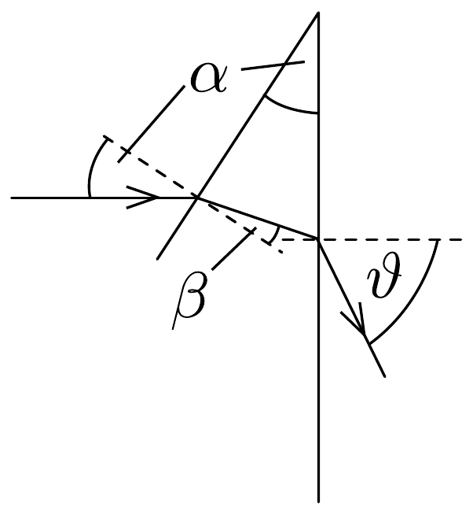
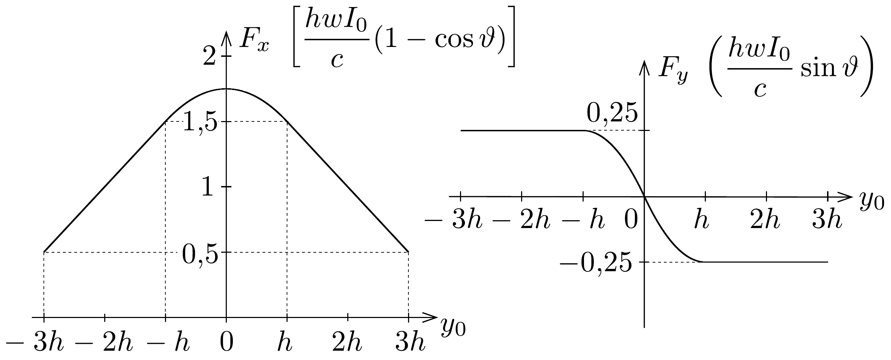

## Megoldás 2

a) Ez a részfeladat a fénysugarak törési törvényének (Snellius-Descartes-törvény) és egyszerú geometriai összefüggéseknek a felírásával oldható meg. A 165. ábra jelöléseivel:
\[
\begin{gathered}
\sin \alpha=n \sin \beta, \\
\sin \vartheta=n \sin (\alpha-\beta),
\end{gathered}
\]
ahonnan
\[
\vartheta=\arcsin \left[n \sin \left(\alpha-\arcsin \left(\frac{\sin \alpha}{n}\right)\right)\right] .
\]

b) A prizmára ható erő a lézersugár lendületének (impulzusának) időegységre esó́ megváltozásával egyenlő nagyságú, azzal ellentétes irányú vektor.

Tekintsük először a prizma felső részére eső fénysugarat és határozzuk meg az impulzusának megváltozását. Ha másodpercenként $n$ darab $E$ energiájú (vagyis $E / c$ nagyságú impulzussal rendelkező) foton esik a prizmára a negatív $x$-tengely irányából, és $\vartheta$ szögben eltérülve hagyják el a prizmát, akkor ezen fotonok impulzusának megváltozása egy másodperc alatt:
\[
\Delta \boldsymbol{p}=\left(\Delta p_{x}, \Delta p_{y}\right)=\frac{n E}{c} \cdot[(\cos \vartheta-1),-\sin \vartheta] .
\]
Tekintettel arra, hogy az $n E$ mennyiség a fotonok által egységnyi idő alatt szállított energia, vagyis a fénysugár $P$ teljesítménye, az üvegprizma felsó felére kifejtett erő:
\[
\boldsymbol{F}_{\text {felül }}=\frac{P_{\text {felül }}}{c} \cdot[(1-\cos \vartheta), \sin \vartheta] .
\]

Hasonló érvelés alapján az alsó prizmaoldalra ható erő:
\[
\boldsymbol{F}_{\text {alul }}=\frac{P_{\text {alul }}}{c} \cdot[(1-\cos \vartheta),-\sin \vartheta],
\]
a prizmára ható teljes erő pedig
\[
\boldsymbol{F}=\frac{1}{c}\left[\left(P_{\text {felül }}+P_{\text {alul }}\right) \cdot(1-\cos \vartheta),\left(P_{\text {felül }}-P_{\text {alul }}\right) \sin \vartheta\right] .
\]

A prizma megfelelő lapjaira eső teljesítményt úgy számíthatjuk ki, hogy az egyes lapok $(y, z)$ síkbeli vetületének területét megszorozzuk az adott lapra jutó átlagos intenzitással, hiszen az intenzitás lineárisan változik:
\[
I(y)=\left\{\begin{array}{l}
I^{+}(y)=I_{0}\left(1-\frac{y}{4 h}\right), \text { ha } \quad 0 \leq y \leq 4 h, \\
I^{-}(y)=I_{0}\left(1+\frac{y}{4 h}\right), \text { ha } \quad-4 h \leq y \leq 0 .
\end{array}\right.
\]
Két lényegesen különböző esetet kell megvizsgálnunk.
1) Ha $h \leq y_{0} \leq 3 h$ (a prizma teljes egészében a lézersugár felső felében található).
\[
P_{\mathrm{felül}}=\frac{I^{+}\left(y_{0}\right)+I^{+}\left(y_{0}+h\right)}{2} h w=\frac{I_{0} h w}{4}\left(\frac{7}{2}-\frac{y_{0}}{h}\right),
\]
\[
P_{\mathrm{alul}}=\frac{I^{+}\left(y_{0}\right)+I^{+}\left(y_{0}-h\right)}{2} h w=\frac{I_{0} h w}{4}\left(\frac{9}{2}-\frac{y_{0}}{h}\right) .
\]

Ezzel az eró két komponense:
\[
\begin{aligned}
F_{x} & =\frac{2 h w I_{0}}{c}\left(1-\frac{y_{0}}{4 h}\right)(1-\cos \vartheta), \\
F_{y} & =-\frac{h w I_{0}}{4 c} \sin \vartheta .
\end{aligned}
\]
2) Ha $0 \leq y_{0} \leq h$ (a prizma alsó felének egy része belelóg a lézersugár alsó felébe). Ebben az esetben $P_{\text {felül }}$ kifejezése változatlan, alul viszont:
\[
P_{\text {alul }}=\frac{I_{0}+I^{+}\left(y_{0}\right)}{2} w y_{0}+\frac{I_{0}+I^{-}\left(-\left(h-y_{0}\right)\right)}{2} w\left(h-y_{0}\right)=\frac{I_{0} h w}{4}\left(\frac{7}{2}+\frac{y_{0}}{h}-\frac{y_{0}^{2}}{h^{2}}\right) .
\]
Tehát a két erőkomponens:
\[
\begin{aligned}
& F_{x}=\frac{h w I_{0}}{4 c}\left(7-\frac{y_{0}^{2}}{h^{2}}\right)(1-\cos \vartheta), \\
& F_{y}=\frac{h w I_{0}}{4 c}\left(\frac{y_{0}^{2}}{h^{2}}-\frac{2 y_{0}}{h}\right) \sin \vartheta .
\end{aligned}
\]

Mivel az intenzitáseloszlás szimmetrikus a lézersugár középvonalára, az $y_{0}<0$ eset a fentebb leírt $y_{0}>0$ eset tükörképe lesz. Az $F_{x}$ és $F_{y}$ függvények menetét a 166. ábra mutatja.

c) A megadott számadatokból az üvegprizma térfogata $V=\frac{1}{2} \cdot 2 h \cdot h \operatorname{tg} \alpha \cdot w$, azaz a súlyára $m g=\varrho h^{2} w g \operatorname{tg} \alpha=1,4 \cdot 10^{-9} \mathrm{~N}$ adódik. A prizma akkor lehet (legalábbis függőleges irányban) egyensúlyban, ha $F_{y}=m g$. Mivel $y_{0}=-h / 2$ ( $F_{y}$ függőlegesen felfelé kell mutasson, ezért $y_{0}$ negatív), így az előző rész 2) esetét kell használnunk:
\[
m g=\frac{h w I_{0}}{4 c}\left(\frac{y_{0}^{2}}{h^{2}}-\frac{2 y_{0}}{h}\right) \sin \vartheta .
\]

Behelyettesítve $y_{0}$ értékét, és felhasználva, hogy (93-1) alapján $\sin \vartheta \approx 0,274, I_{0}$ értékét meghatározhatjuk:
\[
I_{0} \approx \frac{16}{0,822} \frac{m g c}{h w}=8,2 \cdot 10^{8} \frac{\mathrm{~W}}{\mathrm{~m}^{2}} .
\]

A lézer teljes sugárzási teljesítményét az $I_{0} / 2$ átlagos intenzitásnak és a lézernyaláb $1 \mathrm{~mm} \cdot 80 \mu \mathrm{~m}=8 \cdot 10^{-8} \mathrm{~m}^{2}$ nagyságú keresztmetszetének szorzataként kaphatjuk meg; numerikusan $P \approx 33 W$.
d) Az $y_{0}=h / 20$ elmozdulásnál $y_{0} / h=0,05 \ll 1$, a függőleges erőkomponens (ismét a 2) esetet tekintve) tehát jól közelíthető az
\[
F_{y}=-\frac{I_{0} w \sin \vartheta}{2 c} \cdot y
\]
lineáris függvénnyel. Ez egy harmonikus rezgőmozgás erőtörvénye $D=\frac{I_{0} w \sin \vartheta}{2 c}$ „rugóállandóval”. Így a rezgésidő:
\[
T=2 \pi \sqrt{\frac{m}{D}} \approx 11 \mathrm{~ms} .
\]
