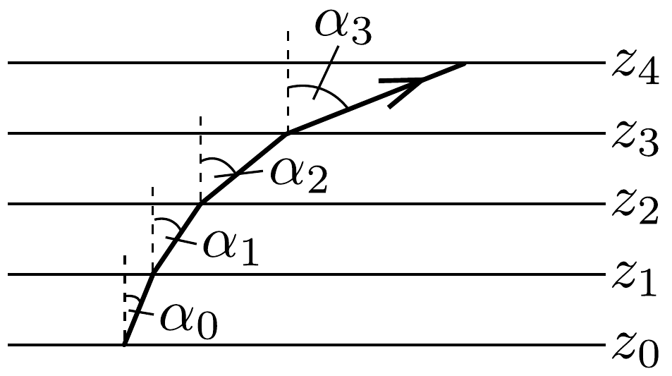
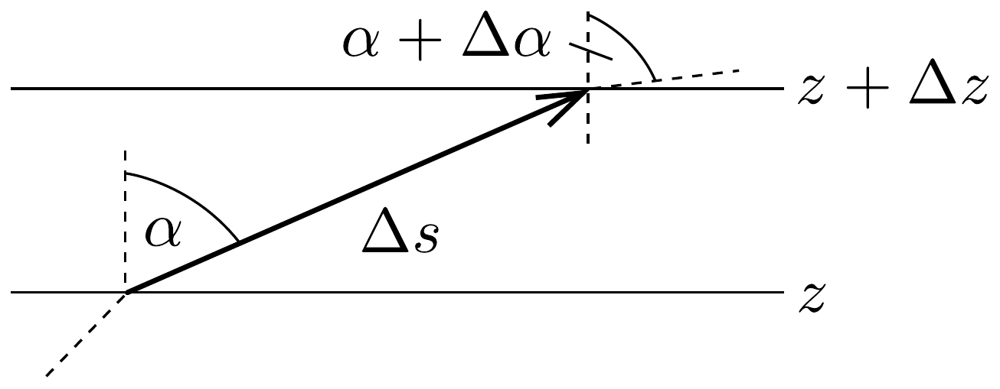
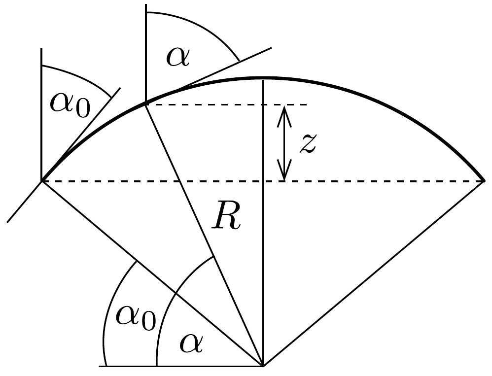
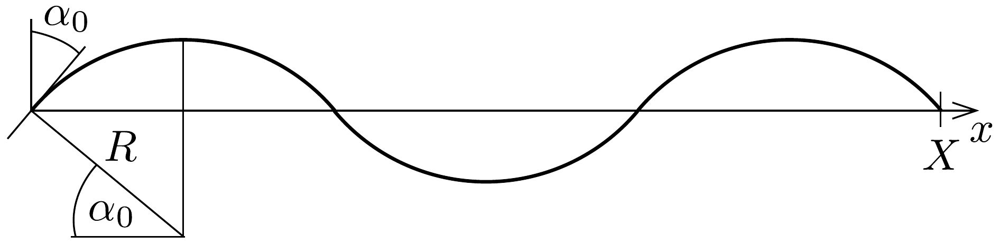

## Megoldás 2

a) A helyról helyre változó hangsebességú közegben terjedő hang „pályája” ugyanúgy elgörbül, mint a változó fénysebességú (azaz változó optikai törésmutatójú) közegben haladó fénysugár.

Megjegyzés: Mindkét esetben akkor van csak értelme „sugárról” beszélni, ha a hullámvonulat viszonylag keskeny és a terjedési sebesség csak lassan, a hullámhossznál sokkal nagyobb intervallumokon változik meg számottevően.

A folytonosan változó hangsebességú közegben haladó hang pályáját úgy számíthatjuk ki, hogy a közeget képzeletben nagyon vékony, hangtanilag homogén szeletekre vágjuk, az egyes szeletekben állandónak tekintjük a hangsebességet, a rétegek határán pedig alkalmazzuk a Snellius-Descartes-féle törési törvényt (192.

ábra):
\[
\begin{gathered}
\sin \alpha_{1}=\sin \alpha_{0} \frac{c\left(z_{1}\right)}{c\left(z_{0}\right)} \\
\sin \alpha_{2}=\sin \alpha_{1} \frac{c\left(z_{2}\right)}{c\left(z_{1}\right)}=\sin \alpha_{0} \frac{c\left(z_{2}\right)}{c\left(z_{0}\right)}, \ldots
\end{gathered}
\]
és így
\[
\sin \alpha=\sin \alpha_{0} \frac{c(z)}{c\left(z_{0}\right)}=\sin \alpha_{0} \cdot\left(1+\frac{b}{c_{0}} z\right) .
\]

Tekintsük most a pálya két, egymáshoz közeli pontját, amelyek egymástól $\Delta s$ távolságban vannak, a mélységük pedig $\Delta z$ értékkel különbözik (193. ábra). A (95-1) törési törvény szerint a haladási iránynak a függőlegessel bezárt $\alpha$ szöge

úgy változik, hogy
\[
\sin (\alpha+\Delta \alpha)-\sin \alpha=\sin \alpha_{0} \frac{b \Delta z}{c_{0}},
\]
ahonnan trigonometrikus átalakítás és a kis szögekre szokásos közelítés után (vagy differenciálszámítás alkalmazásával) kapjuk:
\[
\cos \alpha \cdot \Delta \alpha=\sin \alpha_{0} \frac{b}{c_{0}} \Delta z .
\]
Mivel $\Delta z=\Delta s \cos \alpha$, továbbá tudjuk, hogy egy görbe simulókörének $R$ görbületi sugarát a $\Delta s=R \Delta \alpha$ összefüggés definiálja, leolvashatjuk, hogy
\[
R=\frac{\Delta s}{\Delta \alpha}=\frac{c_{0}}{b \sin \alpha_{0}}
\]

Látjuk, hogy ez a mennyiség a pálya mentén állandó, a pályagörbe tehát kör, és a sugara éppen a megadott formulának megfelelő.

Más módon is beláthatjuk, hogy a hang az adott közelítésben körpályán terjed. Ha feltételezzük, hogy a pálya valamekkora sugarú kör, akkor a 194. ábráról leolvashatjuk, hogy egy tetszőleges pontbeli $\alpha$ „beesési szögre” fennáll az

\[
R \sin \alpha=R \sin \alpha_{0}+z,
\]
vagyis a
\[
\frac{\sin \alpha}{\sin \alpha_{0}}=1+\frac{z}{R \sin \alpha_{0}}
\]
összefüggés. Leolvashatjuk, hogy ez a formula éppen a (95-1) törési törvénynek megfelelő, a $z$ koordinátában lineáris függvénykapcsolat, ha $R$ a bizonyítandó kifejezés. Az alkalmasan választott sugarú körpálya tehát minden pontban eleget tesz a „hangtörés” törvényének, és mivel a pályát a kezdeti feltételek egyértelmúen meghatározzák, a megtalált megoldás a tényleges megoldás kell legyen. Nem szabad azonban megfeledkezzünk arról, hogy a hang csak addig követi a fentebb meghatározott körpályát, amíg a hangsebesség a $c=c_{0}+b z$ összefüggésnek megfelelően változik, vagyis ameddig $z \geq 0$.
b) A kérdéses feltételnek akkor tesz eleget a hang pályagörbéje, ha
\[
z_{\max }=R-R \sin \alpha_{0}<z_{\mathrm{s}},
\]
vagyis ha
\[
\sin \alpha_{0}>1-\frac{z_{\mathrm{s}}}{R},
\]
amibớl $R$ alakját felhasználva a
\[
\sin \alpha_{0}>\frac{c_{0}}{c_{0}+b z_{\mathrm{s}}}
\]
feltétel adódik.
c) Említettük, hogy a $z=0$ szintről felfelé elinduló hang csak addig követi az $R$ sugarú körívet, amíg vissza nem jut a hangforrással azonos mélységbe. Ezután a
$z<0$ tartományban halad az ott érvényes hangsebesség-változásnak megfelelően. A pályagörbe (szimmetria miatt) itt is egy $R$ sugarú körív lesz, amely azonban most felfelé kanyarodik. A hang tehát egymást váltogató körívek mentén terjed (lásd a 195. ábrát), és ha az $\alpha_{0}$ indulási szöget alkalmas módon választjuk, el is juthat az $x=X$ helyen található mikrofonba. Ennek az a feltétele, hogy
\[
2 R \cos \alpha_{0} \cdot n=X, \quad(n=1,2,3, \ldots)
\]
amit $R$ alakjával a
\[
\operatorname{tg} \alpha_{0}=\frac{2 c_{0}}{X b} n
\]
alakba is írhatunk.

d) A fenti formulába behelyettesítve a megadott számértékeket a $\operatorname{tg} \alpha_{0}=15 n$ összefüggéshez jutunk, amelynek $n=1,2,3$ és 4-hez tartozó megoldásai: $\alpha_{0}=$ 86,19°; 88,09°; 88,73° és 89,05°.
e) Határozzuk meg, hogy mennyi idő alatt teszi meg a hang a 193. ábrán látható kicsiny $\Delta s=R \Delta \alpha$ hosszúságú szakaszt! Mivel ezen a rövid intervallumon a hangsebesség állandónak tekinthető, a kérdéses idő
\[
\Delta t=\frac{\Delta s}{c(\alpha)}=\frac{R \sin \alpha_{0}}{c_{0}} \cdot \frac{\Delta \alpha}{\sin \alpha}=\frac{1}{b} \cdot \frac{\Delta \alpha}{\sin \alpha} .
\]
Összegezzük ezeket a kicsiny időtartamokat az első körív „felszálló ágára”, vagyis amíg $\alpha$ értéke $\alpha_{0}$-ról $\pi / 2$-re növekszik. Ez az idő a hang $S$-ből $H$-ba jutási idejének, $T$-nek $2 n$-ed része, ha $\alpha_{0}$ az $n$ számú körívnek megfelelő indulási szög. Így tehát a terjedés ideje
\[
T \approx 2 n \cdot \sum \Delta t=\frac{2 n}{b} \sum \frac{\Delta \alpha}{\sin \alpha} \approx \frac{2 n}{b} \int_{\alpha_{0}}^{\pi / 2} \frac{\mathrm{~d} \alpha}{\sin \alpha}=-\frac{2 n}{b} \ln \left(\operatorname{tg} \frac{\alpha_{0}}{2}\right) .
\]
Numerikusan $n=1$ esetén $T_{1}=6,6662 \mathrm{~s}$ adódik, míg az egyenes pályán való terejedés ideje: $T_{0}=X / c_{0}=6,6667 \mathrm{~s}$.

Megjegyzések:
1. Meglepőnek túnhet, hogy a hang a körív mentén hamarabb elér $S$-ből $H$-ba, mint az egyenes (és emiatt nyilván rövidebb) úton. Ennek az a magyarázata, hogy a $z$
tengelytől eltávolodva a hangsebesség megnő, és ez a sebességnövekedés még hosszabb út esetén is eredményezhet rövidebb terjedési időt.
2. A Fermat-elv szerint két adott pont között úgy terjednek a hullámok (legyen a hullám akár fény, akár hang), hogy a „legrövidebb idő“ alatt jusson el a „célba”. Hogyan egyeztethetó össze ezzel a kijelentéssel az a számítási eredmény, miszerint a hang két különböző pályán is eljut $S$-ből $H$-ba, és a kétféle pályán a terjedési idők különbözőek, tehát mindkettő nem lehet „a legrövidebb”! A paradoxon feloldását a Fermat-elv pontosabb megfogalmazása nyújtja: a hullámok úgy terjednek, hogy a tényleges pályán való haladás ideje jó közelítéssel megegyezik a ténylegeshez közeli pályáknak megfelelő idókkel. Ezt a feltételt mindkét hanghullám (az egyenes és a körív menti is) külön-külön teljesíti, de egymással nem szabad összevetnünk a kétféle pályaidőt, mert ez a két pálya nincs közel egymáshoz!
