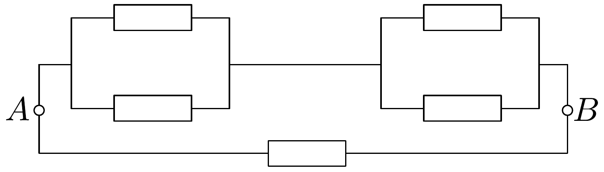
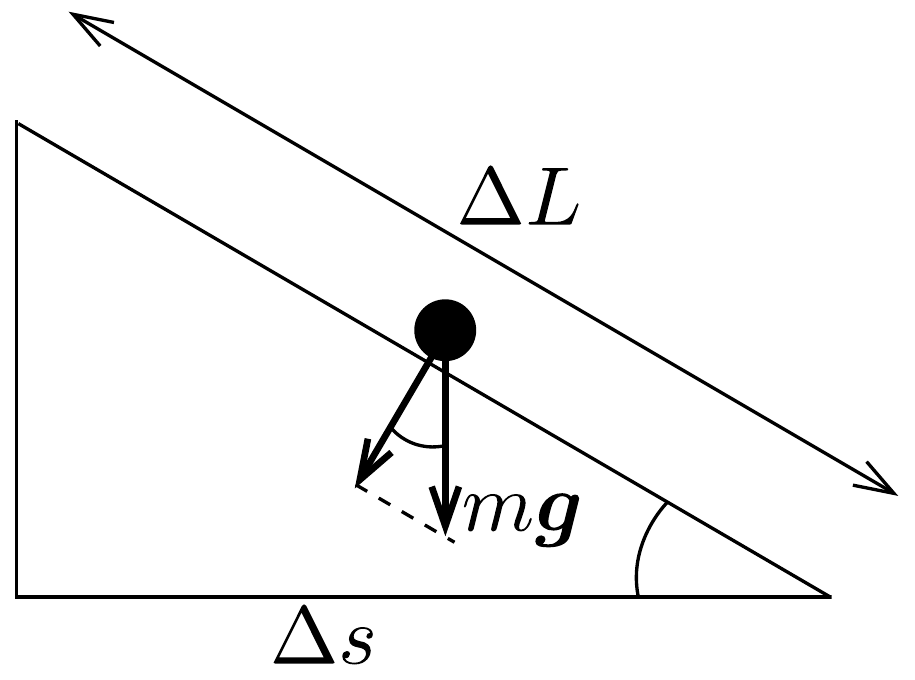
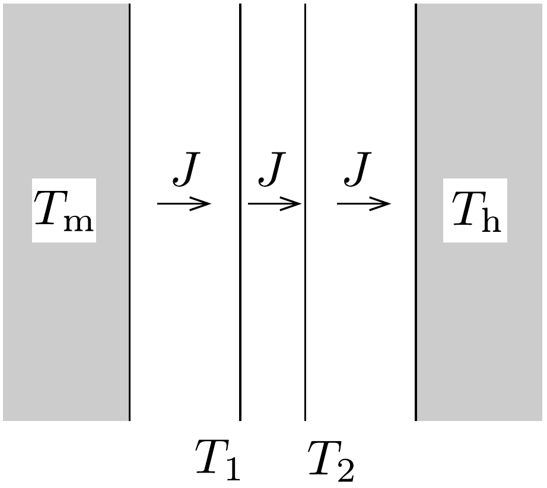

## Megoldás 1

a) A kapcsolás a 202. ábrán látható módon rajzolható át (az eredeti kapcsolásban a két szélső hurokban azonos feszültség esik a két ellenálláson, így a középső hurkot tekintve a középen lévő ellenálláson kétszer ekkora feszültség esik). A párhuzamos és soros kapcsolások ismert szabályai alapján az áramkör eredő ellenállása akár „fejben" is kiszámolható, értéke $0,5 \Omega$.

b) Ha a síelő pályáját elegendően kis szakaszokra osztjuk fel, akkor ezek egyeneseknek tekinthetők. Legyen egy ilyen kis szakasz hossza $\Delta L$, amelyhez $\Delta s$ vízszintes elmozdulás tartozik (203. ábra). Ekkor a súrlódási erő $F_{\mathrm{s}}=\mu m g \Delta s / \Delta L$ alakban adható meg, amivel a súrlódási erő munkája abszolút értékben:
\[
\Delta W_{\mathrm{s}}=\mu m g \frac{\Delta s}{\Delta L} \cdot \Delta L=\mu m g \Delta s .
\]
A súrlódási erők teljes munkáját a $\Delta s$ szakaszok összegzésével kaphatjuk meg: $W_{\mathrm{s}}=\mu m g s$. A munkatétel értelmében ennek meg kell egyeznie a síelő $m g h$ nagyságú helyzeti energia csökkenésével (a nehézségi erőtér által a síelőn végzett munkával), amiből $h=\mu s$.

c) Legyen a $\mathrm{d} t$ rövid időintervallum alatt bekövetkező hőmérsékletnövekedés $\mathrm{d} T$. Eközben a fém $P \mathrm{~d} t$ hőt vesz fel. A hőkapacitást (definíciója alapján) így kaphatjuk meg:
\[
C_{p}=\frac{P \mathrm{~d} t}{\mathrm{~d} T}=\frac{P}{\mathrm{~d} T / \mathrm{d} t} .
\]
A hőmérséklet időbeli változását a megadott függvény deriválásával számíthatjuk ki:
\[
\frac{\mathrm{d} T}{\mathrm{~d} t}=\frac{T_{0}}{4} a\left[1+a\left(t-t_{0}\right)\right]^{-3 / 4}=T_{0} \frac{a}{4}\left(\frac{T_{0}}{T}\right)^{3} .
\]
így a keresett hőkapacitás:
\[
C_{p}=\frac{4 P}{a T_{0}^{4}} \cdot T^{3} .
\]

Megjegyzés: Alacsony, de nem különlegesen alacsony hőmérsékleteken a fémek hőkapacitása valóban köbös hőmérsékletfüggést követ.
d) Állandósult állapot esetén mindenhol ugyanakkora $J$ hőáramsürúség (egységnyi felületen időegység alatt átadott hő) alakul ki. A hőáramokat és a hővédő pajzs két lemezének hőmérsékletét a 204. ábra mutatja. A Stefan-Boltzmann-

törvény felhasználásával a $J$ hőáramsűrúséget háromféleképpen írhatjuk fel:
\[
\begin{aligned}
& J=\sigma\left(T_{\mathrm{m}}^{4}-T_{1}^{4}\right), \\
& J=\sigma\left(T_{1}^{4}-T_{2}^{4}\right), \\
& J=\sigma\left(T_{2}^{4}-T_{\mathrm{h}}^{4}\right) .
\end{aligned}
\]
Adjuk össze a három egyenletet:
\[
3 J=\sigma\left(T_{\mathrm{m}}^{4}-T_{\mathrm{h}}^{4}\right)=J_{0} .
\]
Mivel $J_{0}$ éppen a hővédő pajzs nélküli hőáram, a keresett $\xi=J / J_{0}$ tényező értéke 1/3.
$e$ ) A mágneses teret két hengeres vezető terének szuperpozíciójaként határozhatjuk meg. A hengerek részben áthatolnak egymáson, így az ellentétes irányú áramok a közös tartományban kiejtik egymást. A hengeres vezetők $I^{\prime}$ árama nagyobb, mint a hold alakú vezetők $I$ árama, az áramok arányát a keresztmetszeti felületek aránya adja meg:
\[
\frac{I^{\prime}}{I}=\frac{\frac{\pi}{4} D^{2}}{\left(\frac{\pi}{12}+\frac{\sqrt{3}}{8}\right) D^{2}}=\frac{6 \pi}{2 \pi+3 \sqrt{3}} .
\]
Egy $I^{\prime}$ áramot hordozó hengeres vezetó belsejében, a tengelytől $r$ távolságra a mágneses teret az Ampère-féle gerjesztési törvény alapján számíthatjuk ki:
\[
B_{\varphi}=\frac{\mu_{0}}{2 \pi r} \frac{I^{\prime} \pi r^{2}}{\frac{\pi}{4} D^{2}}=\frac{2 \mu_{0} I^{\prime} r}{\pi D^{2}} .
\]
A mágneses tér az $r$ sugárra meróleges irányú. Ha a henger tengelye az origóban van, a mágneses tér $x$ és $y$ irányú komponenseit így kaphatjuk meg:
\[
B_{x}=-B_{\varphi} \frac{y}{r}=-\frac{2 \mu_{0} I^{\prime} y}{\pi D^{2}} ; \quad B_{y}=B_{\varphi} \frac{x}{r}=\frac{2 \mu_{0} I^{\prime} x}{\pi D^{2}} .
\]
A szuperponált terek esetén az áramok $\pm I^{\prime}$ értékúek, a megfelelő hengerek tengelyei pedig az $x= \pm D / 4$ helyeken vannak. Ez nem befolyásolja az $y$ koordináta értékét, tehát a két ellentétes áram miatt a $B_{x}$ komponens mindenhol eltúnik, továbbá:
\[
B_{y}=\frac{2 \mu_{0}}{\pi D^{2}}\left[I^{\prime}\left(x+\frac{D}{4}\right)-I^{\prime}\left(x-\frac{D}{4}\right)\right]=\frac{\mu_{0} I^{\prime}}{\pi D}=\frac{6 \mu_{0} I}{(2 \pi+3 \sqrt{3}) D} .
\]
Tehát a vezetők közötti térben a pozitív $y$ tengely irányába mutató homogén mágneses mező jön létre.
