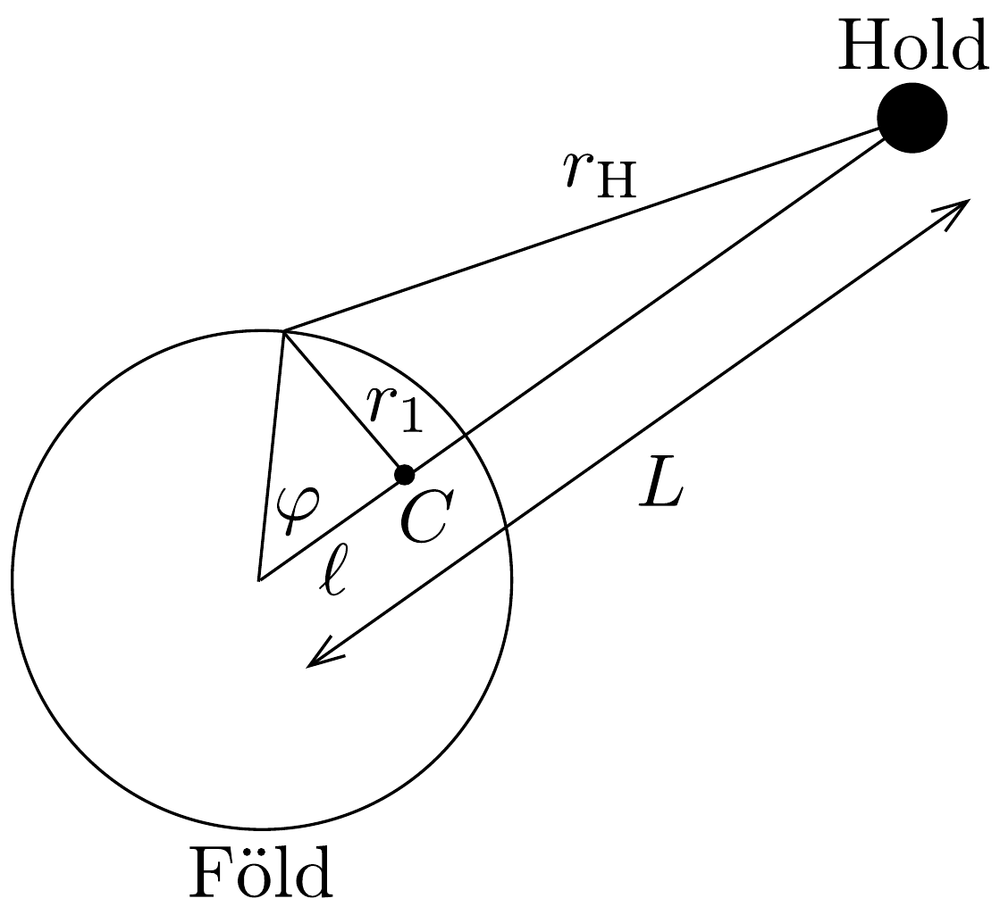

## Megoldás 3

a) A Föld-Hold rendszer közös tömegközéppontja a Föld középpontjától
\[
\ell=\frac{M_{\mathrm{H}}}{M+M_{\mathrm{H}}} L=4,66 \cdot 10^{6} \mathrm{~m}
\]
távolságra van, ami $R$-nél kisebb, tehát a Föld belsejében található. A centripetális erốt a Föld és a Hold közötti gravitációs erő biztosítja:
\[
M \ell \omega^{2}=G \frac{M M_{\mathrm{H}}}{L^{2}},
\]
amibe írjuk be a (96-6) kifejezést, így megkaphatjuk a kérdéses $\omega$ szögsebességet:
\[
\omega=\sqrt{\frac{G M_{\mathrm{H}}}{L^{2} \ell}}=\sqrt{\frac{G\left(M+M_{\mathrm{H}}\right)}{L^{3}}}=2,67 \cdot 10^{-6} \frac{1}{\mathrm{~s}} .
\]
(Ez $2 \pi / \omega=27,2$ napos periódusidőnek felel meg.)
- b) Az $m$ tömegpont potenciális energiája három tagból áll:
\[
V=-\frac{1}{2} m \omega^{2} r_{1}^{2}-G \frac{m M}{r}-G \frac{m M_{\mathrm{H}}}{r_{\mathrm{H}}},
\]
ahol az első a forgás miatt fellépő (centrifugális) potenciális energia, a második a Föld, a harmadik pedig a Hold gravitációs vonzásából származó potenciális energia. Az egyes tagokban szereplő $r_{1}, r$ és $r_{\mathrm{H}}$ távolságok jelentését a 206. ábráról olvashatjuk le.

A távolságok között a következő összefüggéseket állapíthatjuk meg:
\[
\begin{gathered}
r_{1}^{2}=r^{2}-2 r \ell \cos \varphi+\ell^{2}, \\
r_{\mathrm{H}}=L \sqrt{1+\left(\frac{r}{L}\right)^{2}-2\left(\frac{r}{L}\right) \cos \varphi} .
\end{gathered}
\]
c) Mivel az $a=r / L$ hányados nagyon kicsiny, használhatjuk a feladatban megadott közelítést. Ezen kívül még felhasználva a (96-7) egyenlet szerinti $\omega^{2}=$ $G M_{\mathrm{H}} /\left(L^{2} \ell\right)$ kifejezést, valamint $r_{1}^{2}$ alakját, a potenciális energia kifejezése így alakítható át:
\[
\frac{V(r, \varphi)}{m}=-\frac{G M_{\mathrm{H}}}{2 L^{2} \ell} r^{2}-\frac{G M}{r}-\frac{G M_{\mathrm{H}} r^{2}}{2 L^{3}}\left(3 \cos ^{2} \varphi-1\right)-\frac{G M_{\mathrm{H}} \ell}{2 L^{2}}-\frac{G M_{\mathrm{H}}}{L} .
\]

Az egyensúlyban levő folyadékfelszín ekvipotenciális felületet alkot. Helyettesítsük az $r$ sugarat az $r=R+h$ összeggel, ahol az árapályt jellemző $h$ érték sokkal kisebb $R$-nél. Ekkor a következő közelítéseket használhatjuk:
\[
\begin{aligned}
\frac{1}{r}=\frac{1}{R+h} & =\frac{1}{R} \frac{1}{1+\frac{h}{R}} \approx \frac{1}{R}\left(1-\frac{h}{R}\right)=\frac{1}{R}-\frac{h}{R^{2}} \\
r^{2} & =R^{2}+2 R h+h^{2} \approx R^{2}+2 R h .
\end{aligned}
\]
Ezeket felhasználva a (96-8) egyenletben a potenciál közelítő alakja a $\varphi$-t és $h$-t nem tartalmazó, állandó tagoktól eltekintve:
\[
\frac{V(r, \varphi)}{m} \sim-\frac{G M_{\mathrm{H}} R}{L^{2} \ell} h+\frac{G M}{R^{2}} h-\frac{G M_{\mathrm{H}} r^{2}}{2 L^{3}}\left(3 \cos ^{2} \varphi-1\right) .
\]
A kifejezés első tagja elhanyagolható a második taghoz képest, mert a hányadosuk:
\[
\frac{M_{\mathrm{H}}}{M} \frac{R^{3}}{L^{2} \ell} \sim 4 \cdot 10^{-6} .
\]
Ha a maradék két tag kiegyenlíti egymást, azaz amennyiben
\[
h=\frac{M_{\mathrm{H}} r^{2} R^{2}}{2 M L^{3}}\left(3 \cos ^{2} \varphi-1\right),
\]
akkor $V$ nem függ $\varphi$-től, tehát a felület ekvipotenciális. Mivel $r^{2}$-et $R^{2}$-tel közelíthetjük, így az árapály magassága
\[
h=\frac{M_{\mathrm{H}} R^{4}}{2 M L^{3}}\left(3 \cos ^{2} \varphi-1\right) .
\]
A legnagyobb (dagály) érték $\left(h_{\max }=M_{\mathrm{H}} R^{4} /\left(M L^{3}\right)\right)$ a Hold irányában, illetve az ellenkező oldalon következik be, amikor $\varphi=0$ vagy $\pi$, míg a legkisebb (apály) érték $\varphi=\pi / 2$ esetén $h_{\text {min }}=-M_{\mathrm{H}} R^{4} /\left(2 M L^{3}\right)$. A maximális dagály és apály közötti különbség így:
\[
h_{\max }-h_{\min }=\frac{3 M_{\mathrm{H}} R^{4}}{2 M L^{3}}=0,54 \mathrm{~m} .
\]

Megjegyzés: A Csendes-óceán távoli korallzátonyain valóban ekkora különbségeket lehet megfigyelni. A nagy kontinenseknél (különösen meredek partfalak esetén) a feltorlódó dagályhullám akár 15 méteres is lehet.

\section*{
