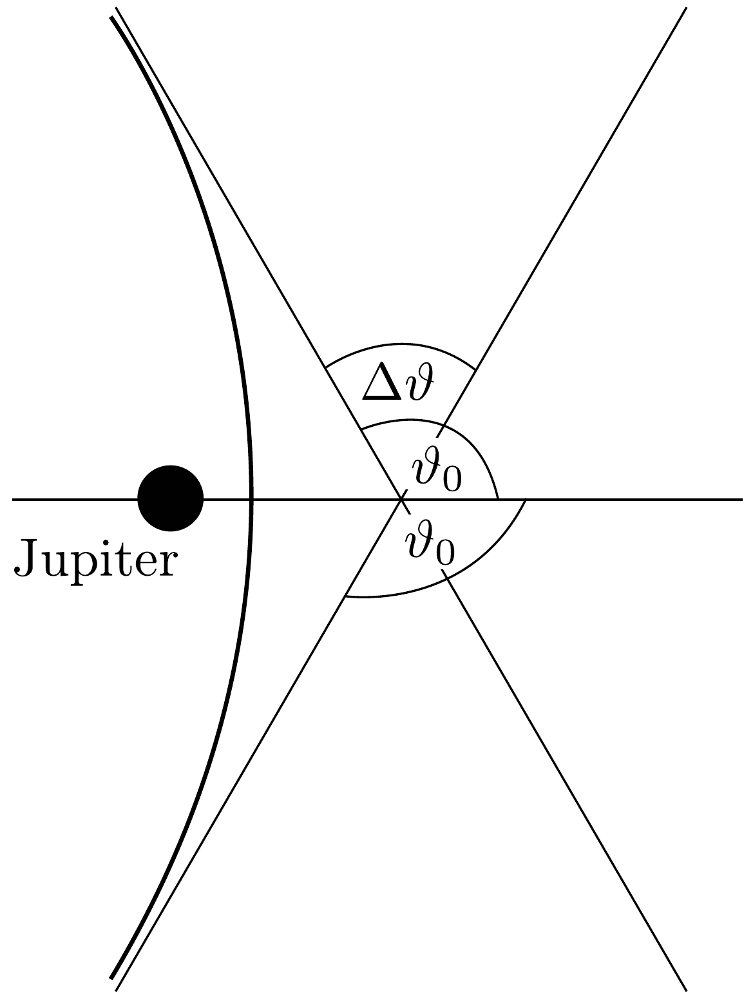

## Megoldás 3

a) A Jupiter keringési sebessége a Nap körül az
\[
\frac{M V^{2}}{R}=\frac{G M M_{\mathrm{N}}}{R^{2}}
\]
mozgásegyenletből számítható:
\[
V=\sqrt{\frac{G M_{\mathrm{N}}}{R}} \approx 1,31 \cdot 10^{4} \mathrm{~m} / \mathrm{s} .
\]
(A feladat szövegében megadott adatok között szerepelt a Jupiter pályasugara és keringési ideje. Ebből a két számból is kiszámítható a kérdéses - egyenletes körmozgásnak megfelelő - sebesség: $V=2 \pi R / T_{\mathrm{J}}$.)
- b) A Nap és a Jupiter gravitációs vonzóerejének nagysága akkor egyenlő, ha fennáll
\[
\frac{G M m}{x^{2}}=\frac{G M_{\mathrm{N}} m}{(R-x)^{2}},
\]
ahol $x$ a Jupitertől mért távolság és $m$ egy próbatest tömege. Innen
\[
x=\frac{\sqrt{M}}{\sqrt{M_{\mathrm{N}}}+\sqrt{M}} R=0,02997 R=2,33 \cdot 10^{10} \mathrm{~m} .
\]
- c) A Naphoz rögzített vonatkoztatási rendszerből (ahol a szonda sebessége: $v_{x}=0 ; v_{y}=v_{0}$ ) egyszerú Galilei-transzformációval térhetünk át a Jupiter $V$

sebességgel mozgó vonatkoztatási rendszerébe. Itt $v_{x}^{\prime}=V$ és $v_{y}^{\prime}=v_{0}$, ahonnan
\[
\begin{gathered}
v^{\prime}=\sqrt{V^{2}+v_{0}^{2}}=1,65 \cdot 10^{4} \frac{\mathrm{~m}}{\mathrm{~s}}, \\
\varphi=\operatorname{arctg} \frac{v_{0}}{V}=0,653 \mathrm{rad}=37,4^{\circ} .
\end{gathered}
\]
d) A Jupiter vonatkoztatási rendszerében (a Jupitertől elegendően távol, de nem „végtelen messze”) a szonda teljes $E$ mechanikai energiája jó közelítéssel a mozgási energiájával egyenlő:
\[
E \approx \frac{1}{2} m v^{\prime 2}=112 \mathrm{GJ} .
\]
e) A (99-1) egyenletet felhasználva a Jupitertől távol $1 / r \rightarrow 0$ és a szonda teljes energiája megmarad: $E=1 / 2 m v^{\prime 2}$. A két aszimptota $\vartheta_{0}$ szöget zár be az $x$ tengellyel (229. ábra):
\[
\vartheta_{0}=\arccos \left(-\frac{1}{\sqrt{1+\frac{v^{\prime 4} b^{2}}{G^{2} M^{2}}}}\right) .
\]

229. ábra.

A szonda szögeltérülése pedig
\[
\Delta \vartheta=2 \vartheta_{0}-\pi=2 \arccos \left(-\frac{1}{\sqrt{1+\frac{v^{\prime 4} b^{2}}{G^{2} M^{2}}}}\right)-\pi .
\]
f) A szonda akkor kerül a legközelebb a Jupiterhez, amikor $\vartheta=0$. A legkisebb távolság a bolygótól (a pályagörbe egyenlete szerint):
\[
r_{\min }=\frac{v^{\prime 2} b^{2}}{G M}\left(1+\sqrt{1+\frac{v^{\prime 4} b^{2}}{G^{2} M^{2}}}\right)^{-1}
\]
ahonnan a kérdéses legkisebb impakt paraméter
\[
b=\sqrt{r_{\min }^{2}+\frac{2 G M}{v^{\prime 2}} r_{\min }} .
\]
(Ugyanez az eredmény közvetlenül is megkapható az energia- és a perdületmegmaradás törvényéből, ha azokat a szonda legtávolabbi és a legközelebbi helyzeteire alkalmazzuk.)

Feltevéseink szerint a szonda nem kerülhet közelebb a Jupiter középpontjához, mint a bolygó sugarának háromszorosa. A fenti összefüggések szerint ennek az a feltétele, hogy
\[
b \geq b_{\min }=\sqrt{9 R_{\mathrm{J}}^{2}+\frac{6 G M}{v^{\prime 2}} R_{\mathrm{J}}} \approx 7,0 R_{\mathrm{J}}=4,9 \cdot 10^{8} \mathrm{~m},
\]
és az ennek megfelelő (legnagyobb) eltérülési szög:
\[
\Delta \vartheta_{\max }=1,51 \mathrm{rad}=86,5^{\circ} .
\]
g) A Jupiter vonatkoztatási rendszerében a szonda sebessége az eltérítés után is $v^{\prime}$, iránya pedig $\vartheta_{0}+\Delta \vartheta$ szöget zár be az $x$ tengellyel. A Nap vonatkoztatási rendszerébe egy újabb Galilei-transzformációval térhetünk vissza:
\[
\begin{gathered}
v_{x}^{\prime \prime}=v^{\prime} \cos \left(\vartheta_{0}+\Delta \vartheta\right)-V, \\
v_{y}^{\prime \prime}=v^{\prime} \sin \left(\vartheta_{0}+\Delta \vartheta\right) .
\end{gathered}
\]
Innen - algebrai átalakítások után - megkaphatjuk a szonda sebességének nagyságát a Nap koordináta-rendszerében:
\[
v^{\prime \prime}=\sqrt{v_{x}^{\prime \prime 2}+v_{y}^{\prime \prime 2}}=\sqrt{v_{0}\left(v_{0}+2 V \sin \Delta \vartheta\right)+2 V^{2}(1-\cos \Delta \vartheta)} .
\]
h) A legnagyobb megengedett értékú szögeltérülésnél a szonda végsebessége: $v^{\prime \prime}=2,62 \cdot 10^{4} \mathrm{~m} / \mathrm{s}$, ami valóban nagyobb, mint $v_{0}$.

\title{
