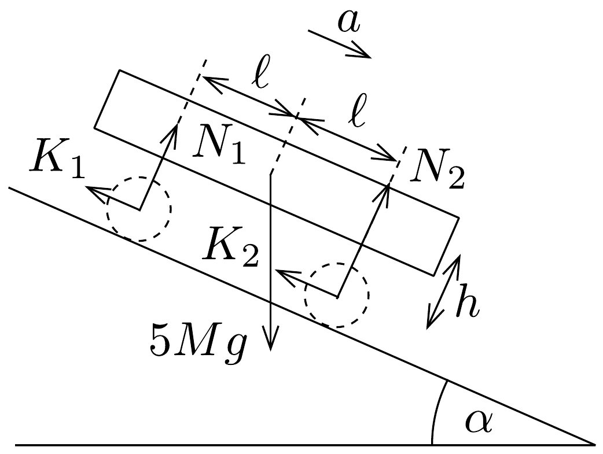
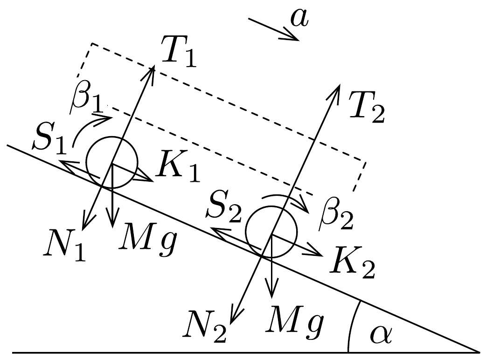

## Megoldás 3

a) Egy $0,025 M$ tömegú, $0,8 R$ sugarú küllő tehetetlenségi nyomatéka a végpontjára vonatkoztatva $\Theta_{\text {küllö }}=0,025 M \cdot(0,8 R)^{2} / 3=5,33 \cdot 10^{-3} M R^{2}$.

A kerék hengeres részének tehetetlenségi nyomatéka a tömör henger és a lyukat kitöltő tömör henger tehetetlenségi nyomatékának különbségeként számolható. Ha a henger tömör lenne, a tömege:
\[
m_{\text {tömör }}=M \cdot \frac{R^{2}}{R^{2}-(0,8 R)^{2}}=2,78 M
\]
lenne. Tehát a lyukba képzelt rész tömege $m_{\text {lyuk }}=m_{\text {tömör }}-M=1,78 M$ lenne.
Felhasználva, hogy egy tömör henger esetén $\Theta=m R^{2} / 2$, a vizsgált henger tehetetlenségi nyomatéka:
\[
\Theta_{\text {henger }}=\Theta_{\text {tömör }}-\Theta_{\text {lyuk }}=\frac{1}{2}\left[m_{\text {tömör }} R^{2}-m_{\text {lyuk }}(0,8 R)^{2}\right]=0,820 M R^{2},
\]
a kerék egészének tehetetlenségi nyomatéka pedig:
\[
\Theta=\Theta_{\text {henger }}+8 \Theta_{\text {küllŏ }} \approx 0,863 M R^{2} .
\]
b) Az $5 M$ tömegű kocsitestre a nehézségi erő és a kerekek (azok forgástengelye) által kifejtett erő hat. A kerekek által kifejtett erőket célszerú lejtővel párhuzamos és arra merőleges komponensekre bontani. Mivel a kocsitest a lejtőn lefelé haladva gyorsul, de nem forog, mozgásegyenletei a 255. ábra jelöléseivel a következő alakba írhatók (a harmadik egyenlet a kocsitest tömegözéppontjára felírt forgatónyomaték-egyensúly; más, gyorsuló pontra felírva ügyelni kell arra, hogy az $5 M a$ tehetetlenségi eró forgatónyomatékát ne felejtsük el):
\[
\begin{gathered}
5 M a=5 M g \sin \alpha-K_{1}-K_{2} \\
5 M g \cos \alpha=N_{1}+N_{2} \\
N_{2} \ell=N_{1} \ell+K_{1} h+K_{2} h
\end{gathered}
\]

Az $M$ tömegú, $R$ sugarú, $\Theta$ tehetetlenségi nyomatékú hátsó kerékre a gravitációs erőn túl a tengelynél a kocsitest, a talajjal érintkező pontban pedig a lejtő fejt ki erőt (256. ábra). A kerék tömegközéppontjának gyorsulása $a$, a szöggyorsulást pedig jelölje $\beta_{1}$. A kerék mozgásegyenletei:

\[
\begin{gathered}
M a=M g \sin \alpha+K_{1}-S_{1}, \\
M g \cos \alpha+N_{1}=T_{1}, \\
\Theta \beta_{1}=S_{1} R .
\end{gathered}
\]
Ha a hátsó kerék tisztán gördül, akkor:
\[
a=R \beta_{1},
\]
ha viszont csúszva gördül, akkor:
\[
S_{1}=\mu T_{1} .
\]

Az első kerékre (256) ábra) a hátsó kerékhez hasonlóan:
\[
\begin{gathered}
M a=M g \sin \alpha+K_{2}-S_{2} \\
M g \cos \alpha+N_{2}=T_{2} \\
\Theta \beta_{2}=S_{2} R .
\end{gathered}
\]

Tiszta gördülésnél
\[
a=R \beta_{2},
\]
ha pedig csúszva gördül, akkor:
\[
S_{2}=\mu T_{2} .
\]
c) 1. eset: mindkét kerék tisztán gördül.

Ebben az esetben mindkét kerék azonos $\beta$ szöggyorsulással forog: $a=\beta R$. Összeadva a (02-6) és a (02-10) egyenleteket, valamint a (02-3) egyenletből $K_{1}+$ $K_{2}$-t, továbbá a (02-8) és a (02-12) egyenletekből kifejezve $S_{1}$-et és $S_{2}$-t:
\[
a=\frac{7}{7+\frac{2 \Theta}{M R^{2}}} g \sin \alpha=0,80 g \sin \alpha, \quad \beta=0,80 \cdot \frac{g \sin \alpha}{R} .
\]
Ezt felhasználva:
\[
\begin{gathered}
S=S_{1}=S_{2}=\frac{\Theta \beta}{R}=0,69 M g \sin \alpha, \\
K=K_{1}=K_{2}=M a-M g \sin \alpha+S=0,49 M g \sin \alpha .
\end{gathered}
\]
(02-4) és (02-5) segítségével pedig:
\[
\begin{aligned}
& N_{1}=\frac{5}{2} M g \cos \alpha-K \frac{h}{\ell}=\left(2,5 \cos \alpha-0,49 \frac{h}{\ell} \sin \alpha\right) M g, \\
& N_{2}=\frac{5}{2} M g \cos \alpha+K \frac{h}{\ell}=\left(2,5 \cos \alpha+0,49 \frac{h}{\ell} \sin \alpha\right) M g .
\end{aligned}
\]
Ezeket beírva a (02-7), illetve a (02-11) egyenletekbe
\[
\begin{aligned}
T_{1} & =\left(3,5 \cos \alpha-0,49 \frac{h}{\ell} \sin \alpha\right) M g, \\
T_{2} & =\left(3,5 \cos \alpha+0,49 \frac{h}{\ell} \sin \alpha\right) M g .
\end{aligned}
\]

Tisztán gördülés akkor jön létre, ha
\[
S \leq \mu_{0} T_{1}, \text { és } S \leq \mu_{0} T_{2}
\]
egyszerre teljesül. Látható, hogy a két feltétel közül a hátsó kerékre vonatkozó az erósebb (az előbb csúszik meg). A lejtő hajlásszögére megfogalmazva:
\[
\operatorname{tg} \alpha \leq \frac{3,5 \mu_{0}}{0,69+\mu_{0} \cdot 0,49 \frac{h}{\ell}}
\]
feltétel teljesülése esetén gördül csúszásmentesen mindkét kerék.
2. eset: a hátsó kerék csúszva, az elsố kerék pedig tisztán gördül.
A (02-6), (02-7) és (02-9b) egyenletekból:
\[
M a=M g \sin \alpha+K_{1}-\mu\left(N_{1}+M g \cos \alpha\right),
\]
a (02-10), (02-11), (02-12) és (02-13a) egyenletek felhasználásával pedig:
\[
M a=M g \sin \alpha+K_{2}-\frac{\Theta}{R^{2}} a .
\]
Ezt a két egyenletet öszeadva, és kihasználva (02-3)-at:
\[
7 M a=7 M g \sin \alpha-\frac{\Theta}{R^{2}} a-\mu\left(N_{1}+M g \cos \alpha\right) .
\]
A (02-3), (02-4) és (02-5) egyenletekkel:
\[
N_{1}=2,5 M g\left(\cos \alpha-\frac{h}{\ell} \sin \alpha\right)+2,5 M a \frac{h}{\ell} .
\]
Ez utóbbi két egyenletből:
\[
a=\frac{\left(7+2,5 \mu \frac{h}{\ell}\right) \sin \alpha-3,5 \mu \cos \alpha}{7+\frac{\Theta}{M R^{2}}+2,5 \mu \frac{h}{\ell}} g .
\]
Ennek felhasználásával $\beta_{2}=a / R$, valamint $N_{1}$ kifejezhető, és (02-7) segítségével $T_{1}$ is megadható, majd a $\beta_{1}=\mu T_{1} R / \Theta$ összefüggéssel a hátsó kerék szöggyorsulása is meghatározható.

Az első kerék tisztán gördülésének feltétele:
\[
S_{2}=\frac{\Theta}{R^{2}} a \leq \mu_{0} T_{2} .
\]
Ehhez szükség van (02-11) szerint $N_{2}$-re, amit (02-4) ad meg a legkönnyebben:
\[
N_{2}=2,5 M g\left(\cos \alpha+\frac{h}{\ell} \sin \alpha\right)-2,5 M a \frac{h}{\ell} .
\]
Tehát:
\[
a\left(\frac{\Theta}{M R^{2}}+\mu_{0} \cdot 2,5 \frac{h}{\ell}\right) \leq g\left(3,5 \cos \alpha+\mu_{0} \cdot 2,5 \sin \alpha \frac{h}{\ell}\right) .
\]
A gyorsulásra kapott kifejezés behelyettesítésével a lejtő hajlásszögére adódik, hogy
\[
\operatorname{tg} \alpha \leq \frac{3,5\left[7,863+2,5 \mu \frac{h}{\ell}+\mu\left(0,863+2,5 \mu_{0} \frac{h}{\ell}\right)\right]}{\left(7+2,5 \mu \frac{h}{\ell}\right)\left(0,863+2,5 \mu_{0} \frac{h}{\ell}\right)-2,5 \mu_{0} \frac{h}{\ell}\left(7,863+2,5 \mu \frac{h}{\ell}\right)} .
\]
Ha a lejtő hajlásszöge az előző esetben megadott felső érték és az itt megadott felső érték közé esik, akkor a hátsó kerék csúszva, az elsó tisztán gördül.
XXXIII. olimpia, 2002
3. eset: mindkét kerék csúszva gördül.

Most a hajlásszög az előző esetben megkapott legfelső értéknél is nagyobb. Ebben az esetben az egész rendszer úgy csúszik le, mint egy doboz, ezért a gyorsulás
\[
a=g(\sin \alpha-\mu \cos \alpha) .
\]
(Természetesen a korábban felírt egyenletekből ugyanezt az eredményt kapjuk.) $N_{1}$ és $N_{2}$ eróket az előző esetnek megfelelően, vagyis a (02-3) (02-4) és (02-5) segítségével kapjuk (beírva $a$ előző alakját):
\[
\begin{aligned}
& N_{1}=2,5(1-\mu) M g \cos \alpha, \\
& N_{2}=2,5(1+\mu) M g \cos \alpha .
\end{aligned}
\]
Ezen eredményeket felhasználva a (02-7) és (02-11) egyenletekben:
\[
\begin{aligned}
& T_{1}=3,5(1-\mu) M g \cos \alpha, \\
& T_{2}=3,5(1+\mu) M g \cos \alpha .
\end{aligned}
\]
Tehát a szöggyorsulások (02-8), illetve (02-12) szerint:
\[
\begin{aligned}
& \beta_{1}=\frac{3,5 \mu(1-\mu) M g R \cos \alpha}{\Theta} \approx 4,06 \mu(1-\mu) \frac{g \cos \alpha}{R}, \\
& \beta_{2}=\frac{3,5 \mu(1+\mu) M g R \cos \alpha}{\Theta} \approx 4,06 \mu(1+\mu) \frac{g \cos \alpha}{R} .
\end{aligned}
\]
d) Vizsgáljuk azt az esetet, amikor az álló helyzetből induló jármú kerekei $d$ úton tisztán, majd $s-d$ úton csúszva gördülnek. Jelölje $a_{0}$, illetve $a$ a jármú gyorsulását a tiszta gördülés, illetve a csúszás szakaszában, $\beta_{1}$, illetve $\beta_{2}$ rendre a hátsó és az első kerék szöggyorsulását a csúszva gördülés idején. (Ezeket a mennyiségeket a $c$ ) részfeladatban meghatároztuk.) Legyen $t_{0}=v_{0} / a_{0}$ a tisztán gördülés ideje, ami alatt $v_{0}$ sebességet ér el a kocsi, és legyen $t=\left(v-v_{0}\right) / a$ az az idő, amíg a jármú csúszva $v_{0}$ sebességről $v$ sebességre gyorsul fel. Tehát:
\[
\begin{gathered}
d=\frac{a_{0}}{2} t_{0}^{2}=\frac{v_{0}^{2}}{2 a_{0}}, \\
s-d=v_{0} t+\frac{a}{2} t^{2}=\frac{v^{2}-v_{0}^{2}}{2 a} .
\end{gathered}
\]
Ezekből a végsebesség:
\[
v=\sqrt{2 a_{0} d+2 a(s-d)} .
\]
A kerekek szögsebessége miután $d$ utat megtett a kocsi:
\[
\omega_{0}=\frac{v_{0}}{R}=\frac{\sqrt{2 a_{0} d}}{R} .
\]
Ezt követően a csúszási szakasz végén a kialakuló szögsebességek:
\[
\omega_{1,2}=\omega_{0}+\beta_{1,2} t=\omega_{0}+\beta_{1,2} \frac{v-v_{0}}{a}=\frac{\sqrt{2 a_{0} d}}{R}+\beta_{1,2} \frac{\sqrt{2 a_{0} d+2 a(s-d)}-\sqrt{2 a_{0} d}}{a} .
\]

\title{
