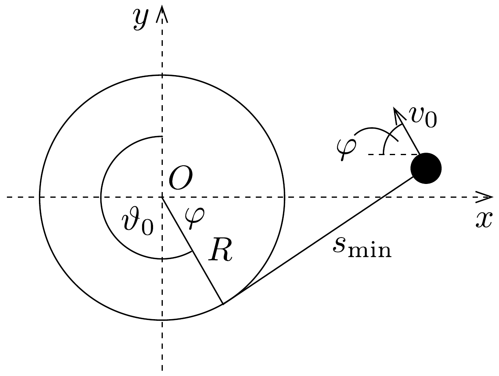

## Megoldás 1

a) Mivel a fonál hossza $L=s+R \vartheta$ állandó, a megfelelő változási sebességek közötti kapcsolat: $\dot{s}+R \dot{\vartheta}=0(\dot{\vartheta}>0, \dot{s}<0)$.
b) A $Q$ pont $R$ sugarú körpályán mozog $\dot{\vartheta}$ szögsebességgel, a sebessége $O$-hoz viszonyítva $\boldsymbol{v}_{O}=R \dot{\vartheta} \boldsymbol{e}_{\mathrm{t}}=-\dot{s} \boldsymbol{e}_{\mathrm{t}}$.
c) A $Q$ pontban ülve a $P$ pont közeledik a $Q$ ponthoz $-\boldsymbol{v}_{O}=\dot{s} \boldsymbol{e}_{\mathrm{t}}$ sebességgel, valamint $s$ sugarú, $\dot{\vartheta}$ szögsebességü körmozgást is végez:
\[
\boldsymbol{v}_{Q}=-s \dot{\vartheta} \boldsymbol{e}_{r}+\dot{s} \boldsymbol{e}_{\mathrm{t}} .
\]
d) A $P$ pont $O$-hoz viszonyított (tehát az inerciarendszerben mérhető) sebessége
\[
\boldsymbol{v}=\boldsymbol{v}_{O}+\boldsymbol{v}_{Q}=-s \dot{\vartheta} \boldsymbol{e}_{r} .
\]
Ez tisztán érintőirányú, összhangban azzal a ténnyel, hogy a $Q$ pontbeli fonaldarab pillanatnyi sebessége az inerciarendszerben mérve nulla. (Maga a $Q$ pont nem egy bizonyos anyagi pontot, hanem a fonál pillanatról pillanatra változó darabkáját jelöli. Ehhez a mozgó ponthoz képest a $P$ pont fonálirányú sebességgel is rendelkezik, ez a fiktív mozgás azonban az inerciarendszerből szemlélve már eltúnik.)
e) A $P$ pontban levó részecske gyorsulásának $e_{\mathrm{t}}$ irányú (tehát fonálirányú) komponense a centripetális gyorsulás képletének megfelelően
\[
\boldsymbol{a}_{\mathrm{cp}}=-s \dot{\vartheta}^{2} \boldsymbol{e}_{\mathrm{t}} .
\]
f) A $P$ pontban levó test gravitációs helyzeti energiája (a helyzeti energiát a test indítási magasságában választottuk nullának)
\[
U(\vartheta)=-m g[R(1-\cos \vartheta)+s \sin \vartheta] .
\]
g) A pálya legalacsonyabb pontja $\vartheta=\pi / 2$-nek felel meg (itt válik a sebesség függőleges komponense nullává). Ebben a pontban a test helyzeti energiája minimális $(s=L-R \pi / 2)$ :
\[
U_{\min }=U\left(\frac{\pi}{2}\right)=-m g\left[R+L-\frac{R \pi}{2}\right] .
\]

Alkalmazva a mechanikai energiamegmaradás törvényét:
\[
0=\frac{1}{2} m v_{\mathrm{m}}^{2}+U_{\min },
\]
ahonnan
\[
v_{\mathrm{m}}=\sqrt{2 g\left[R+L-\frac{R \pi}{2}\right]} .
\]
h) A test mozgási energiája egy tetszőleges $\vartheta$ szöggel jellemzett helyzetben (az energiamegmaradás törvénye szerint)
\[
\frac{1}{2} m v^{2}=-U(\vartheta)=m g[R(1-\cos \vartheta)+s \sin \vartheta],
\]
ahonnan
\[
v^{2}=(s \dot{\vartheta})^{2}=2 g[R(1-\cos \vartheta)+s \sin \vartheta] .
\]
Jelöljük $K$-val a fonalat feszítő erót. A fonálirányú mozgásegyenlet (03-4) felhasználásával
\[
K-m g \sin \vartheta=m s \dot{\vartheta}^{2},
\]
ahonnan (03-5) segítségével kifejezhetó a fonálerő:
\[
K=m\left(s \dot{\vartheta}^{2}+g \sin \vartheta\right)=\frac{m g}{s}[2 R(1-\cos \vartheta)+3 s \sin \vartheta] .
\]
Az $s=L-R \vartheta$ és a $\operatorname{tg}(\vartheta / 2)=(1-\cos \vartheta) / \sin \vartheta$ összefüggéssel:
\[
K=\frac{2 m g R \sin \vartheta}{s}\left[\operatorname{tg} \frac{\vartheta}{2}+\frac{3}{2}\left(\frac{L}{R}-\vartheta\right)\right] .
\]

A fonál meglazulásának $(K=0$-nak $)$ megfelelő $\vartheta_{0}$ szögre fennáll, hogy
\[
\frac{3}{2}\left(\vartheta_{0}-\frac{L}{R}\right)=\operatorname{tg} \frac{\vartheta_{0}}{2},
\]
amit $L / R$ megadott értékének behelyettesítésével a
\[
\frac{3}{2}\left(\vartheta_{0}-\frac{9 \pi}{8}\right)=\operatorname{tg} \frac{\vartheta_{0}}{2}+\operatorname{ctg} \frac{\pi}{16}
\]
alakban is felírhatunk. Ennek az egyenletnek viszonylag könnyen megadható egyik gyöke: $\vartheta_{0}=\frac{9 \pi}{8}=202,5^{\circ}$. Ha valaki nem veszi észre ezt a megoldást, numerikusan (számológép segítségével) is megkaphatja a trigonometrikus egyenlet gyökét: $\vartheta_{0} \approx$ $\approx 3,53$ radián. Ellenőrizhető, hogy a $0<\vartheta<\vartheta_{0}$ tartományban $K>0$, tehát a fonál korábban nem lazul meg.

A fonál legrövidebb, de még nem laza helyzetében
\[
s_{\min }=L-R \vartheta_{0}=\frac{2 R}{3} \operatorname{ctg} \frac{\pi}{16} \approx 3,35 R,
\]
a test sebességének nagysága pedig ekkor (03-5) szerint
\[
v_{0}=\sqrt{2 g R \sin \vartheta_{0}\left(\operatorname{tg} \frac{\vartheta_{0}}{2}+\frac{s_{\min }}{R}\right)} \approx 1,13 \sqrt{g R} .
\]
i) A mozgás további részében $v_{0}$ kezdősebességú ferde hajítás jön létre. A hajítás szöge $\varphi=\vartheta_{0}-2 \pi / 3=67,5^{\circ}$ (264, ábra). A pálya legmagasabb $H$ pontjában a sebessége
\[
v_{H}=v_{0} \cos \varphi \approx 0,43 \sqrt{g R}
\]
lesz, és a $H$ pontig a vízszintes elmozdulása a rúd felé
\[
d=\frac{v_{0}^{2} \sin (2 \varphi)}{2 g} \approx 0,45 R .
\]

Meg kell még vizsgálnunk, hogy a $H$ pont elérése előtt nem ütközik-e neki a test a rúdnak. A $\vartheta=\vartheta_{0}$ helyzetnek megfelelő pontban a test koordinátái:
\[
\begin{aligned}
& x_{0}=R \cos \varphi+s_{\min } \sin \varphi=3,48 R, \\
& y_{0}=s_{\min } \cos \varphi-R \sin \varphi=0,36 R .
\end{aligned}
\]
Mivel $x_{0}-d>R$, így a test nem ütközik a rúdba mielőtt elérné a pálya legmagasabb pontját.
j) A fonál súrlódásmentes csúszása során az $m$ és az $M$ tömegú testből álló rendszer teljes mechanikai energiája állandó marad. Ha az $M$ tömegü test a mozgása során $D$-vel mélyebbre kerül, a helyzeti energiája $M g D$ értékkel csökken, ugyanennyivel nő tehát az $m$ tömegú test helyzeti és mozgási energiájának összege, és ez az összeg a fonál megtapadása után is változatlan marad.

Ha $L-D$ mellett $R$ elhanyagolható, akkor a $m$ tömegü test mozgását a továbbiakban rögzített pont körüli ingamozgásnak tekinthetjük. Egy teljes kör megtételéhez a fonál meglazulása szempontjából a legkényesebb helyzet a pálya legmagasabb pontja. Itt a test $L-D$ magasan van a rúd felett, sebességét pedig az
\[
\frac{1}{2} m v^{2}=M g D-m g(L-D)
\]
egyenlet határozza meg. Ebben a helyzetben:
\[
m g+K=\frac{m v^{2}}{L-D} .
\]
Ha itt $K>0$, azaz
\[
m g<\frac{m v^{2}}{L-D},
\]
az ingatest mozgása során a fonál végig feszes marad. Ebből a (03-6) alapján a sebesség kiküszöbölésével
\[
m g<2 \frac{M g D-m g(L-D)}{L-D},
\]
ami egyszerú átalakításokkal
\[
\frac{D}{L}>\frac{1}{1+\frac{2 M}{3 m}}=\alpha_{\mathrm{k}} .
\]

Megjegyzések: 1. Az $m / M$ arány - a feladat egyszerúsító feltevéseinek teljesülése esetén - egyértelmúen meghatározza a $D / L$ hányadost, igaz, ehhez egy bonyolult differenciálegyenletet kellene megoldanunk. A fenti egyenlótlenség tehát tulajdonképpen csak a tömegek arányára jelent megszorítást.
2. Itt is eljárhatunk a $h$ ) részben látott módszerhez hasonlóan. Az energiamegmaradás a kezdeti állapot és egy olyan állapot között, amikor $M$ már áll, a fonál pedig $\vartheta$ szöggel feltekeredett:
\[
M g D=\frac{1}{2} m v^{2}-m g[R(1-\cos \vartheta)+s \sin \vartheta] .
\]
A fonálerő ugyanúgy, mint korábban:
\[
K(\vartheta)=m \frac{v^{2}}{s}+m g \sin \vartheta,
\]
ahol $s=L-R \vartheta-D$. A sebesség kiküszöbölésével:
\[
K(\vartheta)=\frac{2 m g R}{s}\left[\frac{M}{m} \frac{D}{R}+(1-\cos \vartheta)+\frac{3}{2} \frac{s}{R} \sin \vartheta\right] .
\]
Az ingatest teljesen körbefordul, ha bármilyen $\vartheta$ szögre $K(\vartheta)>0$, vagyis a szögletes zárójelben lévő kifejezés legyen pozitív. Tehát
\[
\frac{M}{m} D+(1-\cos \vartheta) R+\frac{3}{2}(L-R \vartheta-D) \sin \vartheta>0 .
\]
$L$-lel elosztva az egyenlőtlenséget:
\[
\frac{M}{m} \frac{D}{L}+\frac{3}{2} \sin \vartheta-\frac{3}{2} \frac{D}{L} \sin \vartheta+\left[(1-\cos \vartheta)-\frac{3}{2} \sin \vartheta \cdot \vartheta\right] \frac{R}{L}>0 .
\]
Az $R / L$-lel arányos tagok elhanyagolása után a következőt kapjuk:
\[
\sin \vartheta>-\frac{\frac{M}{m} \frac{D}{L}}{\frac{3}{2}\left(1-\frac{D}{L}\right)} .
\]
Ez akkor teljesül minden $\vartheta$ szögre, ha a jobb oldalon álló kifejezés értéke -1 -nél kisebb:
\[
\frac{M}{m} \frac{D}{L}>\frac{3}{2}\left(1-\frac{D}{L}\right) .
\]
Ebből ugyanazt az eredményt kapjuk $D / L$-re, mint korábban.
3. A súrlódásmentes csúszás és nagyon nagy tapadási súrlódás feltételezése nyilván távol áll a realitástól. A leírt jelenséghez hasonló azonban mégis megvalósítható. Ha egy vékony, sima rúddal és jól csúszó, kellően hajlékony fonállal (például horgászdamillal), és megfelelően választott nehezékekkel (pl. acélcsavarokkal) végezzük el a kísérletet, a mozgás első szakasza jó közelítéssel súrlódásmentesnek tekinthető. Igaz ugyan, hogy a fonál a megtapadása után vélhetően újra megcsúszik a hengeren, de a fonál fokozatos feltekeredése miatt (kötélsúrlódás) előbb-utóbb megállítja a csúszást, éppen úgy, mintha a tapadó súrlódás nagyon nagy lenne. Egyszerú eszközökkel kísérletileg is jól vizsgálható, hogy a kérdéses furcsa mozgás valóban létrejöhet, a $m$ tömegü test többször is átfordulhat a rúd felett, és a mozgás akár a fonal teljes feltekeredéséig is tarthat.
