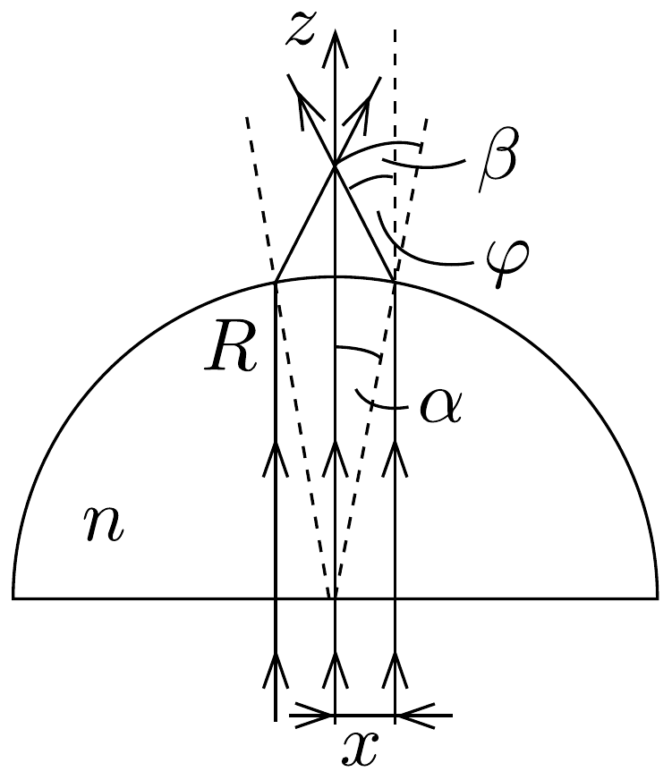

## Megoldás 3

a) Jelöljük az egyes részecskék (relativisztikus) energiáját $E$-vel, impulzusvektorát pedig $\boldsymbol{p}$-vel, és mindegyiket lássuk el a részecske típusára utaló (p, n, e, illetve az antineutrínót $\nu$ ) indexszel. Használjunk olyan egységrendszert, amelyben a fénysebesség egységnyi (ebben a tömeget, az energiát és az impulzust egyaránt MeV-ban mérhetjük.)

A bomlási folyamat során az energiák összege és az impulzusok összege változatlan marad (ezek megmaradó mennyiségek):
\[
\begin{gathered}
E_{\mathrm{n}}=E_{\mathrm{p}}+E_{\mathrm{e}}+E_{\nu} \\
\boldsymbol{p}_{\mathrm{n}}=\boldsymbol{p}_{\mathrm{p}}+\boldsymbol{p}_{\mathrm{e}}+\boldsymbol{p}_{\nu}
\end{gathered}
\]

Az egyes részecskék energiája és impulzusa összefügg egymással:
\[
E_{i}^{2}=\boldsymbol{p}_{i}^{2}+m_{i}^{2} \quad(i=\mathrm{n}, \mathrm{p}, \mathrm{e}, \nu),
\]
amint az a megfeleló $\boldsymbol{v}_{i}$ sebességgel felírt
\[
E_{i}=\frac{m_{i}}{\sqrt{1-v_{i}^{2}}}, \quad \boldsymbol{p}_{i}=\frac{m_{i} \boldsymbol{v}_{i}}{\sqrt{1-v_{i}^{2}}}
\]
formulákból könnyen leolvasható.
Képzeljük el, hogy a vizsgálandó $\mathrm{n} \rightarrow \mathrm{p}+\mathrm{e}+\nu$ bomlási folyamat két lépésben megy végbe: a neutron először elbomlik egy elektronra és egy x jelú részecskére, majd az x részecske elbomlik protonra és antineutrínóra:
\[
\mathrm{n} \rightarrow \mathrm{e}+\mathrm{x}, \quad \text { majd } \quad \mathrm{x} \rightarrow \mathrm{p}+\nu .
\]
(A megmaradási törvények szempontjából lényegtelen, hogy a folyamat ténylegesen így zajlik-e le, vagy pedig egyszerre, egyetlen pillanatban történik a neutron bomlása; a feladatban szereplő kérdésre azonban könnyebb választ adni, ha lépcsózetesnek gondoljuk a bomlást.)

Írjuk fel a bomlás első részére a megmaradási törvényeket abban a koordinátarendszerben, amelyben a neutron áll (azaz ahol $\boldsymbol{p}_{\mathrm{n}}=0$ és $E_{\mathrm{n}}=m_{\mathrm{n}}$ ). Az impulzusmegmaradás törvénye miatt az elektron és az x részecske impulzusa ugyanakkora nagyságú (de ellentétes irányú), az energiamegmaradást tehát így fogalmazhatjuk meg:
\[
m_{\mathrm{n}}=E_{\mathrm{e}}+E_{\mathrm{x}},
\]
valamint, hogy $p_{\mathrm{e}}^{2}=p_{\mathrm{x}}^{2}$ :
\[
E_{\mathrm{e}}^{2}-m_{\mathrm{e}}^{2}=E_{\mathrm{x}}^{2}-m_{\mathrm{x}}^{2} .
\]
Ebből a két egyenletből az elektron energiája::
\[
E_{\mathrm{e}}^{2}=\frac{m_{\mathrm{n}}^{2}+m_{\mathrm{e}}^{2}-m_{\mathrm{x}}^{2}}{2 m_{\mathrm{n}}} .
\]
Látható, hogy a bomlás során keletkező elektronnak annál nagyobb lesz az energiája, minél kisebb a bomlás másik termékének (az x részecskének) a tömege.

Mekkora lehet $m_{\mathrm{x}}$ legkisebb értéke? Erre a kérdésre legkönnyebben az x részecske nyugalmi rendszerében kaphatjuk meg a választ. Mivel x egy protonra és egy antineutrínóra bomlik, fennáll, hogy
\[
m_{\mathrm{x}}=E_{\mathrm{p}}^{\prime}+E_{\nu}^{\prime} \geq m_{\mathrm{p}}+m_{\nu}=m_{\mathrm{x}}^{\min } .
\]
(A vessző arra utal, hogy ezeket a mennyiségeket nem a laboratóriumi koordinátarendszerben számítottuk ki, hanem az x részecske nyugalmi rendszerében.) A (03-13) egyenlőtlenség akkor válik egyenlőséggé, amikor a proton és az antineutrínó egymáshoz képest nem mozog, tehát a laboratóriumi rendszerből nézve a sebességük megegyezik. Ebben a határesetben (03-12) alapján
\[
E_{\mathrm{e}}^{\max }=\frac{m_{\mathrm{n}}^{2}+m_{\mathrm{e}}^{2}-\left(m_{\mathrm{x}}^{\min }\right)^{2}}{2 m_{\mathrm{n}}}=\frac{m_{\mathrm{n}}^{2}+m_{\mathrm{e}}^{2}-\left(m_{\mathrm{p}}+m_{\nu}\right)^{2}}{2 m_{\mathrm{n}}},
\]
amelynek numerikus értéke $1,292569 \mathrm{MeV} \approx 1,29 \mathrm{MeV}$.
Az antineutrínó (és vele egyezően a proton) sebessége az x részecske (labor rendszerbeli) sebességével egyezik meg. A fentiek alapján:
\[
E_{\mathrm{x}}=m_{\mathrm{n}}-E_{\mathrm{e}}=\frac{m_{\mathrm{n}}^{2}-m_{\mathrm{e}}^{2}+m_{\mathrm{x}}^{2}}{2 m_{\mathrm{n}}}=\frac{m_{\mathrm{x}}}{\sqrt{1-v_{\mathrm{m}}^{2}}},
\]
ahonnan a sebesség kifejezhető:
\[
v_{\mathrm{m}}=\frac{\sqrt{\left(m_{\mathrm{n}}^{2}-m_{\mathrm{e}}^{2}+m_{\mathrm{x}}^{2}\right)^{2}-4 m_{\mathrm{n}}^{2} m_{\mathrm{x}}^{2}}}{m_{\mathrm{n}}^{2}-m_{\mathrm{e}}^{2}+m_{\mathrm{x}}^{2}},
\]
ahol most is $m_{\mathrm{x}}=m_{\mathrm{p}}+m_{\nu}$. Numerikusan (fénysebességnyi egységekben mérve) $v_{\mathrm{m}}=0,00126538 \approx 0,00127$.

Megjegyzés: Mivel az antineutrínó tömege sokkal kisebb, mint a többi részecske tömege, így az elektron energiája akkor a legnagyobb, ha az antineutrínó nem rendelkezik sem energiával, sem impulzussal. Ebben az esetben az elektron impulzusa megegyezik a protonéval, irányuk ellentétes. (A fenti megoldásból látható, hogy az antineutrínó sebessége, és így impulzusa is lényegében elhanyagolható.) A bomlásra érvényes egyenlet:
\[
m_{\mathrm{n}}=\sqrt{m_{\mathrm{p}}^{2}+p^{2}}+\sqrt{m_{\mathrm{e}}^{2}+p^{2}} .
\]
Ezt érdemes átrendezni az
\[
m_{\mathrm{n}}-\sqrt{m_{\mathrm{e}}^{2}+p^{2}}=\sqrt{m_{\mathrm{p}}^{2}+p^{2}}
\]
alakra, majd négyzetre emelni, mert ebben az esetben az elektron energiája könynyen kifejezhető:
\[
E_{\mathrm{e}}=\sqrt{m_{\mathrm{e}}+p^{2}}=\frac{m_{\mathrm{n}}^{2}+m_{\mathrm{e}}^{2}-m_{\mathrm{p}}^{2}}{2 m_{\mathrm{n}}},
\]
ami gyakrolatilag a korábban kapott eredmény.
b) A függőlegesen felfelé haladó fénysugarak (fotonok) - amikor az üvegen áthaladnak - irányt változtatnak, és emiatt a lendületük (impulzusuk) függőleges komponense lecsökken. Az egységnyi idő alatt létrejött impulzusváltozás hatására a fény a félgömbre nyomóerőt fejt ki függőlegesen felfelé, és ha ez az erő éppen egyenlő az üveg súlyával, akkor a test lebeghet. Kövessük végig mindezt számítással is.

Tekintsük a lézerfénynyaláb azon részét, amelynek az optikai tengelytől mért távolsága $x$ és $x+\Delta x$ közé esik (ahol $\Delta x \ll x$ ). Ebbe a tartományba a lézer teljes $P$ teljesítményének csak egy kis hányada, a területek arányának megfelelően
\[
\Delta P=\frac{2 \pi x \Delta x}{\delta^{2} \pi} P
\]
érkezik, vagyis a kérdéses tartományba egységnyi idő alatt
\[
\Delta N=\frac{\Delta P}{h \nu}=\frac{2 x P}{\delta^{2} h \nu} \Delta x
\]

számú (egyenként $h \nu$ energiával rendelkező́) foton érkezik. (Itt $\nu$ a lézerfény frekvenciája, $h$ pedig a Planck-állandó.)

Ebben a $\Delta x$ széles tartományban lévó fotonok a 266. ábrán látható módon térülnek el. Látható, hogy egy foton vízszintes irányú lendületváltozása gömbfelület átellenes oldalán kilépő foton lendületváltozásával egyezik meg, de ellentétes irányú, tehát valóban csak a függőleges komponens megváltozása ad járulékot.

Amíg a fény kicsiny $\Delta t$ idő alatt áthalad a félgömbön, egy foton lendületváltozása:
\[
\Delta p=p_{0}-p_{0} \cos \varphi=\frac{h \nu}{c}(1-\cos \varphi) .
\]
A törési törvény szerint, és mivel kis szögekről van szó:
\[
\frac{\sin \alpha}{\sin \beta}=\frac{1}{n} \quad \rightarrow \quad \beta=n \cdot \alpha
\]
Másrészt $\sin \alpha=x / R \approx \alpha$, valamint $\varphi=\beta-\alpha$. Tehát
\[
\varphi=(n-1) \frac{x}{R} .
\]
Felhasználva az útmutatóban megadott közelítést:
\[
\Delta p=\frac{h \nu}{c} \frac{(n-1)^{2}}{2}\left(\frac{x}{R}\right)^{2} .
\]
A $\Delta x$ vastag részen keresztül $\Delta N \Delta t$ számú foton halad át $\Delta t$ idő alatt, azaz ezek lendületváltozása által okozott erő:
\[
\Delta F=\Delta N \Delta t \cdot \frac{\Delta p}{\Delta t}=\Delta N \Delta p=\frac{(n-1)^{2} P}{c \delta^{2} R^{2}} x^{3} \Delta x .
\]
A teljes erő ( $\Delta x \rightarrow 0$ határátmenettel) integrálással adható meg:
\[
F=\frac{(n-1)^{2} P}{c \delta^{2} R^{2}} \int_{0}^{\delta} x^{3} \mathrm{~d} x=\frac{(n-1)^{2} P \delta^{2}}{4 c R^{2}} .
\]

Egyensúly esetén ez az erő $m g$-vel azonos, tehát a lézer teljesítménye:
\[
P=\frac{4 m g R^{2} c}{(n-1)^{2} \delta^{2}} .
\]

Megjegyzés: A fénysugarak irányváltozása szempontjából az üveg félgömb középső (az optikai tengelyhez közeli) tartományát gondolatban két részre lehet bontani: egy planparalel lemezre (amely a rá merólegesen esó fénysugarakat nem töri meg) és egy síkdomború vékony lencsére, amelynek $f_{0}=\frac{R}{n-1}$ a fókusztávolsága. Ez utóbbi $\varphi \approx$ $\approx \operatorname{tg} \varphi=\frac{x}{f_{0}}=\frac{x}{R}(n-1)$ szöggel téríti el a fotonokat.

\title{
