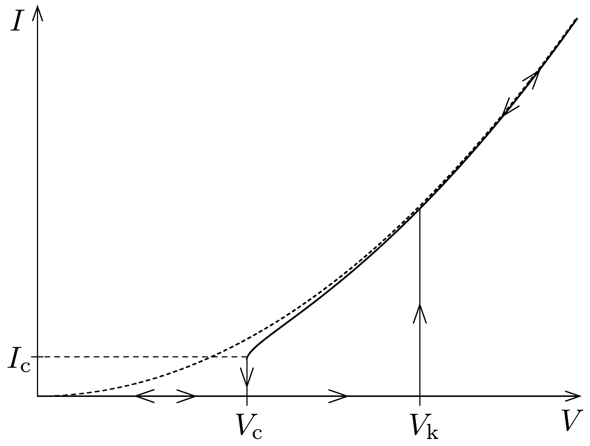
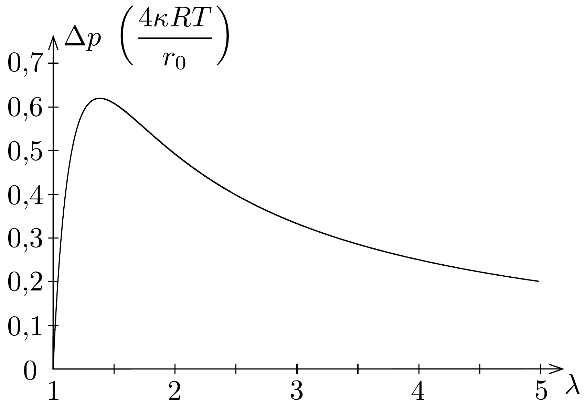

## Megoldás 2

$a$ ) Felhasználva az ideális gáz állapotegyenletét, $n$ mól héliumgáz térfogata $p+\Delta p$ nyomáson és $T$ hőmérsékleten
\[
V=\frac{n R T}{p+\Delta p} .
\]
$T$ hőmérsékletú és $p$ nyomású levegő súrúsége
\[
\varrho=\frac{p M_{\mathrm{lev}} .}{R T} .
\]
Tehát a ballonra ható felhajtóerő:
\[
F_{\mathrm{fel}}=\varrho V g=\frac{p}{p+\Delta p} n g M_{\mathrm{lev} .} .
\]

b) Egy adott $z$ magasságban kicsiny $\mathrm{d} z$ magasságkülönbségből származó nyomásváltozás $\mathrm{d} p=-\varrho(z) g \mathrm{~d} z$, tehát
\[
\frac{\mathrm{d} p}{\mathrm{~d} z}=-\varrho(z) g=-\frac{p(z) M_{\mathrm{lev}} .}{R T(z)} g=-\frac{\varrho_{0} T_{0}}{p_{0}} \frac{p(z)}{T(z)} g,
\]
amiben felhasználtuk, hogy $M_{\text {lev. }}=\varrho_{0} R T_{0} / p_{0}$. A megadott $p(z)$, illetve $T(z)$ összefüggésekkel:
\[
\frac{p_{0} \eta}{z_{0}}\left(1-\frac{z}{z_{0}}\right)^{\eta-1}=\varrho_{0} g\left(1-\frac{z}{z_{0}}\right)^{\eta-1} .
\]
A két együttható azonos kell legyen, azaz
\[
\eta=\frac{\varrho_{0} z_{0} g}{p_{0}}=5,5 .
\]
c) Gondolatban növeljük meg a ballon $r$ sugarát $\mathrm{d} r$-rel. A ballonban lévó gáz tágulási munkája
\[
\mathrm{d} W_{\text {tág }}=(p+\Delta p) \mathrm{d} V,
\]
ahol $\mathrm{d} V=4 \pi r^{2} \mathrm{~d} r$. A külső levegő által végzett munka:
\[
\mathrm{d} W_{\text {lev. }}=-p \mathrm{~d} V .
\]
A ballon anyagának rugalmas energiája megnő, azaz a rugalmas erők által végzett munka:
\[
\mathrm{d} W_{\text {rug. }}=-\mathrm{d} U .
\]
Mivel az $r$ sugarú ballon egyensúlyi állapotban van, ezért az összes munka összege nulla kell legyen (virtuális munka elve):
\[
\mathrm{d} W_{\text {tág }}+\mathrm{d} W_{\text {lev. }}+\mathrm{d} W_{\text {rug. }}=0,
\]
amiből
\[
\frac{\mathrm{d} U}{\mathrm{~d} r}=4 \pi r^{2} \Delta p .
\]
Deriválva a megadott $U(r)$ függvényt:
\[
\frac{\mathrm{d} U}{\mathrm{~d} r}=4 \pi r_{0}^{2} \kappa R T\left(4 \cdot \frac{r}{r_{0}^{2}}-4 r_{0}^{4} \cdot \frac{1}{r^{5}}\right) .
\]
Ezzel a nyomáskülönbség:
\[
\Delta p=\frac{4 \kappa R T}{r_{0}}\left(\frac{1}{\lambda}-\frac{1}{\lambda^{7}}\right) .
\]
A nyomáskülönbség-grafikon $\lambda(>1)$ függvényében kezdetben élesen növekszik, $\lambda=7^{1 / 6}=1,38$ értéknél maximumot vesz fel, majd nagy $\lambda$ értékeknél $\lambda^{-1}$ szerint csökken. A $\Delta p(\lambda)$ függvény a 270, ábrán látható, ahol a nyomáskülönbség $4 \kappa R T / r_{0}$ egységekben van megadva.

d) Írjuk fel az ideális gáz állapotegyenletét: $p_{0} V_{0}=n_{0} R T_{0}$, ahol $V_{0}$ a feszítetlen falú ballon térfogatát jelenti. Az $n$ mól gázt tartalmazó ballon belsón nyomása $V=\lambda^{3} V_{0}$ térfogat mellett $T=T_{0}$ hőmérsékleten:
\[
p_{\text {belsö }}=\frac{n R T_{0}}{V}=\frac{n}{n_{0} \lambda^{3}} p_{0} .
\]
Másrészt a ballon belső nyomását a (04-12) szerint megadott többletnyomás segítségével is kifejezhetjük $T=T_{0}$ hőmérsékleten:
\[
p_{\text {belső }}=p_{0}+\Delta p=p_{0}+\frac{4 \kappa R T_{0}}{r_{0}}\left(\frac{1}{\lambda}-\frac{1}{\lambda^{7}}\right)=\left[1+a\left(\frac{1}{\lambda}-\frac{1}{\lambda^{7}}\right)\right] p_{0} .
\]

A belső nyomás fenti két kifejezését egyenlővé téve határozhatjuk meg az $a$ „ballonparamétert":
\[
a=\frac{\frac{n}{n_{0} \lambda^{3}}-1}{\lambda^{-1}-\lambda^{-7}} .
\]
A megadott $n / n_{0}=3,6$ és $\lambda=1,5$ numerikus adatokat behelyettesítve, a ballonparaméterre $a=0,11$ adódik.
e) Az a) alkérdésben levezetett felhajtóeró egyensúlyt tart az $m_{\mathrm{T}}$ tömegre ható nehézségi eróvel, amiből
\[
\frac{p}{p+\Delta p}=\frac{m_{\mathrm{T}}}{n M_{\mathrm{lev}}} .
\]

A d) alkérdésben szereplő, feszítetlen falú ballonban lévő, $n_{0}$ mennyiségú gázra:
\[
p_{0} \cdot \frac{4}{3} r_{0}^{3} \pi=n_{0} R T_{0}
\]
a magasban lebegő ballonban lévő gázra:
\[
(p+\Delta p) \cdot \frac{4}{3}\left(\lambda_{\mathrm{f}} r_{0}\right)^{3} \pi=n R T .
\]
A kettő egyenlet hányadosából:
\[
(p+\Delta p) \lambda_{\mathrm{f}}^{3}=p_{0} \frac{n T}{n_{0} T_{0}},
\]
amibe behelyettesítve a (04-12) egyenletet az $a$ paraméterrel
\[
p \lambda_{\mathrm{f}}^{3}+a \frac{T}{T_{0}} p_{0} \lambda_{\mathrm{f}}^{2}\left(1-\frac{1}{\lambda_{\mathrm{f}}^{6}}\right)=p_{0} \frac{n T}{n_{0} T_{0}} \rightarrow \frac{p}{p_{0}} \frac{T_{0}}{T} \lambda_{\mathrm{f}}^{3}=\frac{n}{n_{0}}-a \lambda_{\mathrm{f}}^{2}\left(1-\frac{1}{\lambda_{\mathrm{f}}^{6}}\right),
\]
valamint összevetve a (04-13) egyenlettel:
\[
\frac{p}{p_{0}} \frac{T_{0}}{T} \lambda_{\mathrm{f}}^{3}=\frac{m_{\mathrm{T}}}{n_{0} M_{\mathrm{lev} .}} .
\]
Az utolsó két egyenlet bal oldala azonos, ezért a jobb is az:
\[
\frac{n}{n_{0}}-a \lambda_{\mathrm{f}}^{2}\left(1-\frac{1}{\lambda_{\mathrm{f}}^{6}}\right)=\frac{m_{\mathrm{T}}}{n_{0} M_{\mathrm{lev} .}} \rightarrow \lambda_{\mathrm{f}}^{2}\left(1-\frac{1}{\lambda_{\mathrm{f}}^{6}}\right)=\frac{1}{a n_{0}}\left(n-\frac{m_{\mathrm{T}}}{M_{\mathrm{lev} .}}\right)=4,54 .
\]
A numerikus értékhez felhasználtuk a $d$ ) alkérdés $a$-ra vonatkozó eredményét. Az egyenlet megoldása akkor egyszerú, ha közelítést használunk. Mivel $\lambda_{\mathrm{f}}>\lambda=1,5$, ezért a zárójelben lévő $1 / \lambda_{\mathrm{f}}^{6}$ tag sokkal kisebb, mint 1, vagyis
\[
\lambda_{\mathrm{f}}^{2} \approx 4,54 \rightarrow \lambda_{\mathrm{f}} \approx 2,1 .
\]

A ballon maximális emelkedési magasságát úgy kaphatjuk meg, ha (04-14)-be beírjuk a nyomás és a hőmérséklet magasságfüggését:
\[
\left(1-\frac{z_{\mathrm{f}}}{z_{0}}\right)^{\eta-1} \cdot \lambda_{\mathrm{f}}^{3}=\frac{m_{\mathrm{T}}}{n_{0} M_{\mathrm{lev} .}} .
\]
Mivel $\eta$ és $\lambda_{\mathrm{f}}$ paraméterek már ismertek, $z_{\mathrm{f}}$ magasságot megadhatjuk:
\[
z_{\mathrm{f}}=z_{0}\left[1-\left(\frac{m_{\mathrm{T}}}{\lambda_{\mathrm{f}}^{3} n_{0} M_{\text {lev. }}}\right)^{1 /(\eta-1)}\right] \approx 11 \mathrm{~km} .
\]
