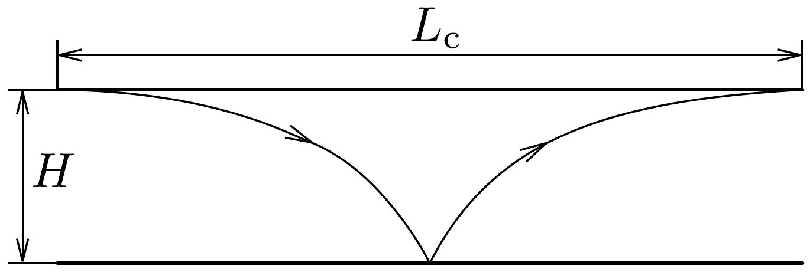

## Megoldás 3

a) A bemenó nyíláson átjutott neutronok vízszintes irányban egyenletes mozgást végeznek, míg függőleges irányban úgy mozognak, mint egy pattogó labda. Azok a neutronok érik el a detektort, melyek kezdeti sebességének $v_{z}$ függőleges komponenséből származó mozgási energiája nem elegendően nagy ahhoz, hogy $H$ magasságba emelkedjenek, és így elérjék az $A$ neutronelnyelő falat.

Tehát az energiamegmaradás törvénye szerint $\frac{1}{2} m v_{z}^{2}+m g z<m g H$, ahonnan a kezdeti sebességre a
\[
-\sqrt{2 g(H-z)}<v_{z}(z)<\sqrt{2 g(H-z)}
\]
egyenlőtlenség adódik.
b) Az üregnek olyan hosszúnak kell lennie, hogy minden, az előző pontban kiszámolt tartományon kívüli kezdeti paraméterekkel érkező neutron elérje a $H$ magasságban elhelyezett abszorbenst. Az abszorbens eléréséig vízszintesen a legnagyobb utat az a neutron teszi meg, amely éppen $H$ magasságban $v_{z}=0$ függőleges kezdősebességgel lép be az üregbe (281. ábra). A $H$ magasságból való esés ideje $\sqrt{\frac{2 H}{g}}$, tehát a keresett minimális hossz:
\[
L_{\mathrm{c}}=2 v_{x} \sqrt{\frac{2 H}{g}}=6,4 \mathrm{~cm} .
\]

c) Ha a $\left(z, v_{z}\right)$ kezdeti értékek az $a$ ) alkérdésnél megadott egyenlőtlenség által megengedett $T$ tartományba esnek, akkor a $z$ és $z+\mathrm{z}$ közé eső magasságban $v_{z}$ és $v_{z}+\mathrm{d} v_{z}$ közé eső kezdeti sebességgel belépő neutronok mind elérik a detektort, és időegységenként $\mathrm{d} N_{\mathrm{kl}}=\varrho \mathrm{d} z \mathrm{~d} v_{z}$ beütést okoznak. Így a detektor által időegységenként észlelt összes beütésszám:
\[
\begin{aligned}
N_{\mathrm{kl}}(H) & =\int_{T} \mathrm{~d} N_{\mathrm{kl}}=\varrho \iint_{\left(z, v_{z}\right) \in T} \mathrm{~d} z \mathrm{~d} v_{z}=\varrho \int_{z=0}^{H} \int_{v_{z}=-\sqrt{2 g(H-z)}}^{\sqrt{2 g(H-z)}} \mathrm{d} v_{z} \mathrm{~d} z= \\
& =2 \varrho \int_{z=0}^{H} \sqrt{2 g(H-z)} \mathrm{d} z=\frac{-2 \varrho}{3 g}\left[(2 g(H-z))^{3 / 2}\right]_{z=0}^{H}=\frac{4 \varrho \sqrt{2 g}}{3} H^{3 / 2}
\end{aligned}
\]
d) A $H$ magasságból eső neutron impulzusának függőleges komponense $z$ magasságban $(0 \leq z \leq H) p_{z}(z)=m \sqrt{2 g(H-z)}$, így egy teljes periódusra (lefelé és fölfelé történő szakaszra) a hatásintegrál:
\[
S(H)=2 \int_{z=0}^{H} p_{z}(z) \mathrm{d} z=\frac{4 m \sqrt{2 g}}{3} H^{\frac{3}{2}} .
\]

A Bohr-Sommerfeld-kvantálás által megengedett $H_{n}$ holtpontmagasságokra, illetve a hozzájuk tartozó $E_{n}=m g H_{n}$ energiaszintekre az $S\left(H_{n}\right)=n h$ feltételből azt kapjuk, hogy
\[
H_{n}=\sqrt[3]{\frac{9 h^{2}}{32 m^{2} g}} \cdot n^{\frac{2}{3}}, \quad \text { illetve } \quad E_{n}=\sqrt[3]{\frac{9 m g^{2} h^{2}}{32}} \cdot n^{\frac{2}{3}}
\]
A számadatokat behelyettesítve az elsó szinthez tartozó numerikus értékek:
\[
H_{1}=16,5 \mu \mathrm{~m}, \quad \text { és } \quad E_{1}=1,69 \mathrm{peV} .
\]

Vegyük észre, hogy $H_{1}$ az üreg $H=50 \mu \mathrm{~m}$ magasságának nagyságrendjébe esik. Ez teszi lehetóvé, hogy a $H$ magasság változtatásával megfigyeljük a kvantáltságot.
$e$ ) A határozatlansági reláció értelmében az energia $\Delta E$ pontosságú mérése, és a $\Delta t$ mérési idő között fennáll, hogy $\Delta E \Delta t \geq \hbar=\frac{h}{2 \pi}$. Esetünkben $\Delta E \approx E_{1}$, így a minimális mérési idő, illetve a minimális üreghossz:
\[
t_{\mathrm{q}} \approx \frac{\hbar}{E_{1}}=0,4 \mathrm{~ms}, \quad \text { illetve } \quad L_{\mathrm{q}} \approx v_{x} \frac{\hbar}{E_{1}}=4 \mathrm{~mm} .
\]

A d) pontban kiszámolt kvantáltság elfogadásával kvalitatív módon értelmezhető a grenoble-i kutatócsoport által mért lépcsős grafikon.

A neutronok mozgása függőlegesen kvantált. Adott $H$ üregmagasságnál csak azokhoz az $E_{n}$ energiákhoz tartozó „csatornák vannak nyitva", melyekre $H_{n}<H$. Speciálisan ha $0<H<H_{1}$, akkor egyetlen neutron sem jut át az üregen, ha $H_{1}<H<H_{2}$, akkor csak az $E_{1}$ energiához tartozó csatorna van nyitva, és így tovább. Ahogy egyre magasabb és magasabb $E_{n}$ energiákhoz tartozó csatornák is kinyílnak, lépcsőzetesen nő az üregen átjutó, és a detektorral észlelt neutronok száma.

\title{
