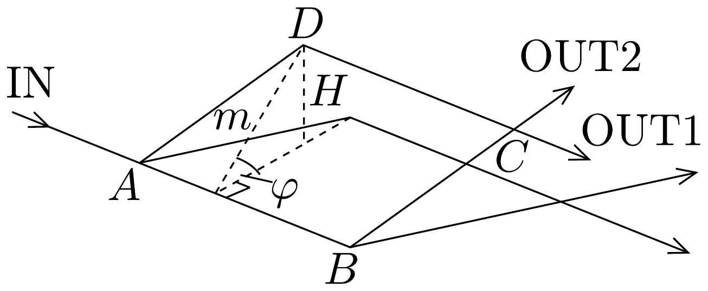

## Megoldás 1

1.1. A 282. ábráról leolvasható, hogy az interferáló nyalábok által határolt rombusz átlói $2 a$, illetve $2 a \operatorname{tg} \vartheta$ hosszúságúak, így a keresett terület $A=2 a^{2} \operatorname{tg} \vartheta$.
1.2. A $2 \vartheta$ szögü rombusz magassága
\[
m=\frac{a}{\cos \vartheta} \sin (2 \vartheta)=2 a \sin \vartheta,
\]
tehát a keresett távolság (286. ábra):
\[
H=m \sin \varphi=2 a \sin \vartheta \sin \varphi .
\]

1.3. A Föld nehézségi erőterében mozgó neutron gravitációs potenciális energiája növekszik, ha a neutron a vízszinteshez képest magasabb helyre kerül. Ennek
következtében mozgási energiája és vele együtt az impulzusa csökken, a hullámhossza tehát megnő. A feladatban közölt adatok szerint az interferáló neutronok tipikus hullámhossza $\lambda \approx 10^{-10} \mathrm{~m}$ nagyságrendű, ez azt jelenti, hogy sebességük
\[
v=\frac{h}{\lambda M} \approx 4 \cdot 10^{3} \frac{\mathrm{~m}}{\mathrm{~s}},
\]
ami jóval kisebb, mint a fénysebesség, tehát nem kell relativisztikus hatásokkal számolnunk.

A 286, ábrán látható, hogy az $A D$, illetve $B C$ ferde szakaszok egymás vízszintes eltoltjai, tehát az optikai úthosszkülönbségbe csak az $L=\frac{a}{\cos \vartheta}$ hosszúságú vízszintes szakaszok adnak járulékot:
\[
\Delta N_{\mathrm{opt}}=\frac{L}{\lambda_{0}}-\frac{L}{\lambda_{1}}=\frac{a}{\lambda_{0} \cos \vartheta}\left(1-\frac{\lambda_{0}}{\lambda_{1}}\right),
\]
ahol $\lambda_{0}$, illetve $\lambda_{1}$ az $A B$, illetve $C D$ szakaszon mérhető hullámhosszt jelöli.
A neutronok impulzusa $\frac{h}{\lambda}$, így az energiamegmaradás törvénye szerint
\[
\frac{1}{2 M}\left(\frac{h}{\lambda_{0}}\right)^{2}=\frac{1}{2 M}\left(\frac{h}{\lambda_{1}}\right)^{2}+M g H,
\]
ahonnan
\[
\frac{\lambda_{0}}{\lambda_{1}}=\sqrt{1-2 \frac{M^{2} g}{h^{2}} \lambda_{0}^{2} H} \approx 1-\frac{M^{2} g}{h^{2}} \lambda_{0}^{2} H .
\]
(A legutolsó közelítésnél felhasználtuk, hogy $\frac{M^{2} g}{h^{2}} \lambda_{0}^{2} H \approx 10^{-7} \ll 1$.)
Így az optikai úthosszkülönbségre azt kapjuk, hogy
\[
\Delta N_{\text {opt }}=\frac{a}{\lambda_{0} \cos \vartheta} \frac{M^{2} g}{h^{2}} \lambda_{0}^{2} H=2 \frac{M^{2} g}{h^{2}} a^{2} \lambda_{0} \operatorname{tg} \vartheta \sin \varphi .
\]
1.4. A fenti eredmény az 1.1. pontban kiszámolt $A$ terület és a $V$ térfogat segítségével az
\[
\Delta N_{\mathrm{opt}}=\frac{\lambda_{0} A}{V} \sin \varphi
\]
alakban írható, ahol $V=1,597 \cdot 10^{-14} \mathrm{~m}^{3}$.
1.5. Intenzitásmaximum esetén az optikai úthosszak különbsége egész szám, $\Delta N_{\text {opt }}=0, \pm 1, \pm 2, \ldots$, míg intenzitásminimum esetén félegész, $\Delta N_{\text {opt }}= \pm \frac{1}{2}, \pm \frac{3}{2}$, $\pm \frac{5}{2}, \ldots$, így a ciklusok keresett $n$ száma:
\[
n=\Delta N_{\text {opt }} \left\lvert\, \begin{aligned}
& 90^{\circ} \\
& \varphi=-90^{\circ}
\end{aligned}=\frac{2 \lambda_{0} A}{V} .\right.
\]
1.6. A megadott $a=3,6 \mathrm{~cm}$ és $\vartheta=22,1^{\circ}$ értékek mellett az interferométer területe $A=10,53 \mathrm{~cm}^{2}$, így a keresett hullámhossz:
\[
\lambda_{0}=\frac{n V}{2 A}=\frac{19 \cdot 1,597 \cdot 10^{-14}}{2 \cdot 1,053 \cdot 10^{-3}} \mathrm{~m}=0,1441 \mathrm{~nm}=1,441 \cdot 10^{-10} \mathrm{~m} .
\]
1.7. Ugyancsak az 1.5. pontban levezetett kifejezés alapján $n=30$ és $\lambda_{0}=$ = 0,2 nm mellett a terület:
\[
A=\frac{n V}{2 \lambda_{0}}=\frac{30 \cdot 1,597 \cdot 10^{-14}}{2 \cdot 2 \cdot 10^{-10}} \mathrm{~m}=11,98 \mathrm{~cm}^{2} .
\]
