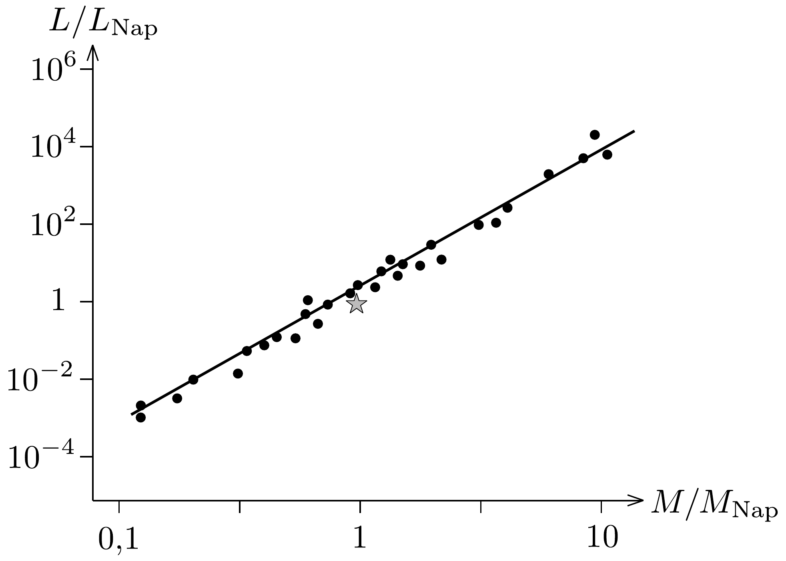

## Megoldás 1

1.1.1. Periódusidő: 3 nap $\approx 2,6 \cdot 10^{5} \mathrm{~s}$. Periódusidő $T=\frac{2 \pi}{\omega}$, innen a szögsebesség: $\omega \approx 2,4 \cdot 10^{-5} \frac{1}{\mathrm{~s}}$.
1.1.2. Nevezzük $\alpha$-nak és $\beta$-nak a 288, ábrán látható minimumokat: $\frac{I_{1}}{I_{0}}=$ $=\alpha=0,90$ és $\frac{I_{2}}{I_{0}}=\beta=0,63$. Amikor a nagyobb csillag eltakarja a kisebbet,
akkor a mért intenzitás $I_{1} \sim R_{1}^{2} T_{1}^{4}$. Ha pedig a kisebb csillag van a nagyobb „előtt", akkor $I_{2} \sim R_{2}^{2} T_{2}^{2}+\left(R_{1}^{2}-R_{2}^{2}\right) T_{1}^{4}$, valamint $I_{0} \sim R_{1}^{2} T_{1}^{4}+R_{2}^{2} T_{2}^{4}$. Ezek segítségével a következő összefüggéseket kapjuk:
\[
\frac{I_{0}}{I_{1}}=1+\left(\frac{R_{2}}{R_{1}}\right)^{2}\left(\frac{T_{2}}{T_{1}}\right)^{4}=\frac{1}{\alpha}, \quad \frac{I_{2}}{I_{1}}=1-\left(\frac{R_{2}}{R_{1}}\right)^{2}\left(1-\left(\frac{T_{2}}{T_{1}}\right)^{4}\right)=\frac{\beta}{\alpha} .
\]
Ezekből az összefüggésekből a kérdéses arányok kiszámíthatóak:
\[
\frac{R_{1}}{R_{2}}=\sqrt{\frac{\alpha}{1-\beta}}=1,6, \quad \frac{T_{1}}{T_{2}}=\sqrt[4]{\frac{1-\beta}{1-\alpha}}=1,4 .
\]
1.2.1. A Doppler-eltolódás alapján: $\frac{\Delta \lambda}{\lambda_{0}} \cong \frac{v}{c}$. A maximális és minimális hullámhosszak: $\lambda_{1, \max }=5897,7 \AA, \lambda_{1, \min }=5894,1 \AA, \lambda_{2, \max }=5899,0 \AA$, $\lambda_{2, \text { min }}=5892,8 \AA$.

A maximális és minimális hullámhosszak különbsége: $\Delta \lambda_{1}=3,6 \AA, \Delta \lambda_{2}=$ $=6,2 \AA$.

Mivel a Doppler-eltolódás formulája a nyugalmi $\lambda_{0}$ hullámhosszhoz képesti hullámhosszváltozást adja meg, ezért a kiszámolt hullámhosszkülönbségből a pályamenti sebességek kétszeresét kapjuk:
\[
v_{1}=c \frac{\Delta \lambda_{1}}{2 \lambda_{0}} \approx 9,2 \cdot 10^{4} \mathrm{~m} / \mathrm{s}, \quad v_{2}=c \frac{\Delta \lambda_{2}}{2 \lambda_{0}} \approx 1,6 \cdot 10^{5} \mathrm{~m} / \mathrm{s} .
\]
1.2.2. Mivel a tömegközéppont nem mozog hozzánk képest:
\[
\frac{M_{1}}{M_{2}}=\frac{v_{2}}{v_{1}} \approx 1,7 .
\]
1.2.3. Felhasználva, hogy $v_{i}=\omega r_{i}(i=1,2)$, kiszámíthatjuk a csillagok pályájának sugarát: $r_{1} \approx 3,8 \cdot 10^{9} \mathrm{~m}$ és $r_{2} \approx 6,7 \cdot 10^{9} \mathrm{~m}$.
1.2.4. $r=r_{1}+r_{2} \approx 1,1 \cdot 10^{10} \mathrm{~m}$.
1.3.1. A gravitációs eró megegyezik a tömeg és a centripetális gyorsulás szorzatával:
\[
G \frac{M_{1} M_{2}}{r^{2}}=M_{1} \frac{v_{1}^{2}}{r_{1}}=M_{2} \frac{v_{2}^{2}}{r_{2}} .
\]
Ennek alapján
\[
M_{1}=\frac{r^{2} v_{2}^{2}}{G r_{2}} \approx 6,9 \cdot 10^{30} \mathrm{~kg}, \quad M_{2}=\frac{r^{2} v_{1}^{2}}{G r_{1}} \approx 4,0 \cdot 10^{30} \mathrm{~kg} .
\]
1.4.1. A 292. ábra alapján elmondható, hogy amíg $M / M_{\text {Nap }}$ nagyjából 10-et változik, addig $L / L_{\text {Nap }}$ kb. $10^{4}$-t változik. Tehát a pontokra illeszthető egyenes meredeksége egy értékes jegy pontossággal $\alpha=4$.

1.4.2. Az előző részfeladat eredménye alapján:
\[
L_{i}=L_{\text {Nap }}\left(\frac{M_{i}}{M_{\mathrm{Nap}}}\right)^{4} .
\]
Így a tömegek ismeretében $L_{1} \approx 5,5 \cdot 10^{28} \mathrm{~W}$ és $L_{2} \approx 6,2 \cdot 10^{27} \mathrm{~W}$.
1.4.3. A rendszer teljes kisugárzott teljesítménye egy $d$ sugarú gömb mentén oszlik el egyenletesen, és hozza létre az észlelhető $I_{0}$ intenzitást:
\[
I_{0}=\frac{L_{1}+L_{2}}{4 \pi d^{2}}, \quad \text { ebből } \quad d=\sqrt{\frac{L_{1}+L_{2}}{4 \pi I_{0}}} \approx 10^{18} \mathrm{~m} \approx 100 \text { fényév. }
\]
1.4.4. $\theta \cong \operatorname{tg} \theta=\frac{r}{d} \approx 10^{-8} \mathrm{rad}$.
1.4.5. Egy tipikus optikai hullámhossz: $\lambda_{0} \cong 500 \mathrm{~nm}$. Mivel egy távcsó szögfelbontása $\theta \sim \lambda_{0} / D$, innen $D \gtrsim \frac{d \lambda_{0}}{r} \approx 50 \mathrm{~m}$.
