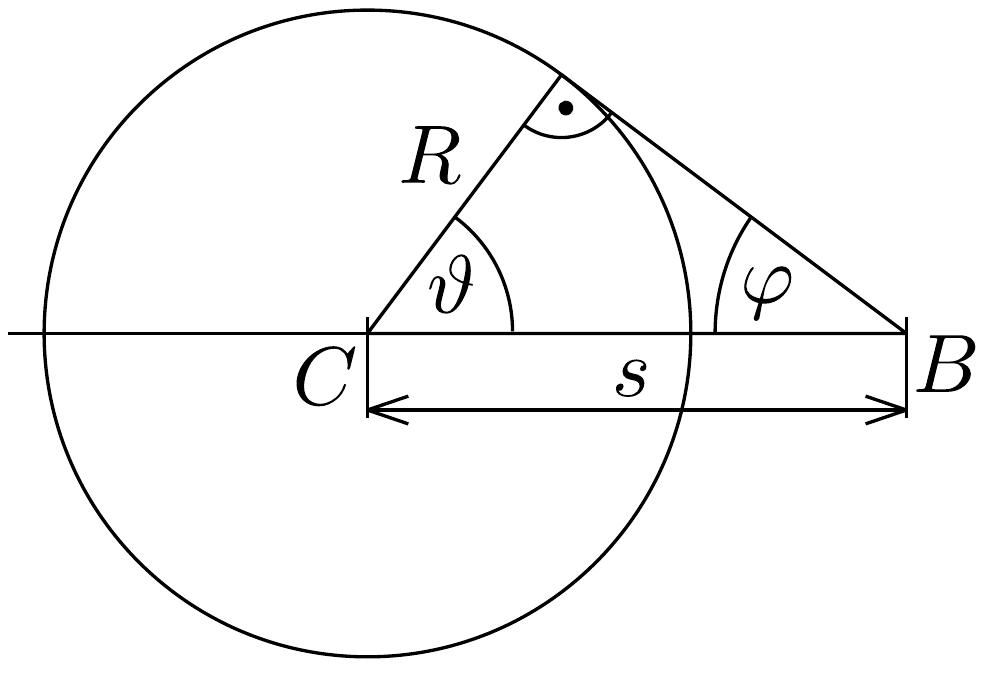
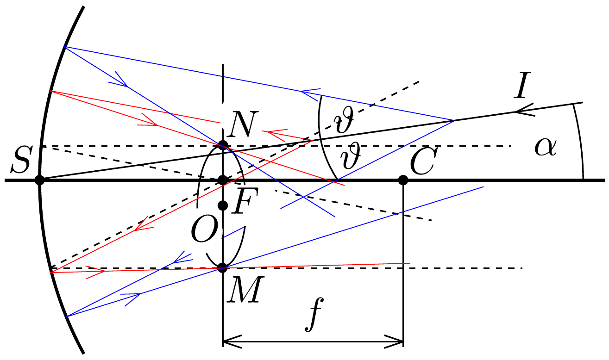
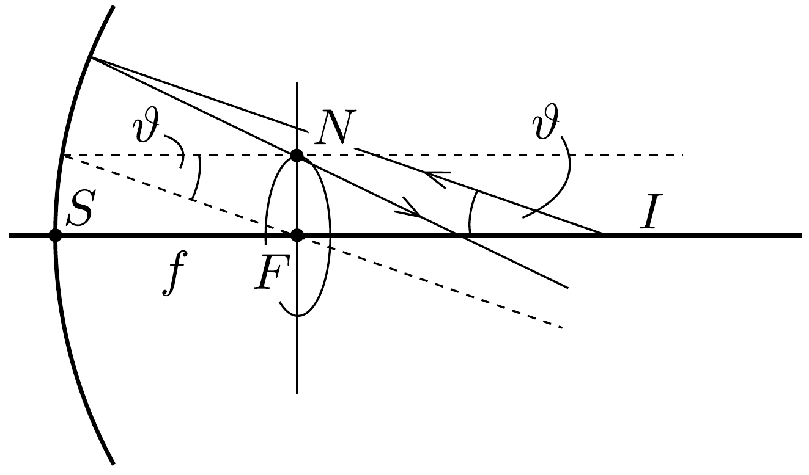

## Megoldás 2

2.1.1. és 2.1.2. Mialatt a részecske $t$ idő alatt a $C$ pontból $s=v t=\beta c t$ utat megtéve a $B$ pontba ér, a $C$ pontban kibocsátott fény egy $R=\frac{c}{n} t$ sugarú gömböt ér el (303. ábra). Így a hullámfront a $B$-ből a gömbhöz húzott érintőkúp, amely

\[
\varphi=\arcsin \frac{R}{s}=\arcsin \frac{1}{\beta n}
\]
szöget zár be a részecske pályájával.
2.2. Adott irányból párhuzamosan érkezó fénysugarakat a homorú gömbtükör a fókuszsíkba képezi le. A 304. ábrán szaggatottan jelölt, a fókuszponton átmenő, a kékkel és pirossal jelölt beeső sugárzások irányával párhuzamos nyalábok az optikai tengellyel párhuzamósan verődnek vissza. Ezen segédsugarakkal a fókuszsíkban kimetszhetjük az $N$ és $M$ pontokat. Mivel a sugárzás egy kúpfelületen terjed, ezért a fókuszsíkban forgásszimmetrikusan elhelyezkedő pontokban, azaz egy gyűrú mentén keletkezik a kép. A gyürú középpontját az $O$ pont jelöli. A $C O$ egyenes párhuzamos az $I S$ egyenessel, így $O F \approx f \cdot \alpha$.

A gyürú sugarát meghatározhatjuk pl. úgy, hogy gondolatban az $I S$ részecskepályát beforgatjuk az optikai tengelybe (305, ábra). Ekkor az $O$ pont egybeesik az $F$ ponttal, és a fókuszponton áthaladó segédsugárral $r \approx f \cdot \vartheta$.

2.3.1. A relativisztikus impulzus kifejezéséből a sebesség:
\[
p=\frac{m v}{\sqrt{1-\frac{v^{2}}{c^{2}}}} \rightarrow \beta=\frac{1}{\sqrt{1+\left(\frac{m c^{2}}{p c}\right)^{2}}} .
\]
A Cserenkov-sugárzás létrejöttéhez $v>c / n$ kell hogy teljesüljön. Innen
\[
n_{\min }=\frac{1}{\beta}=\sqrt{1+\left(\frac{m c^{2}}{p c}\right)^{2}} .
\]

Mivel a megadott adatok alapján mindhárom részecskére $m c^{2} /(p c) \ll 1$,
\[
n_{\min } \approx 1+\frac{1}{2}\left(\frac{m c^{2}}{p c}\right)^{2} .
\]
A feladatban megadott összefüggés szerint:
\[
P_{\min }=\frac{1}{2 a} \cdot\left(\frac{m c^{2}}{p c}\right)^{2},
\]
ahonnan az egyes részecskékre a számszerú eredmények:
\[
P_{\min , \text { proton }}=16 \mathrm{~atm}, \quad P_{\min , \text { kaon }}=4,6 \mathrm{~atm}, \quad P_{\min , \text { pion }}=0,36 \mathrm{~atm} .
\]
2.3.2. A gyúrúk sugara $r=f \vartheta$, ahol $\cos \vartheta=\frac{1}{n \beta}$. Most azt az $n_{1 / 2}$ törésmutatót keressük, amely mellett $2 r_{\kappa}=r_{\pi}$, azaz $2 \vartheta_{\kappa}=\vartheta_{\pi}$. Ezek felhasználásával
\[
\frac{1}{n_{1 / 2} \cdot \beta_{\pi}}=\cos \vartheta_{\pi}=\cos \left(2 \vartheta_{\kappa}\right)=2 \cos ^{2} \vartheta_{\kappa}-1=\frac{2}{n_{1 / 2}^{2} \cdot \beta_{\kappa}^{2}}-1 .
\]
Az egyenlőségsor első és utolsó eleme a
\[
\beta_{\pi} \beta_{\kappa}^{2} n_{1 / 2}^{2}+\beta_{\kappa}^{2} n_{1 / 2}-2 \beta_{\pi}=0
\]
másodfokú egyenletet adja a keresett $n_{1 / 2}$ törésmutatóra, mely egyszerúen linearizálható, ha észrevesszük, hogy mind $n_{1 / 2}$, mind $\beta_{\pi}$ és $\beta_{\kappa}$ nagyon kicsit tér el 1-től:
\[
\beta \approx 1-\frac{1}{2}\left(\frac{m c^{2}}{p c}\right)^{2}=1-\delta \quad \text { és } \quad n_{1 / 2}=1+\varepsilon,
\]
ahol
\[
\delta_{\mathrm{p}}=4,42 \cdot 10^{-3}, \quad \delta_{\kappa}=1,25 \cdot 10^{-3}, \quad \delta_{\pi}=9,8 \cdot 10^{-5} .
\]
A közelítéseket beírva az $n_{1 / 2}$-re kapott egyenletbe, és a másodrendú, illetve annál magasabb rendú tagokat elhanyagolva:
\[
\varepsilon=\frac{4 \delta_{\kappa}-\delta_{\pi}}{3}=1,63 \cdot 10^{-3} \quad \text { és } \quad P_{1 / 2}=\frac{\varepsilon}{a}=6,05 \mathrm{~atm} .
\]
Ezen a nyomáson a protonok nem keltenek Cserenkov-sugárzást. A törésmutató ismeretében meghatározható a kaonok és pionok által keltett sugárzási kúp félnyílásszöge:
\[
\cos \vartheta_{\kappa}=\frac{1}{n_{1 / 2} \cdot \beta_{\kappa}} \approx \frac{1}{1+\varepsilon} \cdot \frac{1}{1-\delta_{\kappa}} \approx(1-\varepsilon)\left(1+\delta_{\kappa}\right) \approx 1+\delta_{\kappa}-\varepsilon,
\]
ahonnan $\vartheta_{\kappa} \approx 1,7^{\circ}$ és $\vartheta_{\pi}=2 \vartheta_{\kappa} \approx 3,4^{\circ}$.
2.4.1. A $\vartheta$ félnyílásszög a $p$ impulzus függvényében (08-6) szerint:
\[
\cos \vartheta=\frac{1}{\beta n}=\frac{1}{n} \sqrt{1+\left(\frac{m c^{2}}{p c}\right)^{2}} \approx \frac{1}{n}\left[1+\frac{1}{2}\left(\frac{m c^{2}}{p c}\right)^{2}\right],
\]
ahonnan $(\sin \vartheta \approx \vartheta$ és $n \approx 1)$
\[
\frac{\mathrm{d} \vartheta}{\mathrm{~d} p} \approx \frac{\left(m c^{2}\right)^{2} c}{\vartheta \cdot(p c)^{3}} .
\]
Behelyettesítve az adatokat, illetve felhasználva $\vartheta_{\kappa}$ és $\vartheta_{\pi} P_{1 / 2}$ esetén meghatározott értékeit:
\[
\frac{\mathrm{d} \vartheta_{\kappa}}{\mathrm{d} p} \approx 8,4 \cdot 10^{-3} \frac{c}{\mathrm{GeV}}, \quad \frac{\mathrm{~d} \vartheta_{\pi}}{\mathrm{d} p} \approx 3,3 \cdot 10^{-4} \frac{c}{\mathrm{GeV}} .
\]
2.4.2. A megadott feltételből az impulzus bizonytalansága:
\[
\vartheta_{\pi}-\vartheta_{\kappa}>10\left(\frac{\mathrm{~d} \vartheta_{\kappa}}{\mathrm{d} p}+\frac{\mathrm{d} \vartheta_{\pi}}{\mathrm{d} p}\right) \cdot \Delta p \rightarrow \Delta p<0,3 \frac{\mathrm{GeV}}{c} .
\]
2.5.1. Adott $n$ törésmutatójú közegben Cserenkov-sugárzás a $v_{\min }=c / n$ sebesség fölött észlelhető. Ennél a sebességnél a mozgási energia:
\[
T_{\min }=\frac{m c^{2}}{\sqrt{1-\frac{v_{\min }^{2}}{c^{2}}}}-m c^{2}=m c^{2}\left(\frac{n}{\sqrt{n^{2}-1}}-1\right) \approx 0,52 \cdot m c^{2} .
\]
2.5.2. Az $\alpha$-részecskékre, illetve elektronokra ezek az értékek
\[
T_{\alpha} \approx 1,96 \mathrm{GeV}, \quad T_{\beta} \approx 0,26 \mathrm{MeV},
\]
ami azt jelenti, hogy elektronok hozták létre a Cserenkov által észlelt sugárzást.
2.6.1. $P$ nyomáson $\varepsilon=n-1=a P$, tehát a látható tartomány két végpontjához tartozó törésmutatók eltérése $\Delta n=0,02(n-1)=0,02 \cdot a P=3,24 \cdot 10^{-5}$.

Mivel $\cos \vartheta=1 /(n \beta)$, ahol $\beta=1-\delta$, így deriválva $n$ szerint
\[
\frac{\mathrm{d} \vartheta}{\mathrm{~d} n}=\frac{1}{\beta \vartheta n^{2}},
\]
tehát pionra a szögeltérés (a megadott nyomás $P_{1 / 2}$-nek felel meg):
\[
\Delta \vartheta_{\pi}=\frac{1}{\left(1-\delta_{\pi}\right) \cdot \vartheta_{\pi} n^{2}} \Delta n \approx \frac{\Delta n}{\vartheta_{\pi}}=0,03^{\circ} .
\]
2.6.2.1. A diszperzió miatti kiszélesedés félértékszélessége $\frac{\Delta \vartheta_{\pi}}{2} \approx 0,015^{\circ}$. A 2.4.1. rész eredménye alapján az impulzusinhomogenitás miatti kiszélesedés
\[
\Delta \vartheta_{\pi}^{\prime}=\frac{\mathrm{d} \vartheta_{\pi}}{\mathrm{d} p} \cdot \Delta p \approx 0,006^{\circ},
\]
ami nagyjából háromszor kisebb a diszperzióhoz tartozó kiszélesedésnél.
2.6.2.2. Kisebb hullámhosszon a törésmutató nagyobb, tehát a Cserenkov-kúp nyílásszöge szélesebb, így a gyűrú sugara nagyobb. Ez azt jelenti, hogy a gyürú színe kívül kékes, középen fehér, belül pedig vöröses.
