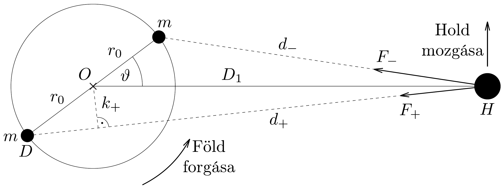

## Megoldás 1

1.1.1.-1.1.3. A Föld-Hold rendszer teljes impulzusmomentuma a Föld forgásából és a Hold keringéséből származó két tag összege. Kezdetben az impulzusmomentum $L_{1}=\Theta_{\mathrm{F}} \omega_{\mathrm{F} 1}+\Theta_{\mathrm{H} 1} \omega_{\mathrm{H} 1}$, a folyamat végén pedig, amikor a Föld forgásának és a Hold keringésének szögsebessége megegyezik, $L_{2}=\Theta_{\mathrm{F}} \omega_{2}+\Theta_{\mathrm{H} 2} \omega_{2}$. Az impulzusmomentum-megmaradás értelmében $L_{1}=L_{2}$, és $L_{2}$-ben a Föld impulzusmomentumát elhanyagolva azt kapjuk, hogy
\[
L_{1}=\Theta_{\mathrm{F}} \omega_{\mathrm{F} 1}+\Theta_{\mathrm{H} 1} \omega_{\mathrm{H} 1}=\Theta_{\mathrm{H} 2} \omega_{2} .
\]
1.2.1-1.2.3. Feltételezve, hogy a Hold a végső helyzetben is körpályán kering a Föld körül, mozgásegyenlete ( $M_{\mathrm{H}}$ a Hold tömege)
\[
G \frac{M_{\mathrm{F}} M_{\mathrm{H}}}{D_{2}^{2}}=M_{\mathrm{H}} \omega_{2}^{2} D_{2} \rightarrow \omega_{2}^{2} D_{2}^{3}=G M_{\mathrm{F}} .
\]

Felhasználva az $L_{1}$-re kapott (09-1) összefüggést, valamint hogy $\Theta_{\mathrm{H} 2}=M_{\mathrm{H}} D_{2}^{2}$, a végső pályasugarat és szögsebességet könnyen kifejezhetjük a kért mennyiségekkel:
\[
D_{2}=\frac{L_{1}^{2}}{G M_{\mathrm{F}} M_{\mathrm{H}}^{2}}, \quad \omega_{2}=\frac{G^{2} M_{\mathrm{F}}^{2} M_{\mathrm{H}}^{3}}{L_{1}^{3}} .
\]
1.2.4-1.2.5. Az $R$ sugarú, $M$ tömegü homogén gömb tehetetlenségi nyomatéka $\frac{2}{5} M R^{2}$. Ennek felhasználásával, a feladatban leírt modell alapján a Föld tehetetlenségi nyomatéka
\[
\Theta_{\mathrm{F}}=\frac{2}{5} \frac{4 \pi}{3}\left(r_{1}^{5} \varrho_{1}+\left(r_{0}^{5}-r_{1}^{5}\right) \varrho_{0}\right)=8,0 \cdot 10^{37} \mathrm{~kg} \mathrm{~m}^{2} .
\]
Az elsó tag az $r_{1}$ sugarú, $\varrho_{1}$ sürúségú belső mag járuléka, míg a második tag az $r_{0}$ külső sugarú, $\varrho_{0}$ súrúségú külső köpeny járuléka.
1.2.6-1.2.8. A feladatban megadott adatokat a már felírt (09-1) és (09-2) formulákba behelyettesítve a keresett számértékek könnyen meghatározhatók:
\[
\begin{gathered}
L_{1}=3,4 \cdot 10^{34} \frac{\mathrm{~kg} \mathrm{~m}^{2}}{\mathrm{~s}}, \\
D_{2}=5,4 \cdot 10^{8} \mathrm{~m}=1,4 D_{1}, \\
\omega_{2}=1,6 \cdot 10^{-6} \frac{1}{\mathrm{~s}}, \quad \text { így a periódusidő } 46 \text { nap. }
\end{gathered}
\]
1.2.9. A végső helyzetben a Föld impulzusmomentuma $\Theta_{\mathrm{F}} \omega_{2}=1,3 \cdot 10^{32} \frac{\mathrm{kgm}^{2}}{\mathrm{~s}}$, míg a Holdé $\Theta_{\mathrm{H} 2} \omega_{2}=3,4 \cdot 10^{34} \frac{\mathrm{~kg} \mathrm{~m}^{2}}{\mathrm{~s}}$, ami nagyjából 260-szorosa a Földének, tehát a számolás elején tett elhanyagolás valóban jogos volt.
1.3. A Földön lévő vízréteg szabad felszíne állandó gravitációs potenciálú felületen helyezkedik el. Ha csak a Föld gravitációs terét vennénk figyelembe, akkor az ekvipotenciális felületek koncentrikus gömbök lennének. A Hold gravitációs terének hatására e gömbök deformálódnak; a Föld Hold felé eső, és azzal átellenesen elhelyezkedő pontjukban „kitüremkedések” jönnek létre. (Ezeknek a kitüremkedéseknek a forgó Földhöz képesti mozgását érzékeljük árapályként.) A Föld forgása miatt a kitüremkedések kicsiny $\vartheta>0$ szöggel kifordulnak a Föld-Hold egyenesből. A feladat szerinti modellben a kitüremkedéseket két $m$ tömegü tömegponttal helyettesítjük, melyek a Föld felszínének átellenes pontjaiban helyezkednek el, ahogy a 316, ábrán látható.

Mivel $\vartheta>0$, a két égitest forgatónyomatékot fejt ki egymásra, mely a Föld forgását lassítja, a Hold pályamenti impulzusmomentumát pedig növeli.
1.3.1-1.3.6. Az egyszerú modell alapján könnyen kiszámolhatjuk a két tömegpont Holdra ható forgatónyomatékát.

A koszinusztétel alapján a tömegpontok távolsága a Holdtól
\[
d_{ \pm}^{2}=D_{1}^{2}+r_{0}^{2} \pm 2 D_{1} r_{0} \cos \vartheta,
\]

tehát a tömegpontok és a Hold közötti gravitációs erő
\[
F_{ \pm}=\frac{G m M_{\mathrm{H}}}{d_{ \pm}^{2}} .
\]
Az $O D H$ háromszög területét kétféleképpen felírva $\frac{1}{2} r_{0} D_{1} \sin \vartheta=\frac{1}{2} k_{+} d_{+}$, ahonnan az $F_{+}$eróhöz tartozó erókar
\[
k_{+}=\frac{r_{0} D_{1} \sin \vartheta}{d_{+}} .
\]
Hasonló formula kapható a másik erőkarra is, így a két tömegpont által kifejtett forgatónyomaték:
\[
\tau_{ \pm}=F_{ \pm} k_{ \pm}=\frac{G m M_{\mathrm{H}} r_{0} D_{1} \sin \vartheta}{\left(D_{1}^{2}+r_{0}^{2} \pm 2 D_{1} r_{0} \cos \vartheta\right)^{\frac{3}{2}}} .
\]

Egyszerúsítsünk $D_{1}^{3}$-bel és alkalmazzuk az $(1+x)^{a} \approx 1+a x$ közelítő formulát, mely $x \ll 1$ esetén érvényes, figyelembe véve, hogy esetünkben $\frac{r_{0}}{D_{1}} \ll 1$.
\[
\begin{aligned}
\tau_{ \pm} & =\frac{G m M_{\mathrm{H}} r_{0} \sin \vartheta}{D_{1}^{2}}\left(1+\frac{r_{0}^{2}}{D_{1}^{2}} \pm 2 \frac{r_{0}}{D_{1}} \cos \vartheta\right)^{-\frac{3}{2}} \approx \\
& \approx \frac{G m M_{\mathrm{H}} r_{0} \sin \vartheta}{D_{1}^{2}}\left(1-\frac{3}{2} \frac{r_{0}^{2}}{D_{1}^{2}} \mp 3 \frac{r_{0}}{D_{1}} \cos \vartheta\right) .
\end{aligned}
\]

A fenti közelítéssel élve a Holdra ható, a keringését gyorsító eredő forgatónyomaték:
\[
\tau=\tau_{-}-\tau_{+} \approx \frac{6 G m M_{\mathrm{H}} r_{0}^{2} \sin \vartheta \cos \vartheta}{D_{1}^{3}}=4,1 \cdot 10^{16} \mathrm{Nm} .
\]
1.3.7.-1.3.8. A Föld körül körpályán keringő Hold mozgásegyenlete
\[
\frac{G M_{\mathrm{F}} M_{\mathrm{H}}}{D^{2}}=M_{\mathrm{H}} D \omega_{\mathrm{H}}^{2},
\]
ahonnan a Hold szögsebessége $\omega_{\mathrm{H}}=\sqrt{\frac{G M_{\mathrm{F}}}{D^{3}}}$. Ennek felhasználásával a Hold impulzusmomentuma a keringési sugárral kifejezve:
\[
L_{\mathrm{H}}=\Theta_{\mathrm{H}} \omega_{\mathrm{H}}=M_{\mathrm{H}} D^{2} \omega_{\mathrm{H}}=M_{\mathrm{H}} \sqrt{D G M_{\mathrm{F}}} .
\]
Ez az összefüggés fönnáll az impulzusmomentum és a pályasugár jelenlegi $L_{\mathrm{H} 1}$ és $D_{1}$ értéke mellett is, és $\Delta t$ idővel később is, amikor az impulzusmomentum értéke a $\tau$ forgatónyomaték hatására $L_{\mathrm{H} 1}+\tau \Delta t$ lesz, a Hold pályasugara pedig $D_{1}+\Delta D$-re nő. Mivel
\[
\sqrt{D+\Delta D} \approx \sqrt{D}+\frac{\Delta D}{2 \sqrt{D}}
\]
azért a (09-4) összefüggésben a két oldal megváltozására azt kapjuk, hogy
\[
\Delta L_{\mathrm{H} 1}=\tau \Delta t=\frac{M_{\mathrm{H}}}{2} \sqrt{\frac{G M_{\mathrm{F}}}{D_{1}}} \Delta D .
\]
Innen $\Delta D$-t kifejezve, és $\Delta t=1$ év $=3,1 \cdot 10^{7} \mathrm{~s}$ értékkel számolva a Hold jelenlegi éves távolodására azt kapjuk, hogy
\[
\Delta D_{1}=\frac{2 \tau \Delta t}{M_{\mathrm{H}}} \sqrt{\frac{D_{1}}{G M_{\mathrm{F}}}}=0,034 \mathrm{~m}=3,4 \mathrm{~cm} .
\]

A (09-3) formulával megadott $\tau$ forgatónyomaték csökkenti a Föld impulzusmomentumát, $\Delta L_{\mathrm{F}}=-\tau \Delta t=\Theta_{\mathrm{F}} \Delta \omega_{\mathrm{F}}$, ahonnan $\Delta t=1$ év alatt a jelenlegi szögsebesség-változás:
\[
\Delta \omega_{\mathrm{F} 1}=-\frac{\tau \Delta t}{\Theta_{\mathrm{F}}}=-1,9 \cdot 10^{-14} \frac{1}{\mathrm{~s}} .
\]
Mivel a periódusidő $T_{\mathrm{F} 1}=\frac{2 \pi}{\omega_{\mathrm{F} 1}}$, a nap hossza egy év alatt
\[
\Delta T_{\mathrm{F} 1}=2 \pi\left(\frac{1}{\omega_{\mathrm{F} 1}+\Delta \omega_{\mathrm{F} 1}}-\frac{1}{\omega_{\mathrm{F} 1}}\right) \approx-\frac{2 \pi}{\omega_{\mathrm{F} 1}^{2}} \Delta \omega_{\mathrm{F} 1}=2,2 \cdot 10^{-5} \mathrm{~s}
\]
értékkel nő.
1.4.1.-1.4.2. Az előző részfeladatban láttuk, hogy a körpályán keringő Hold szögsebessége
\[
\omega_{\mathrm{H} 1}=\sqrt{\frac{G M_{\mathrm{F}}}{D_{1}^{3}}} .
\]

Ezt és a $\Theta_{\mathrm{H} 1}=M_{\mathrm{H}} \omega_{\mathrm{H} 1}^{2}$ felhasználva a Föld-Hold rendszer mechanikai energiája jelenleg:
\[
E=\frac{\Theta_{\mathrm{F}} \omega_{\mathrm{F} 1}^{2}}{2}+\frac{\Theta_{\mathrm{H} 1} \omega_{\mathrm{H} 1}^{2}}{2}-\frac{G M_{\mathrm{F}} M_{\mathrm{H}}}{D_{1}}=\frac{\Theta_{\mathrm{F}} \omega_{\mathrm{F} 1}^{2}}{2}-\frac{G M_{\mathrm{F}} M_{\mathrm{H}}}{2 D_{1}} .
\]
Figyelembe véve, hogy
\[
\Delta\left(\omega^{2}\right)=(\omega+\Delta \omega)^{2}-\omega^{2} \approx 2 \omega \Delta \omega \quad \text { és } \quad \Delta\left(\frac{1}{D}\right)=\frac{1}{D+\Delta D}-\frac{1}{D} \approx-\frac{\Delta D}{D^{2}},
\]
valamint felhasználva a (09-5) és a (09-6) eredményeket, az egy év alatt bekövetkező energiaváltozás:
\[
\Delta E=\Theta_{\mathrm{F}} \omega_{\mathrm{F} 1} \Delta \omega_{\mathrm{F} 1}+\frac{G M_{\mathrm{F}} M_{\mathrm{H}}}{2 D_{1}^{2}} \Delta D_{1}=-1,1 \cdot 10^{20} \mathrm{~J} .
\]
1.4.3.-1.4.4. A Föld teljes felszínét $h=0,5 \mathrm{~m}$ vastagon beborító vízréteg tömege:
\[
M_{\text {víz }}=\varrho_{\text {víz }} \cdot 4 \pi r_{0}^{2} h=2,6 \cdot 10^{17} \mathrm{~kg} .
\]
A víz viszkozitása miatt az egy év alatt disszipálódott energia:
\[
\Delta E_{\mathrm{víz}}=-M_{\mathrm{víz}} g h \cdot 2 \cdot 365 \cdot 0,1=-9,3 \cdot 10^{19} \mathrm{~J},
\]
ami nagyságrendben jól egyezik az előző részben kapott energiacsökkenéssel.
