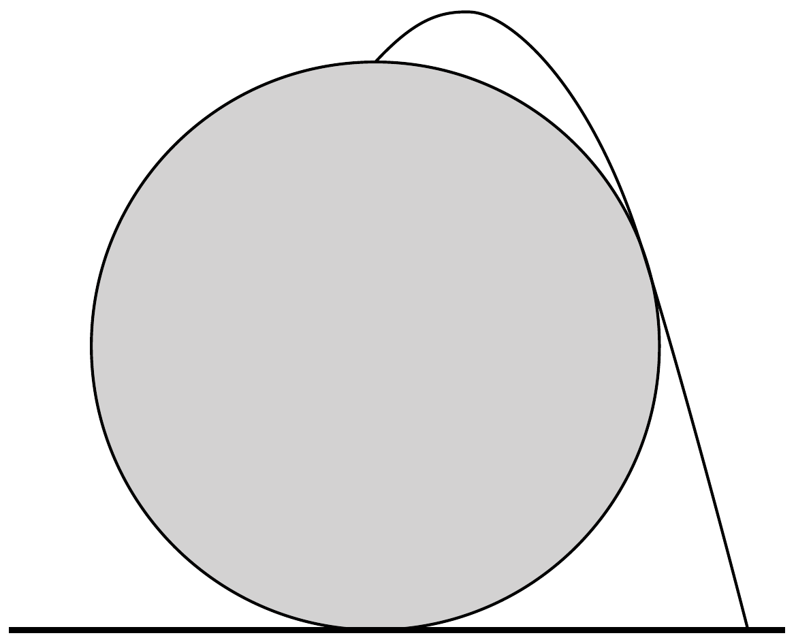
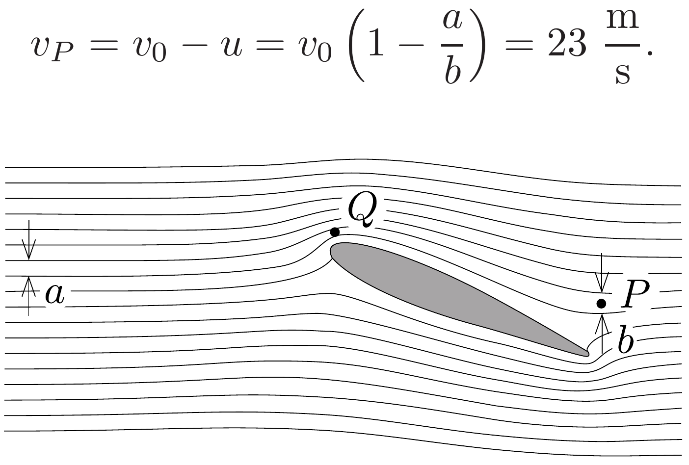
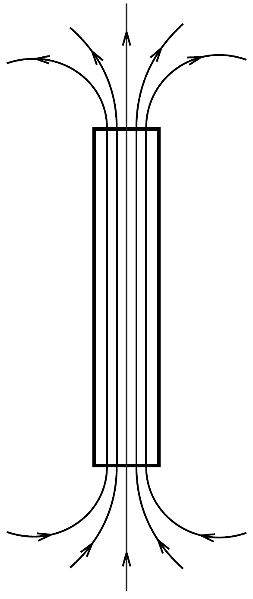

## Megoldás 1

1.A.1. Ha a golyót függőlegesen felfelé dobjuk, akkor - a mechanikai energia megmaradása alapján - eléri az $x=0, z=\frac{v_{0}^{2}}{2 g}$ pontot. Ezt összehasonlítva a $z \leq$ $\leq z_{0}-k x^{2}$ egyenlőtlenséggel, a
\[
z_{0}=\frac{v_{0}^{2}}{2 g}
\]
adódik. A $k$ állandó meghatározásához vizsgáljuk a $z \rightarrow-\infty$ határesetet! Ebben a határesetben a golyó akkor jut (adott $z$ érték esetén) vízszintes irányban
a legmesszebbre, ha a parabolapálya a leglaposabb, azaz ha a golyót vízszintesen hajítjuk el. Ekkor
\[
z=-\frac{g}{2 v_{0}^{2}} x^{2}
\]
Ezt beírva a megadott, most $x \rightarrow \infty$ határesetben vizsgált egyenlőtlenségbe
\[
-\frac{g}{2 v_{0}^{2}} x^{2} \leq z_{0}-k x^{2}, \quad \text { azaz } \quad k-\frac{g}{2 v_{0}^{2}} \leq \frac{z_{0}}{x^{2}} \rightarrow 0 .
\]
Innen $k \leq \frac{g}{2 v_{0}^{2}}$. Ha $k<\frac{g}{2 v_{0}^{2}}$ teljesülne, akkor (nagy $x$-re) a vízszintesen eldobott golyó által leírt pálya és a megadott egyenlőtlenség által meghatározott parabola között egy „rés" lenne, vagyis ha ábrázoljuk a $z=-g /\left(2 v_{0}^{2}\right) x^{2}$ és a $v_{0}^{2} /(2 g)-k x^{2}$ parabolákat, akkor $k<g /\left(2 v_{0}^{2}\right)$ esetén növekvő $x$-re a második parabola „elmászik" a vízszintes hajítás parabolájától. Viszont a $z \rightarrow-\infty$ határesetben a vízszintesen eldobott test pályája az optimális, azaz ekkor érhetjük el a legtávolabbi $x$ helyeket. Tehát csakis az egyenlőség állhat fenn:
\[
k=\frac{g}{2 v_{0}^{2}} .
\]

Megjegyzés: Bár a feladat nem kérte, de ha a fenti egyenlőtlenséget akarjuk belátni, akkor a kérdéses paramétereket közvetlenül megkaphatjuk. Az origóból $\alpha$ szög alatt elhajított test függőleges és vízszintes helykoordinátái:
\[
\begin{gathered}
x=v_{0} \cos \alpha t, \\
z=v_{0} \sin \alpha t-\frac{g}{2} t^{2} .
\end{gathered}
\]
A $t$ idő kiküszöbölésével, valamint kihasználva, hogy $1 / \cos ^{2} \alpha=1+\operatorname{tg}^{2} \alpha$, a következő egyenletet kapjuk:
\[
\frac{g x^{2}}{2 v_{0}^{2}} \operatorname{tg}^{2} \alpha-x \operatorname{tg} \alpha+\left(z+\frac{g x^{2}}{2 v_{0}^{2}}\right)=0 .
\]
Ha egy $(x, z)$ hely elérhetó a hajítás során, akkor ennek az egyenletnek $\operatorname{tg} \alpha$-ra létezik megoldása. Ha elérhetetlen koordinátájú pontot helyettesítünk, be akkor nem kapunk megoldást, azaz nincs olyan hajítási szög, amivel ezt a pontot elérjük. Mivel az egyenlet $\operatorname{tg} \alpha$-ban másodfokú, ezért akkor kapunk megoldást, ha a diszkriminánsa nemnegatív:
\[
D=x^{2}-\frac{2 g x^{2}}{v_{0}^{2}}\left(z+\frac{g x^{2}}{2 v_{0}^{2}}\right) \geq 0,
\]
ahonnan megkapjuk a feladat által megadott egyenlőtlenséget, amiből a paraméterek leolvashatók:
\[
z \leq \frac{v_{0}^{2}}{2 g}-\frac{g x^{2}}{2 v_{0}^{2}} .
\]
1.A.2. A golyó pályája megfordítható, így az eredeti kérdés helyett vizsgálhatjuk ezt is: legalább mekkora sebességgel kell az épület tetejéről eldobni a golyót, hogy valahol földet érjen (anélkül, hogy az épületnek ütközne). Könnyen belátható, hogy a golyó pályája vagy a 342. ábrán látható, az épületet érintő parabola,

vagy pedig egy olyan vízszintes hajítás, ahol a parabola görbülete a csúcspontjában megegyezik a gömb sugarával. (Ha a golyó sehol nem érinti a parabolát, akkor csökkenthető a sebessége, egész addig, amíg valahol érinteni fogja.)

Vizsgáljuk meg a vízszintes hajítást! Ha változatlan sebességgel, de a vízszinteshez képest kis szöggel felfelé dobnánk a golyót, akkor sehol sem érintené az épületet - így viszont kezdeti sebessége csökkenthető lenne! Ebből következik, hogy a vízszintes hajítás nem lehet ideális, így a helyes megoldás a 342 ábrán látható pálya.
1.A.3. A nyers eró módszerével úgy tudnánk eljárni, hogy felírjuk annak a feltételét, hogy az optimális pálya két helyen metszi, egy ponton pedig érinti az épületet. Azonban így egy negyedfokú egyenletet kapunk, aminek a megoldása nem egyszerú.

Vegyük észre, hogy az egész épületnek benne kell lenni abban a tartományban, amit az épület tetejéről induló, minimális sebességű hajításokkal el tudnánk találni. (Hiszen ha az optimálishoz képest csökkentjük az eldobás vízszintessel bezárt szögét, akkor a golyó nem érinti, hanem eltalálja az épületet.) Ugyanakkor a dobással elérhető tartomány határának érinteni kell az épületet. (Ellenkező esetben az optimális sebességgel lehetne úgy hajítani, hogy az nem érinti az épületet.)

Tehát a minimális sebességgel eldobott golyóval elérhető tartomány határa és az épület felszíne érinti egymást (a szimmetria miatt két pontban). Ha a minimális indítási sebesség a gömb tetejéről $v_{0}$, akkor a következő egyenletrendszert kapjuk:
\[
x^{2}+z^{2}+2 z R=0, \quad z=\frac{v_{0}^{2}}{2 g}-\frac{g x^{2}}{2 v_{0}^{2}} .
\]
$z$ kiküszöbölésével $x^{2}$-re a következő másodfokú egyenlet adódik:
\[
\left(\frac{g}{2 v_{0}^{2}}\right)^{2} x^{4}+\left(\frac{1}{2}-\frac{g R}{v_{0}^{2}}\right) x^{2}+\left(\frac{v_{0}^{2}}{4 g}+R\right) \frac{v_{0}^{2}}{g}=0 .
\]
A két görbe akkor érinti egymást, amikor az egyenlet diszkriminánsa éppen 0.

Ebből
\[
\left(\frac{1}{2}-\frac{g R}{v_{0}^{2}}\right)^{2}=\frac{1}{4}+\frac{g R}{v_{0}^{2}}, \quad \text { azaz } \quad v_{0}^{2}=\frac{g R}{2} .
\]
A mechanikai energia megmaradása alapján a keresett minimális indítási sebesség
\[
v_{\min }=\sqrt{v_{0}^{2}+4 g R}=3 \sqrt{\frac{g R}{2}} .
\]
1.B.1. A szárnyhoz rögzített vonatkoztatási rendszerben a kontinuitási törvény miatt két áramvonal között (egy áramlási vonal mentén) állandó a levegő térfogatárama (az időegységenként átáramló levegő mennyisége). A térfogatáram a sebesség és a keresztmetszet szorzata. A keresztmetszet viszont esetünkben - a kétdimenziós geometria miatt - arányos az áramvonalak távolságával, ami a 343. ábráról leolvasható. Mivel nincsen szél, a nyugalomban lévő levegő sebessége a szárnyhoz viszonyítva éppen $v_{0}$. Az ábrán megmérve $a=10$ egység és $b=13$ egység. Ez alapján a levegő sebessége a $P$ pontban a szárnyhoz képest $u=v_{0} \frac{a}{b}$, a földhöz képest pedig

1.B.2. Bár az $\frac{1}{2} \rho v^{2}$ dinamikus nyomás aránylag kicsi, változása bizonyos mértékú adiabatikus összenyomódást vagy kitágulást eredményez. Ott, ahol a levegő kitágul, a hőmérséklete lecsökken, és ha a hőmérséklet eléri a harmatpontot, akkor a vízgőz kicsapódik, apró vízcseppek jelennek meg. A kicsapódás ott kezdődik meg, ahol a kitágulás maximális, azaz ahol a levegő (statikus) nyomása minimális. A Bernoulli-törvény szerint $p+\frac{1}{2} \varrho v^{2}=$ állandó, így $p$ ott lesz a legkisebb, ahol $v$ (a levegó szárnyhoz viszonyított sebessége) a legnagyobb, azaz ahol az áramvonalak a legközelebb vannak egymáshoz. Ez a 343, ábrán a $Q$-val jelölt pont.
1.B.3. Először meg kell határoznunk a harmatpontot. A vízgőz nyomása $p_{\mathrm{g}}=p_{\mathrm{sa}} r=2,08 \mathrm{kPa}$. A kis változások miatt a gőznyomás hőmérsékletfüggését tekinthetjük közelítőleg lineárisnak:
\[
\frac{p_{\mathrm{sa}}-p_{\mathrm{g}}}{T_{\mathrm{a}}-T}=\frac{p_{\mathrm{sa}}-p_{\mathrm{sb}}}{T_{\mathrm{a}}-T_{\mathrm{b}}},
\]
amiből $T \approx 291,5 \mathrm{~K}$ adódik.
Ezután meg kell határozni a levegő sebessége és hőmérséklete közötti kapcsolatot. A Bernoulli-törvényhez hasonlóan egy energiamérleget írhatunk fel, de figyelembe kell vennünk a levegő összenyomásával/kitágulásával kapcsolatos munkát is. Mivel a levegő rossz hốvezető, és az áramlás során gyorsak a változások, a folyamat adiabatikus. Egy áramlási cső (például két közeli áramvonal közötti térrész) két pontjára (1 és 2) felírva a munkatételt egy mol levegőre az
\[
\frac{1}{2} M v_{1}^{2}+c_{V} M T_{1}+p_{1} V_{1}=\frac{1}{2} M v_{2}^{2}+c_{V} M T_{2}+p_{2} V_{2}
\]
összefüggést kapjuk, ahol $M$ a levegő moláris tömege, $c_{V}$ pedig az állandó térfogaton mért fajhő. (Az első tag a gáz mozgási energiája, a második a belső energiája, a harmadik pedig a gáz benyomásakor végzett munka.) Felhasználva, hogy egy mol gázra $p V=R T$, és $c_{V} M+R=c_{p} M$, azt kapjuk, hogy $\frac{1}{2} v^{2}+c_{p} T=$ állandó. Ebből
\[
c_{p} \Delta T=-\Delta \frac{v^{2}}{2}=\frac{1}{2} v_{\text {krit. }}^{2}\left(1-\frac{a^{2}}{c^{2}}\right),
\]
ahol $c$ az áramvonalak távolsága a $Q$ pontban. (Kihasználtuk, hogy $v_{\text {krit. }} a=v_{Q} c$.) Felhasználva, hogy $c \approx 4,5$ egység és $\Delta T=-1,5 \mathrm{~K}$,
\[
v_{\text {krit. }}=c \sqrt{\frac{2 c_{p} \Delta T}{c^{2}-a^{2}}} \approx 28 \frac{\mathrm{~m}}{\mathrm{~s}} .
\]
Megjegyzés: A valóságban ennél valamivel nagyobb sebesség szükséges, mert a levegő hirtelen kicsapódása csak jelentős túltelítés hatására indul meg.
1.C.1. A csó́ szupravezető falán nem mehetnek át indukcióvonalak, így a csőben állandó a fluxus.

A cső belsejében örvénymentes a tér, a két feltételből együtt pedig adódik, hogy homogén is, azaz az indukcióvonalak párhuzamosak, és egyenlő távolságra vannak egymástól.

Megjegyzés: A csövön kívül a tér hasonlít a vékony, hosszú tekercs (szolenoid) mágneses teréhez, azzal a fontos különbséggel, hogy a szolinoid végeinek közelében a tekercs oldalán is lépnek ki indukcióvonalak, a szupravezetó csőnél ez nem lehetséges. A másik különbség: a szolenoid árama (egyenletes tekercselés esetén) hosszegységenként mindenhol ugyanakkora, a szupravezetó cső falában folyó áram pedig a végek közelében nem egyenletes.

A szupravezető csó indukcióvonalait vázlatosan a 344. ábra mutatja.
1.C.2. Nyújtsuk meg gondolatban egy kicsiny $\Delta \ell$ értékkel a csövet, és vizsgáljuk meg, hogy ehhez mennyi munkára van szükség. A cső fluxusa nem változhat (mert a fluxusváltozás a szupravezetőben végtelen nagy áramokat indukálna), így a mágneses indukció is állandó: $B=\frac{\Phi}{\pi r^{2}}$. A mágneses tér energiasúrúsége $\frac{1}{2 \mu_{0}} B^{2}$, amiből a cső megnyújtásához szükséges munka
\[
\Delta W=\frac{1}{2 \mu_{0}} B^{2} \Delta V=\frac{1}{2 \mu_{0}} \frac{\Phi^{2}}{\pi^{2} r^{4}} \pi r^{2} \Delta \ell=\frac{\Phi^{2}}{2 \mu_{0} \pi r^{2}} \Delta \ell .
\]

Ezt a munkát a húzóeró végzi: $\Delta W=T \Delta \ell$, amiből a keresett erő
\[
T=\frac{\Phi^{2}}{2 \mu_{0} \pi r^{2}} .
\]
1.C.3. A csövek között fellépő eró iránya - az elrendezés szimmetriája miatt - nyilván merőleges a csövek tengelyére. Az erő nagyságát egy elektrosztatikus analógia alapján fogjuk meghatározni. Vizsgáljuk meg, hogyan változik a rendszer mágneses energiája, ha az egyik csövet egy kicsit elmozdítjuk, eltávolítjuk a másiktól. A csövek belsejében semmi se változik, mert a csövek fluxusa állandó, csak a külső tér változik. A csöveken kívül a mágneses indukció örvénymentes (mert nincsenek áramok), a csövek végpontjai $\pm \Phi$ erősségú források, ezeken kívül viszont mindenhol forrásmentes a tér. Ezek a csöveken kívül pontosan olyan feltételek, mint amilyenek négy, $\pm Q$ nagyságú elektromos töltés elektromos terét jellemzik. (A csöveken belül természetesen különböző a két tér, és a csövek falai is az elektromos esettől különböző határfelületet jelentenek, de három dimenzióban a vékony csövek elhanyagolható módon torzítják a csöveken kívüli teret.) Ezek szerint a csövek végpontjait úgy tekinthetjük, mintha mágneses ponttöltések (monopólusok) lennének.

Keressük meg az elektromos és a mágneses jelenségek közötti megfeleltetést. Két, $Q$ nagyságú, egymástól $a$ távolságra elhelyezett elektromos töltés között $F=$ $=\frac{1}{4 \pi \varepsilon_{0}} \frac{Q^{2}}{a^{2}}$ erő hat. Az egyik töltés terének energiasürúsége a másik töltés helyén
\[
w=\frac{\varepsilon_{0}}{2} E^{2}=\frac{1}{32 \pi^{2} \varepsilon_{0}} \frac{Q^{2}}{a^{4}} .
\]
Ezek szerint az erő́t írhatjuk $F=8 \pi w a^{2}$ alakban is. Ez a kifejezés bármely esetben
használható két ellentétes előjelú, azonos nagyságú ponttöltés között fellépő erő meghatározására, így használhatjuk a mágneses ponttöltésekre is.

A Gauss-törvény alapján egy $\Phi$ fluxusú mágneses ponttöltés által $a$ távolságra létrehozott indukció $B=\frac{\Phi}{4 \pi a^{2}}$. Az energiasűrúség a ponttöltéstől $a$ távolságra
\[
w=\frac{1}{2 \mu_{0}} B^{2}=\frac{1}{32 \pi^{2} \mu_{0}} \frac{\Phi^{2}}{a^{4}},
\]
amiból az $a$ távolságra lévó $\Phi$ fluxusú mágneses ponttöltések között fellépő erő
\[
F=8 \pi w a^{2}=\frac{1}{4 \pi \mu_{0}} \frac{\Phi^{2}}{a^{2}} .
\]

A négy ponttöltés közül az ellentétesek vonzzák egymást, a közöttük fellépő erő $F_{1}=\frac{1}{4 \pi \mu_{0}} \frac{\Phi^{2}}{\ell^{2}}$. Az átlósan elhelyezkedő azonos előjelú töltések közötti taszítóerő csövekre meróleges komponense
\[
F_{2}=\frac{\sqrt{2}}{2} \frac{1}{4 \pi \mu_{0}} \frac{\Phi^{2}}{2 \ell^{2}} .
\]
Az eredő vonzóerő ezek alapján
\[
F=2\left(F_{1}-F_{2}\right)=\frac{4-\sqrt{2}}{8 \pi \mu_{0}} \frac{\Phi^{2}}{\ell^{2}} .
\]
