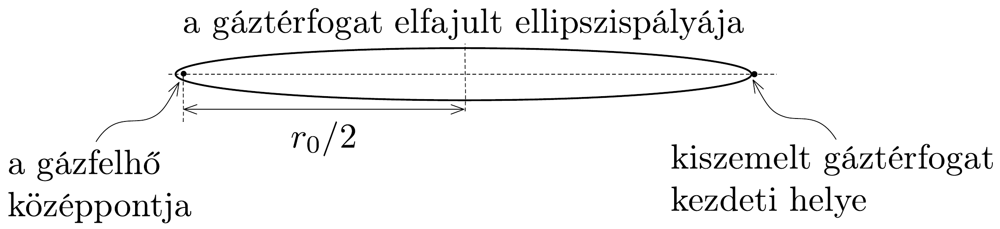

## Megoldás 3

3.1. A kezdeti szakaszban a hőmérséklet nem változik. Így a Boyle-Mariottetörvény alapján:
\[
n=\frac{p_{1}}{p_{0}}=\frac{V_{0}}{V_{1}}=\left(\frac{r_{0}}{r_{1}}\right)^{3}=8 .
\]
3.2. A folyamat kezdetén a gáz nyomásából származó erók elhanyagolhatók a gravitációs erőhöz képest. Tekintsünk egy kicsiny gáztérfogatot a gázfelhő szélén. Ismert, hogy egy gömbszimmetrikus tömegeloszlás gravitációs tere a gömbön kívül (és annak felületén) megegyezik a gömb középpontjába helyezet (azonos tömegü) tömegpont gravitációs terével. Így a kicsiny gáztérfogat kezdeti gyorsulása $g \approx$ $\approx G m / r_{0}^{2}$. Mivel a gravitációs erón nem változik lényegesen, a gyorsulást közelíthetjük ezzel az állandó értékkel. Ebben a közelítésben egyenletesen gyorsuló mozgásról beszélhetünk. A négyzetes úttörvényből az idő könnyen kifejezhető:
\[
t_{2} \approx \sqrt{\frac{2\left(r_{0}-r_{2}\right)}{g}}=\sqrt{\frac{2 r_{0}^{2}\left(r_{0}-r_{2}\right)}{G m}}=\sqrt{\frac{0,1 r_{0}^{3}}{G m}} .
\]

Megjegyzés: Érdemes észrevenni, hogy ez az idő csak a gázfelhő súrúségétől függ. Ez azt jelenti, hogy a gázfelhő belsejében kiszemelt kicsiny gáztérfogatra is igaz, hogy $t_{2}$ idő alatt csökken a középponttól mért távolsága $5 \%$-kal. (Belül a gyorsulás $g(r)=$ $G m / r_{0}^{3} \cdot r$ alakú, amivel $t_{2}$-re a fenti formulát kapjuk meg.) Hasonló módon belátható, hogy ez a későbbi (nem nulla kezdősebességû́) mozgásszakaszokra is érvényes, és emiatt a kezdetben homogén anyageloszlású gázfelhő mindaddig homogén marad, amíg a gáz nyomása elhanyagolható.
3.3. Továbbra is feltételezzük, hogy a kiszemelt, kicsiny gáztérfogat mozgásában a gravitáción kívüli hatásokat elhanyagolhatjuk. A feladat szövege azt sugallja, hogy az esési pályát egy elfajult ellipszispályának tekintsük, melynek fél nagytengelye $r_{0} / 2$ (lásd a 345. ábrát).

Kepler III. törvényéből következik, hogy a pálya periódusideje megegyezik egy $r_{0} / 2$ sugarú körpálya $T$ periódusidejével, amit az egyenletes körmozgás mozgásegyenletéből könynyen ki lehet számítani:
\[
\left(\frac{2 \pi}{T}\right)^{2} \frac{r_{0}}{2}=\frac{G m}{\left(r_{0} / 2\right)^{2}}, \quad \text { ahonnan } \quad T=2 \pi \sqrt{\frac{r_{0}^{3}}{8 G m}} .
\]
A feladat szövegéből kitűnik, hogy a végső sugár sokkal kisebb, mint a kezdeti, ezért az összeomlás idejét közelíthetjük a kiszámolt periódusidő felével:
\[
t=\frac{T}{2}=\pi \sqrt{\frac{r_{0}^{3}}{8 G m}} .
\]

Megjegyzés. A gázfelhő gravitációs összeroskadásának idejét úgy is megkaphatjuk, hogy az energiamegmaradás törvényét használva kiszámítjuk a sebesség helyfüggését:
\[
\frac{v^{2}}{2}-\frac{G m}{r}=E \quad\left(=-\frac{G m}{r_{0}}\right),
\]
ahonnan
\[
-\frac{\mathrm{d} r}{\mathrm{~d} t}=v(r)=\sqrt{2 E+\frac{2 G m}{r}},
\]
majd a sebesség reciprokát integráljuk a teljes pályára:
\[
t=\int_{0}^{r_{0}} \frac{\mathrm{~d} r}{\sqrt{2 E+\frac{2 G m}{r}}} .
\]
Az integrál (melynek kiszámítása a verseny korlátozott ideje alatt nyilván nem várható el) ugyanazt az eredményt adja, mint a Kepler-törvényekre hivatkozó megoldás.
3.4. Mivel a gáz hómérséklete nem változik, azért a gáz által kisugárzott hő a gázon végzett munkával egyenlő. A gáz izoterm állapotváltozása során a végzett munka:
\[
W=-\int_{V_{0}}^{V_{3}} p(V) \mathrm{d} V
\]
ahol a nyomás a $p V=\frac{m}{\mu} R T_{0}$ gáztörvényből számolható. A kisugárzott hő eszerint
\[
Q=W=-n R T_{0} \int_{V_{0}}^{V_{3}} \frac{1}{V} \mathrm{~d} V=R T_{0} \frac{m}{\mu} \ln \frac{V_{0}}{V_{3}}=3 R T_{0} \frac{m}{\mu} \ln \frac{r_{0}}{r_{3}} .
\]

Megjegyzések. 1. A felhasznált munkaképlet arra az esetre vonatkozik, amikor a gáz egyensúlyi állapotokon keresztül jut el egyik állapotból a másikba. Ez a jelen esetben nem teljesül, de ennél jobb becslést nem lehet adni.
2. Hibás, ha úgy gondoljuk, hogy a gravitációs energia teljes változása egyenló a kisugárzott hővel. Ugyanis ez csak akkor lenne igaz, ha a nyomás a gravitációval azonos nagyságú lenne, itt viszont elhanyagolható. A feladat szövegében megadott $G m \mu / r_{0} \gg R T_{0}$ egyenlőtlenséggel könnyü belátni, hogy a kisugárzott hő elhanyagolható a gravitációs energiaváltozáshoz képest.
3.5. Az összeroskadás ebben a szakaszban adiabatikus. Az adiabatikus állapotváltozásra igaz, hogy $p V^{\kappa}=$ állandó. Ebből és a gáztörvényből következik, hogy $T V^{\kappa-1}=$ állandó. Ezt felhasználva:
\[
T=T_{0}\left(\frac{V_{3}}{V}\right)^{\kappa-1}=T_{0}\left(\frac{r_{3}}{r}\right)^{3 \kappa-3} .
\]
3.6. Az összeroskadás $r_{3} \rightarrow r_{4}$ szakaszában a gravitációs energia és a meglévő mozgási energia alakul át a gáz belső energiájává. A mozgási energia megegyezik az $r_{0} \rightarrow r_{3}$ szakaszon történő gravitációs energiaváltozás nagyságával. A gravitációs energiaváltozást a következő formulával becsülhetjük:
\[
\Delta E_{\mathrm{g}}=-G \frac{m^{2}}{r_{4}}-\left(-G \frac{m^{2}}{r_{0}}\right) \approx-G \frac{m^{2}}{r_{4}} .
\]
(A pontosabb, integrálással meghatározható energiaváltozás ettől a becsléstől egy $\frac{3}{5}$-ös szorzótényezőben különbözik.) A belső energia megváltozása:
\[
\Delta E_{\mathrm{b}}=\frac{f}{2} n R T_{4}-\frac{f}{2} n R T_{0} \approx \frac{f}{2} n R T_{4} \approx n R T_{4} .
\]
A fenti közelítéseknél kihasználtuk, hogy $r_{4} \ll r_{0}$ és $T_{4} \gg T_{0}$; az $f / 2$ tényezó helyébe pedig azért írtunk 1-et, mert csupán nagyságrendi becslésre törekszünk; az egységnyi nagyságú szorzótényezőket nem vesszük számításba.)

A két energiaváltozás nagyságát egyenlővé téve - és a hőmérsékletet a felhő sugarával kifejezve - kapjuk:
\[
G \frac{m^{2}}{r_{4}} \approx \frac{m}{\mu} R T_{0}\left(\frac{r_{3}}{r_{4}}\right)^{3 \kappa-3} .
\]
Innen a keresett méret és hőmérséklet kifejezhető:
\[
r_{4} \approx r_{3}\left(\frac{R T_{0} r_{3}}{\mu m G}\right)^{\frac{1}{3 \kappa-4}}, \quad T_{4} \approx T_{0}\left(\frac{R T_{0} r_{3}}{\mu m G}\right)^{\frac{3 \kappa-3}{4-3 \kappa}} .
\]

Megjegyzések. 1. Az egyensúlyba került gázfelhő közepén kialakuló nyomást (közelítően, de nagyságrendileg helyesen) kétféleképpen is kiszámíthatjuk: egyrészt a ( $\varrho$ súrúségü) gáz hidrosztatikai nyomásaként:
\[
p \approx \varrho r_{4} \cdot \frac{G m}{r_{4}^{2}},
\]
másrészt a gáztörvény felhasználásával:
\[
p \approx \frac{\varrho}{\mu} R T_{4} .
\]
A két kifejezés jobb oldalát egyenlővé téve (valamint $T_{4}$ és $r_{4}$ korábban kiszámított kapcsolatát is felhasználva) megkapjuk $T_{4}$ és $r_{4}$ fentebb levezetett kifejezéseit.
2. Sok versenyzó (a magyar diákok közül is többen) a virtuális munka elvét használta. Eszerint egy test akkor van egyensúlyi helyzetben, ha egy kicsiny elképzelt (virtuális) kitérítés esetén a testen végzett munkák összege nulla. A jelen esetre alkalmazva ez azt jelenti, hogy kicsi sugárváltozás esetén a felszabaduló gravitációs energia éppen fedezi a gáz belső energia növekedését. Az így számolt képletek egy konstans szorzózényezőben térnek el a fenti eredményektől.

Az eltérés okát egy egyszerú mechanikai példával szemléltethetjük. Ha egy nyújtatlan rugóra egy testet akasztunk, és felírjuk az energiamegmaradás törvényét, akkor a rezgőmozgás alsó és felső́ maximális kitérési helyét kapjuk meg, a virtuális munka elvével pedig az egyensúlyi helyzetet találjuk meg.

\section*{
