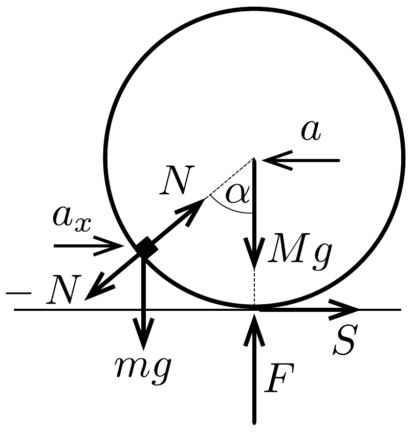
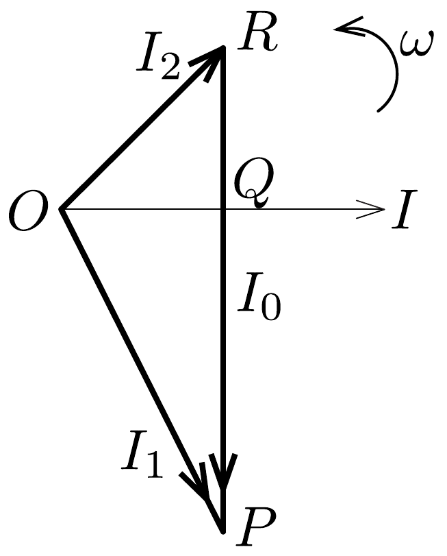

## Megoldás 1

A rész
A 360. ábra mutatja a kis testre és a csőre ható erőket: az $m$ tömegú kis testre az $m g$ nehézségi erő és az $N$ nyomóerő, az $M$ tömegü csőre az $M g$ nehézségi erő, a talaj $F$ nyomóereje, az $S$ tapadási súrlódási eró és a kis test által kifejtett $-N$ nyomóerő hat.

Írjuk fel a mozgásegyenletet a kis test $a_{x}$ vízszintes (az ábrán jobbra mutató) gyorsuláskomponensére, a cső tömegközéppontjának $a$ (az ábrán balra mutató) gyorsulására és a cső $\beta$ szöggyorsulására:
\[
\begin{aligned}
m a_{x} & =N \sin \alpha, \\
M a & =N \sin \alpha-S, \\
\Theta \beta & =S R,
\end{aligned}
\]
ahol $\Theta=M R^{2}$ a cső tehetetlenségi nyomatéka. A cső gyorsulása és szöggyorsulása között a tiszta gördülés miatt fennáll az $a=\beta R$ kapcsolat.

Az egyenletrendszert megoldva a testek gyorsulásai között az $m a_{x}=2 M a$ összefüggés adódik. A testek kezdetben nyugalomban voltak, és ez az összefüggés a mozgás során mindvégig fennáll, így a kis test $u$ vízszintes sebességkomponense és a cső $v$ sebessége között is ugyanilyen kapcsolat áll fenn: $m u=2 M v$.

A rendszer konzervatív, így teljesül az energiamegmaradás tétele. Az egyenletet a kezdeti állapotra és arra a pillanatra írjuk fel, amikor a kis test éppen legalul van (és csak vízszintes irányban mozog):
\[
m g R=\frac{m u^{2}}{2}+\frac{M v^{2}}{2}+\frac{\Theta \omega^{2}}{2},
\]
ahol $\omega$ a cső szögsebessége, és a tiszta gördülés miatt $v=\omega R$.
Az egyenletekből kifejezhetjük a kis test és a cső sebességét abban a pillanatban, amikor a kis test épp legalul van:
\[
u=2 \sqrt{\frac{M g R}{2 M+m}}, \quad v=\frac{m}{M} \sqrt{\frac{M g R}{2 M+m}} .
\]

Vizsgáljuk a kis test mozgását a cső tömegközéppontjával együttmozgó vonatkoztatási rendszerben: itt a kis test $R$ sugarú pályán körmozgást végez. A pálya legalján a sebessége $v_{\text {rel }}=u+v$, centripetális gyorsulása pedig
\[
a_{\mathrm{cp}}=\frac{v_{\mathrm{rel}}^{2}}{R}=\frac{(u+v)^{2}}{R} .
\]

Ebben a pillanatban a csó gyorsulása nulla, így a kis test gyorsulása a talajhoz rögzített vonatkoztatási rendszerben is ugyanekkora. Így a kis testre vonatkozó mozgásegyenlet: $m a_{\mathrm{cp}}=N-m g$, amiből a keresett erő:
\[
N=3 m g\left(1+\frac{m}{3 M}\right) .
\]

B rész
- 1) A termodinamika elsó fótétele alapján a gáz által felvett $\delta Q$ hő
\[
\delta Q=n C_{\mathrm{V}} \mathrm{~d} T+p \mathrm{~d} V,
\]
a keresett $C$ moláris hőkapacitás pedig
\[
C=\frac{1}{n} \frac{\delta Q}{\mathrm{~d} T}=C_{\mathrm{V}}+\frac{p}{n} \frac{\mathrm{~d} V}{\mathrm{~d} T} .
\]
Az egyenletekben $C_{\mathrm{V}}$ az állandó nyomáson mért moláris hőkapacitás, $p, n, V$ és $T$ pedig a buborékban lévő gáz nyomása, mólszáma, térfogata és hómérséklete.

A Laplace-formula alapján $p=\frac{4 \sigma}{r}$ (a buborék külső és belső felülete miatt szükséges a 2-es szorzó), így eszerint a buborékban lévő gáz állapotváltozása egy olyan politropikus folyamat, melyre $p^{3} V=$ állandó. Ezt összevetve az ideális gáz $p V=n R T$ állapotegyenletével kapjuk, hogy
\[
T^{3} V^{-2}=\text { állandó, }
\]
amit differenciálva
\[
\frac{\mathrm{d} V}{\mathrm{~d} T}=\frac{3 V}{2 T} .
\]

Behelyettesítve ezt az eredményt a moláris hőkapacitás képletébe:
\[
C=C_{V}+\frac{p}{n} \frac{3 V}{2 T}=C_{V}+\frac{3}{2} R,
\]
majd felhasználva, hogy a kétatomos gáz állandó térfogaton mért moláris hőkapacitása
\[
C_{V}=\frac{5}{2} R,
\]
a keresett moláris hőkapacitás
\[
C=\frac{5}{2} R+\frac{3}{2} R=4 R=33,2 \frac{\mathrm{~J}}{\mathrm{~mol} \mathrm{~K}} .
\]
2) Mivel a gáz hőkapacitása sokkal kisebb, mint a buborék hőkapacitása, valamint a gáz és a buborék között jó hőkontaktus van, a gáz állapotváltozása izotermikusnak tekinthető.

Egyensúlyi állapotban a gáz $p$ nyomása megegyezik az $r$ sugarú buborék $p_{\mathrm{g}}$ görbületi nyomásáva:
\[
p=p_{\mathrm{g}}=\frac{4 \sigma}{r} .
\]

Tekintsük a szappanhártya kicsiny $A$ felületú darabját. Ennek tömege $m=$ $\rho A h$. Ha a buborék sugarának kicsiny megváltozását $x$-szel jelöljük, akkor a felületdarabkára felírt mozgásegyenlet:
\[
m \ddot{x} \approx\left(p^{\prime}-p_{\mathrm{g}}^{\prime}\right) A,
\]
ahol $p^{\prime}$ a gáz nyomása, $p_{\mathrm{g}}^{\prime}$ a görbületi nyomás az $r+x$ sugarú buborékban.
Az izotermikus állapotváltozás miatt $p^{\prime} V^{\prime}=p V$, amibő
\[
p^{\prime}=p \frac{1}{\left(1+\frac{x}{r}\right)^{3}} \approx p\left(1-\frac{3 x}{r}\right)=p_{\mathrm{g}}\left(1-\frac{3 x}{r}\right) .
\]
A görbületi nyomás
\[
p_{\mathrm{g}}^{\prime}=\frac{4 \sigma}{r+x} \approx p_{\mathrm{g}}\left(1-\frac{x}{r}\right) .
\]

Behelyettesítve a mozgásegyenletbe:
\[
\rho A h \ddot{x}=p_{\mathrm{g}}\left(-\frac{2 x}{r}\right) A, \quad \ddot{x}=-\frac{8 \sigma}{\rho h r^{2}} x,
\]
ami egy harmonikus rezgés mozgásegyenlete, azaz a rezgés körfrekvenciája
\[
\omega=\sqrt{\frac{8 \sigma}{\rho h r^{2}}}=108 \mathrm{~s}^{-1} .
\]

C rész
I. megoldás. Abban a pillanatban, amikor a tekercseken átfolyó áram maximális, a tekercseken nem esik feszültség (az áram változási üteme nulla). Emiatt a két kondenzátoron azonos nagyságú, ellentétes feszültségnek kell esnie. Jelöljük ebben a pillanatban a kondenzátorok feszültségét $U$-val, a maximális áramerősséget pedig $I_{0}$-lal.

A töltésmegmaradás miatt $q_{0}=2 C U+C U$, amiből a kondenzátorok feszültsége
\[
U=\frac{q_{0}}{3 C} .
\]
Az energiamegmaradás alapján
\[
\frac{q_{0}^{2}}{4 C}=\frac{L I_{0}^{2}}{2}+\frac{2 L I_{0}^{2}}{2}+\frac{C U^{2}}{2}+\frac{2 C U^{2}}{2},
\]
amiből pedig a maximális áram
\[
I_{0}=\frac{q_{0}}{3 \sqrt{2 L C}}
\]

Miután a $K$ kapcsolót bezárjuk két, egymástól független rezgőkör alakul ki. Mindkét rezgőkör körfrekvenciája
\[
\omega=\frac{1}{\sqrt{2 L C}}
\]

Az egyes rezgőkörökben a rezgés amplitúdóját, azaz az áramerősségek $I_{1 \max }$ és $I_{2 \text { max }}$ maximumát az energiamegmaradás alapján határozhatjuk meg:
\[
\frac{2 C U^{2}}{2}+\frac{L I_{0}^{2}}{2}=\frac{L I_{1 \max }^{2}}{2}, \quad \frac{C U^{2}}{2}+\frac{2 L I_{0}^{2}}{2}=\frac{2 L I_{2 \max }^{2}}{2},
\]
amelyekből $I_{1 \text { max }}=\sqrt{5} I_{0}, I_{2 \text { max }}=\sqrt{2} I_{0}$.
Ha az áram irányát mindkét áramkörben az óramutató járásával egyezónek vesszük, a kapcsolón átfolyó áram: $I=I_{1}-I_{2}$, ahol az $I_{1}$ és $I_{2}$ áramok időfüggése:
\[
I_{1}(t)=A \cos \omega t+B \sin \omega t, \quad I_{2}(t)=D \cos \omega t+F \sin \omega t .
\]

Az $A$ és $D$ konstansok meghatározásához írjuk fel a kezdeti feltételeket:
\[
I_{1}(0)=A=I_{0}, \quad I_{2}(0)=D=I_{0},
\]
a $B$ és $F$ konstansok meghatározásához pedig a maximális áramerősségeket:
\[
A^{2}+B^{2}=I_{1 \max }^{2}, \quad D^{2}+F^{2}=I_{2 \max }^{2},
\]
amiből
\[
B=2 I_{0}, \quad F=-I_{0} .
\]
Az $F$ együttható negatív elójele azt fejezi ki, hogy a kapcsoló bekapcsolásának pillanatában a $2 L$ induktivitású tekercs árama csökken.

Eszerint az egyes rezgőkörök áramának időfüggése:
\[
I_{1}(t)=I_{0}(\cos \omega t+2 \sin \omega t), \quad I_{2}(t)=I_{0}(\cos \omega t-\sin \omega t),
\]
a kapcsolón átfolyó áram időfüggvénye pedig:
\[
I(t)=I_{1}(t)-I_{2}(t)=3 I_{0} \sin \omega t .
\]

Ebből a keresett maximális áramerősség:
\[
I_{\max }=3 I_{0}=\omega q_{0}=\frac{q_{0}}{\sqrt{2 L C}}
\]
II. megoldás. Az $A, B, D$ és $F$ állandók meghatározása helyett a maximális áramerősséget a 361. ábrán látható vektordiagramból is meghatározhatjuk (az ábra a $t=0$-hoz tartozó, bekapcsolási pillanatot mutatja, amikor a kapcsolón még nulla, a két áramkörben pedig $I_{0}$ nagyságú áram folyik). A keresett $I_{\max }$ áramerősség nagyságát a $P R$ szakasz hossza határozza meg.

A kapcsoló bekapcsolásakor az $I_{1}$ áram növekszik, mert a $2 C$ kapacitású kondenzátor továbbra is kisül, míg az $I_{2}$ áram csökken, hiszen a $C$ kapacitású kondenzátor tovább töltődik. Emiatt az $I_{1}$ és $I_{2}$ áramokat az $O P$, illetve az $O R$ vektorok ábrázolják.

A vektorok hossza az I. megoldás alapján $\sqrt{5} I_{0}$, illetve $\sqrt{2} I_{0}$. A kapcsoló bekapcsolásakor mindkét áram nagysága $I_{0}$, ami az ábrán éppen az $O Q$ szakasz hossza.

A Pitagorasz-tétel alapján ebből:
\[
P Q=\sqrt{O P^{2}-O Q^{2}}=2 I_{0}, \quad Q R=\sqrt{O R^{2}-O Q^{2}}=I_{0},
\]
ebből pedig a keresett maximális áramerősség:
\[
I_{\max }=P R=3 I_{0}=\omega q_{0}=\frac{q_{0}}{\sqrt{2 L C}}
\]

Az áramok időfüggését a következőképpen is megadhatjuk. Ha az egyes kondenzátorokon átfolyó áramokra a
\[
\begin{aligned}
I_{1}(t) & =\sqrt{5} I_{0} \sin \left(\omega t+\varphi_{1}\right), \\
I_{2}(t) & =\sqrt{2} I_{0} \sin \left(\omega t+\varphi_{2}\right)
\end{aligned}
\]
alakokat tételezzük fel (addíciós tételekkel az I. megoldásbeli, szinusz és koszinusz összegére vezető formulát kapjuk), akkor az $I_{1}(t=0)=I_{2}(t=0)=I_{0}$ kezdeti feltétellel
\[
\sin \varphi_{1}=\frac{1}{\sqrt{5}}, \quad \sin \varphi_{2}=\frac{1}{\sqrt{2}}
\]
amelyekből felhasználva, hogy $I_{1}$ növekszik, $I_{2}$ csökken:
\[
\cos \varphi_{1}=\frac{2}{\sqrt{5}}, \quad \cos \varphi_{2}=-\frac{1}{\sqrt{2}},
\]
vagyis a kapcsolón átfolyó áram:
\[
I(t)=I_{1}(t)-I_{2}(t)=I_{0}\left(\sqrt{5} \cos \varphi_{1}-\sqrt{2} \cos \varphi_{2}\right) \sin \omega t=3 I_{0} \sin \omega t .
\]
III. megoldás. Mivel a két rezgőkör körfrekvenciája megegyezik, a kapcsolón átfolyó áram körfrekvenciája is ugyanakkora lesz. A kapcsoló zárásakor a rajta átfolyó áram értéke nulla, így a kapcsolón átfolyó $I$ áram időfüggvénye:
\[
I(t)=I_{\max } \sin \omega t, \quad \text { ahol } \quad \omega=\frac{1}{\sqrt{2 L C}}
\]

Idő szerint deriválva és a kapcsoló zárásának pillanatában
\[
I_{\max }=\frac{\dot{I}}{\omega} .
\]

Legyen egy adott pillanatban a $2 C$ kapacitású kondenzátor töltése $q_{1}$. Ekkor a másik kondenzátor töltése a töltésmegmaradás miatt $q_{2}=q_{0}-q_{1}$ lesz. A kapcsoló zárása után
\[
\dot{I}_{1}=\omega^{2} q_{1}, \quad \dot{I}_{2}=-\omega^{2}\left(q_{0}-q_{1}\right) .
\]
A kapcsolón átfolyó áram idő szerinti deriváltja
\[
\dot{I}=\dot{I}_{1}-\dot{I}_{2}=\omega^{2} q_{0},
\]
amiből pedig a keresett maximális áram:
\[
I_{\max }=\frac{\dot{I}}{\omega}=\omega q_{0}=\frac{q_{0}}{\sqrt{2 L C}} .
\]

Ebből a megoldásból az is látszik, hogy a maximális áram értéke független a kapcsoló zárásának időpontjától.
