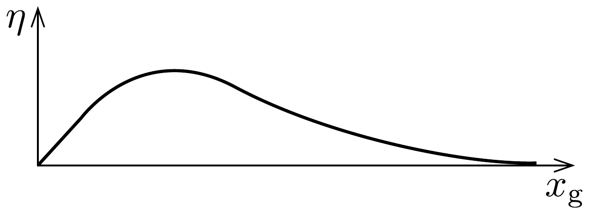

## Megoldás 1

1.A.1. A Stefan-Boltzmann-törvény alapján: $L_{\odot}=4 \pi R_{\odot}^{2} \cdot \sigma T_{\odot}^{4}$. Innen:
\[
T_{\odot}=\left(\frac{L_{\odot}}{4 \pi R_{\odot}^{2} \sigma}\right)^{1 / 4}=5,76 \cdot 10^{3} \mathrm{~K} .
\]
1.A.2. A beesó fény teljes frekvenciatartományára összegezve kapjuk a teljesítményt:
\[
P_{\mathrm{be}}=\int_{0}^{\infty} u(f) \mathrm{d} f=\int_{0}^{\infty} A \frac{R_{\odot}^{2}}{d_{\odot}^{2}} \frac{2 \pi h}{c^{2}} f^{3} \exp \left(-h f / k_{\mathrm{B}} T_{\odot}\right) \mathrm{d} f .
\]

Legyen $x=\frac{h f}{k_{\mathrm{B}} T_{\odot}}$. Ekkor $f=\frac{k_{\mathrm{B}} T_{\odot}}{h} x$ és $\mathrm{d} f=\frac{k_{\mathrm{B}} T_{\odot}}{h} \mathrm{~d} x$. Ezzel és felhasználva a megadott (iii) összefüggést:
\[
P_{\mathrm{be}}=\frac{2 \pi h A R_{\odot}^{2}}{c^{2} d_{\odot}^{2}} \frac{\left(k_{\mathrm{B}} T_{\odot}\right)^{4}}{h^{4}} \underbrace{\int_{0}^{\infty} x^{3} \mathrm{e}^{-x} \mathrm{~d} x}_{=6}=\frac{12 \pi k_{\mathrm{B}}^{4}}{c^{2} h^{3}} T_{\odot}^{4} A \frac{R_{\odot}^{2}}{d_{\odot}^{2}} .
\]

Megjegyzés: A Wien-közelítés használata nélkül a beérkező teljesítményt úgy becsülhetjük meg, hogy a Nap által kisugárzott energia egy $d_{\odot}$ sugarú gömbfelületre egyenletesen érkezik. Ekkora távolságban elhelyezkedő, $A$ területre jutó energia:
\[
P_{\mathrm{be}}=\frac{L_{\odot}}{4 \pi d_{\odot}^{2}} A=\sigma T_{\odot}^{4} A \frac{R_{\odot}^{2}}{d_{\odot}^{2}}=\frac{2 \pi^{5} k_{\mathrm{B}}^{4}}{15 c^{2} h^{3}} T_{\odot}^{4} A \frac{R_{\odot}^{2}}{d_{\odot}^{2}} .
\]
A két kifejezésben szereplő számfaktor nagyon közel esik egymáshoz.
1.A.3. Egyetlen foton energiája $h f$, így
\[
n_{\gamma}(f)=\frac{u(f)}{h f}=A \frac{R_{\odot}^{2}}{d_{\odot}^{2}} \frac{2 \pi}{c^{2}} f^{2} \exp \left(-h f / k_{\mathrm{B}} T_{\odot}\right) .
\]
1.A.4. A hasznos kimenó teljesítményt az $E_{\mathrm{g}}=h f_{\mathrm{g}}$ egy fotonra jutó energiakvantum és az $E \geq E_{\mathrm{g}}$ energiájú fotonok számának szorzata adja:
\[
\begin{aligned}
P_{\mathrm{ki}} & =h f_{\mathrm{g}} \int_{f_{\mathrm{g}}}^{\infty} n_{\gamma}(f) \mathrm{d} f=h f_{\mathrm{g}} A \frac{R_{\odot}^{2}}{d_{\odot}^{2}} \frac{2 \pi}{c^{2}} \int_{f_{\mathrm{g}}}^{\infty} f^{2} \exp \left(-h f / k_{\mathrm{B}} T_{\odot}\right) \mathrm{d} f= \\
& =k_{\mathrm{B}} T_{\odot} x_{\mathrm{g}} A \frac{R_{\odot}^{2}}{d_{\odot}^{2}} \frac{2 \pi}{c^{2}}\left(\frac{k_{\mathrm{B}} T_{\odot}}{h}\right)^{3} \int_{x_{\mathrm{g}}}^{\infty} x^{2} \mathrm{e}^{-x} \mathrm{~d} x= \\
& =\frac{2 \pi k_{\mathrm{B}}^{4}}{c^{2} h^{3}} T_{\odot}^{4} A \frac{R_{\odot}^{2}}{d_{\odot}^{2}} x_{\mathrm{g}}\left(x_{\mathrm{g}}^{2}+2 x_{\mathrm{g}}+2\right) \mathrm{e}^{-x_{\mathrm{g}}}
\end{aligned}
\]
1.A.5. A hatásfok:
\[
\eta=\frac{P_{\mathrm{ki}}}{P_{\mathrm{be}}}=\frac{x_{\mathrm{g}}}{6}\left(x_{\mathrm{g}}^{2}+2 x_{\mathrm{g}}+2\right) \mathrm{e}^{-x_{\mathrm{g}}} .
\]

Ha $P_{\mathrm{be}}$-re 1.A.2. másik eredményét használjuk, akkor a hatásfok:
\[
\eta=\frac{2 \pi k_{\mathrm{B}}^{4}}{c^{2} h^{3}} \frac{1}{\sigma} x_{\mathrm{g}}\left(x_{\mathrm{g}}^{2}+2 x_{\mathrm{g}}+2\right) \mathrm{e}^{-x_{\mathrm{g}}}=\left(\frac{90}{\pi^{4}}\right) \frac{x_{\mathrm{g}}}{6}\left(x_{\mathrm{g}}^{2}+2 x_{\mathrm{g}}+2\right) \mathrm{e}^{-x_{\mathrm{g}}} .
\]
A két eredmény közel van egymáshoz, mert $90 / \pi^{4} \approx 0,92 \approx 1$.
1.A.6.
\[
\eta=\frac{1}{6}\left(x_{\mathrm{g}}^{3}+2 x_{\mathrm{g}}^{2}+2 x_{\mathrm{g}}\right) \mathrm{e}^{-x_{\mathrm{g}}} .
\]
A határokon érvényes értékek: $\eta(0)=0$ és $\eta(\infty)=0$.

Mivel a zárójelben lévő polinom kizárólag pozitív együtthatókat tartalmaz, az monoton növekvő. Az exponenciális függvény monoton csökkenő, így a szorzatuknak valahol maximuma van.
\[
\begin{aligned}
& \frac{\mathrm{d} \eta}{\mathrm{~d} x_{\mathrm{g}}}=\frac{1}{6}\left(-x_{\mathrm{g}}^{3}+x_{\mathrm{g}}^{2}+2 x_{\mathrm{g}}+2\right) \mathrm{e}^{-x_{\mathrm{g}}}, \\
& \left.\frac{\mathrm{~d} \eta}{\mathrm{~d} x_{\mathrm{g}}}\right|_{x_{\mathrm{g}}=0}=\frac{1}{3},\left.\quad \frac{\mathrm{~d} \eta}{\mathrm{~d} x_{\mathrm{g}}}\right|_{x_{\mathrm{g} \rightarrow \infty}}=0 .
\end{aligned}
\]
A függvény grafikonja vázlatosan a 369. ábrán látható.

369. ábra.

Ha 1.A.2. másik eredményét használjuk, akkor:
\[
\begin{gathered}
\frac{\mathrm{d} \eta}{\mathrm{~d} x_{\mathrm{g}}}=\frac{15}{\pi^{4}}\left(-x_{\mathrm{g}}^{3}+x_{\mathrm{g}}^{2}+2 x_{\mathrm{g}}+2\right) \mathrm{e}^{-x_{\mathrm{g}}}, \\
\left.\frac{\mathrm{~d} \eta}{\mathrm{~d} x_{\mathrm{g}}}\right|_{x_{\mathrm{g}}=0}=\frac{30}{\pi^{4}} \approx 0,31,\left.\quad \frac{\mathrm{~d} \eta}{\mathrm{~d} x_{\mathrm{g}}}\right|_{x_{\mathrm{g} \rightarrow \infty}}=0 .
\end{gathered}
\]
1.A.7. A maximális értéket ott veszi fel a függvény, ahol
\[
\frac{\mathrm{d} \eta}{\mathrm{~d} x_{\mathrm{g}}}=\frac{1}{6}\left(-x_{\mathrm{g}}^{3}+x_{\mathrm{g}}^{2}+2 x_{\mathrm{g}}+2\right) \mathrm{e}^{-x_{\mathrm{g}}}=0 \quad \Rightarrow \quad p\left(x_{\mathrm{g}}\right) \equiv x_{\mathrm{g}}^{3}-x_{\mathrm{g}}^{2}-2 x_{\mathrm{g}}-2=0 .
\]
Az egyenlet megoldásához használhatjuk például a felező módszert (más numerikus módszer is elfogadható):
\[
\begin{aligned}
p(0) & =-2, \\
p(1) & =-4, \\
p(2) & =-2, \\
p(3) & =10 \quad \Rightarrow \quad 2<x_{0}<3, \\
p(2,5) & =2,375 \quad \Rightarrow \quad 2<x_{0}<2,5, \\
p(2,25) & =-0,171 \quad \Rightarrow \quad 2,25<x_{0}<2,5 .
\end{aligned}
\]
A közelítóérték, ahol $\eta$-nak maximuma van: $x_{0}=2,27$. A maximum: $\eta(2,27)=$ 0,457.
1.A.8. Az $x_{\mathrm{g}}$ értéke:
\[
x_{\mathrm{g}}=\frac{1,11 \cdot 1,60 \cdot 10^{-19}}{1,38 \cdot 10^{-23} \cdot 5763}=2,23,
\]
amivel a hatásfok:
\[
\eta_{\mathrm{Si}}=\frac{x_{\mathrm{g}}}{6}\left(x_{\mathrm{g}}^{2}+2 x_{\mathrm{g}}+2\right) \mathrm{e}^{-x_{\mathrm{g}}}=0,457 .
\]
Ha 1.A.2. másik eredményét használjuk, akkor:
\[
\eta_{\mathrm{Si}}=\frac{15 x_{\mathrm{g}}}{\pi^{4}}\left(x_{\mathrm{g}}^{2}+2 x_{\mathrm{g}}+2\right) \mathrm{e}^{-x_{\mathrm{g}}}=0,422 .
\]
1.A.9. Tekintsünk egy $r$ sugarú, $\mathrm{d} r$ vastagságú, $\mathrm{d} m$ tömegú gömbhéjat. Ha ezt a gömbhéjat el akarjuk távolítani, akkor - mivel a gömbhéjon belüli, az $r$ sugarú gömb vonzóerőt fejt ki rá - munkát kell végeznünk. Mivel a gömb gravitációs tere gömbszimmetrikus, ezért a gömbhéj eltávolításhoz szükséges elemi munka:
\[
\mathrm{d} W=\frac{G m(r) \cdot \mathrm{d} m}{r},
\]
ahol $m(r)=\varrho \cdot 4 / 3 r^{3} \pi$, az $r$ sugarú gömb, $\mathrm{d} m=\varrho \cdot 4 r^{2} \pi \mathrm{~d} r$ pedig a gömbhéj tömege. Ezekben $\varrho=3 M_{\odot} /\left(4 R_{\odot}^{3} \pi\right)$ a Nap súrúsége. A gömb teljes szétbontásához szükséges munka az elemi munkák összege, vagyis Nap teljes gravitációs potenciális energiája:
\[
\Omega=-\int_{0}^{M_{\odot}} \frac{G m(r) \mathrm{d} m}{r},
\]
azaz
\[
\Omega=-\int_{0}^{R_{\odot}} G\left(\frac{4}{3} \pi r^{3} \varrho\right)\left(4 \pi r^{2} \varrho\right) \frac{\mathrm{d} r}{r}=-\frac{16 \pi^{2} G \varrho^{2}}{3} \frac{R_{\odot}^{5}}{5}=-\frac{3}{5} \frac{G M_{\odot}^{2}}{R_{\odot}} .
\]
1.A.10. A teljes $-\Omega$ energia szabadul fel, tehát
\[
\tau_{\mathrm{KH}}=\frac{-\Omega}{L_{\odot}}=\frac{3 G M_{\odot}^{2}}{5 R_{\odot} L_{\odot}}=1,88 \cdot 10^{7} \text { év. }
\]
1.B.1. Mivel $\Delta E$ energia felszabadulása során két neutrínó keletkezik, így a Föld $1 \mathrm{~m}^{2}$-es felszínére 1 másodperc alatt érkező neutronok száma
\[
\Phi_{\nu}=2 \cdot \frac{L_{\odot}}{4 \pi d_{\odot}^{2} \Delta E}=6,8 \cdot 10^{14} \mathrm{~m}^{-2} \mathrm{~s}^{-2} .
\]
1.B.2. Legyen $\varepsilon$ a neutrínó detektálásának hatásfoka, $N_{0}$ a bejövő részecskeszám. Ezzel:
\[
\begin{aligned}
& N_{1}=\varepsilon N_{0}, \\
& N_{\mathrm{e}}=\varepsilon N_{0}(1-r), \\
& N_{\mathrm{x}}=\varepsilon N_{0} r / 6, \\
& N_{2}=N_{\mathrm{e}}+N_{\mathrm{x}} .
\end{aligned}
\]

Tehát:
\[
(1-r) N_{1}+\frac{r}{6} N_{1}=N_{2}
\]
innen a kérdezett hányados:
\[
r=\frac{6}{5}\left(1-\frac{N_{2}}{N_{1}}\right) .
\]
1.B.3. A feladat szövege nagy energiájú elektronokat említ, ezért relativisztikusan kell számolnunk. Amikor egy elektron már éppen nem bocsát ki Cserenkovsugárzást, a sebessége $v_{\text {stop }}=c / n$-re csökken. Az elektron teljes energiája ekkor:
\[
E_{\mathrm{stop}}=\frac{m_{\mathrm{e}} c^{2}}{\sqrt{1-v_{\mathrm{stop}}^{2} / c^{2}}}=\frac{n m_{\mathrm{e}} c^{2}}{\sqrt{n^{2}-1}} .
\]
Abban a pillanatban, miután a neutrínó kiütötte az elektront, az elektron energiája:
\[
E_{\mathrm{start}}=\alpha \Delta t+\frac{n m_{\mathrm{e}} c^{2}}{\sqrt{n^{2}-1}} .
\]
A kölcsönhatás előtt az elektron energiája $m_{\mathrm{e}} c^{2}$. Így a neutrínó által átadott energia:
\[
E_{\text {átadott }}=E_{\text {start }}-m_{\mathrm{e}} c^{2}=\alpha \Delta t+\left(\frac{n}{\sqrt{n^{2}-1}}-1\right) m_{\mathrm{e}} c^{2} .
\]
1.B.4. A ${ }^{7} \mathrm{Be}$ atommagok mozgása miatt Doppler-effektus lép fel a neutrínókra. Mivel az energia relatív megváltozása kicsiny $\left(\Delta E_{\text {rms }} / E_{\nu} \sim 10^{-4}\right)$, a nemrelativisztikus Doppler-eltolódással lehet számolni (a relativisztikus számolás szinte azonos eredményt ad). A megfigyelés irányának a $z$ irányt véve $\left(v_{x, \text { rms }}=v_{y, \text { rms }}=v_{z, \text { rms }}\right):$
\[
\frac{\Delta E_{\mathrm{rms}}}{E_{\nu}}=\frac{v_{z, \mathrm{rms}}}{c}=\frac{\frac{1}{\sqrt{3}} V_{\mathrm{Be}}}{c}=3,85 \cdot 10^{-4} .
\]
Tehát a Be atommagok sebességének négyzetes középértéke:
\[
V_{\mathrm{Be}}=\sqrt{3} \cdot 3,85 \cdot 10^{-4} \cdot 3,00 \cdot 10^{8} \mathrm{~ms}^{-1}=2,01 \cdot 10^{5} \frac{\mathrm{~m}}{\mathrm{~s}} .
\]
A Nap magjának átlagos hőmérséklete pedig:
\[
\frac{1}{2} m_{\mathrm{Be}} V_{\mathrm{Be}}^{2}=\frac{3}{2} k_{\mathrm{B}} T_{\mathrm{c}} \quad \Rightarrow \quad T_{\mathrm{c}}=1,13 \cdot 10^{7} \mathrm{~K} .
\]
