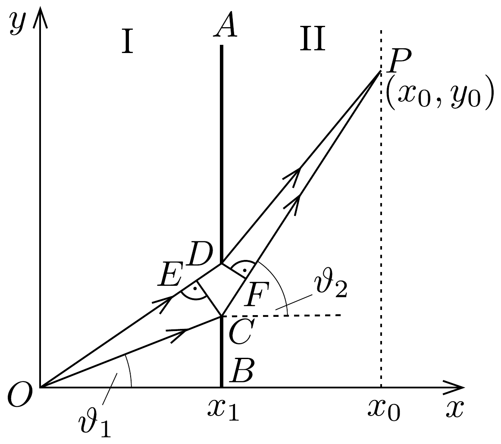
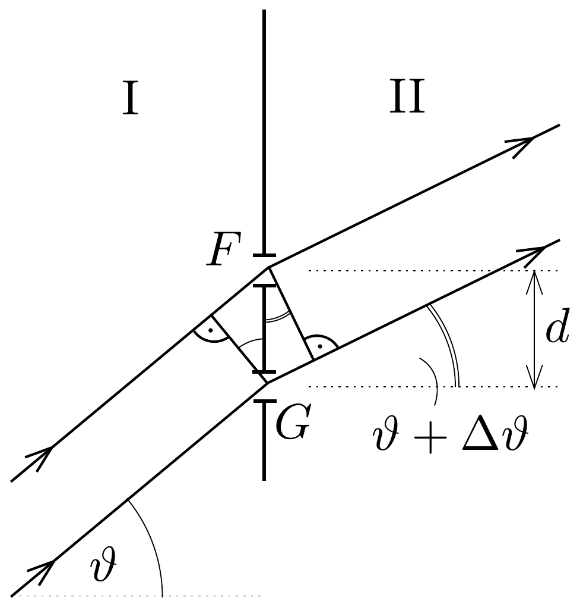

## Megoldás 2

2.A.1. A mechanikai energia megmaradása alapján:
\[
\frac{1}{2} m v_{1}^{2}=\frac{1}{2} m v_{2}^{2}+V_{0}, \quad \text { amiből } \quad v_{2}=\sqrt{v_{1}^{2}-\frac{2 V_{0}}{m}} .
\]
2.A.2. A határfelületen csak az $x$ irányú sebességkomponens változik (a határfelületen fellépő $-x$ irányú erőlökés hatására), az $y$ irányú nem. Ezért
\[
\begin{aligned}
v_{1 y} & =v_{2 y} \\
v_{1} \sin \vartheta_{1} & =v_{2} \sin \vartheta_{2}
\end{aligned}
\]
2.A.3. A hatás definíciójának megfelelően $A(w)$ az $O$ és $P$ rögzített pontok között:
\[
A(w)=m v_{1} \sqrt{x_{1}^{2}+w^{2}}+m v_{2} \sqrt{\left(x_{0}-x_{1}\right)^{2}+\left(y_{0}^{2}-w^{2}\right)} .
\]
Az $A(w)$ hatás akkor lesz minimális, ha $w$ szerinti deriváltja nulla:
\[
\begin{gathered}
\frac{v_{1} w}{\sqrt{x_{1}^{2}+w^{2}}}-\frac{v_{2}\left(y_{0}-w\right)}{\sqrt{\left(x_{0}-x_{1}\right)^{2}+\left(y_{0}-w\right)^{2}}}=0, \\
\frac{v_{1}}{v_{2}}=\frac{\left(y_{0}-w\right) \sqrt{x_{1}^{2}+w^{2}}}{w \sqrt{\left(x_{0}-x_{1}\right)^{2}+\left(y_{0}-w\right)^{2}}} .
\end{gathered}
\]
Vegyük észre, hogy ez ugyanaz, mint a 2.A.2.-ben megkapott $v_{1} \sin \vartheta_{1}=v_{2} \sin \vartheta_{2}$ eredmény!
2.B.1. A fény sebessége az I-es közegben $c / n_{1}$, a II-es közegben $c / n_{2}$, ahol $c$ a fénysebesség vákuumban. Legyen a két közeget elválasztó egyenes egyenlete $y=y_{0}$, a fénysugár pedig az $x=w$ helyen lépjen át egyik közegből a másikba. Az a $\tau(w)$ idő, amíg a fény a ( $0 ; 0$ ) origóból a rögzített $\left(x_{0} ; y_{0}\right)$ pontba jut:
\[
\tau(w)=\frac{n_{1}}{c} \sqrt{y_{1}^{2}+w^{2}}+\frac{n_{2}}{c} \sqrt{\left(x_{0}-w\right)^{2}+\left(y_{0}-y_{1}\right)^{2}} .
\]
A szélsőértéket 2.A.3.-hoz hasonlóan deriválással határozhatjuk meg:
\[
\begin{gathered}
\frac{n_{1} w}{\sqrt{y_{1}^{2}+w^{2}}}-\frac{n_{2}\left(x_{0}-w\right)}{\sqrt{\left(x_{0}-w\right)^{2}+\left(y_{0}-y_{1}\right)^{2}}}=0, \\
n_{1} \sin \alpha_{1}=n_{2} \sin \alpha_{2} .
\end{gathered}
\]
Ez a Snellius-Descartes-törvény.
2.B.2. A Snellius-Descartes-törvény alapján $n_{0} \sin \alpha_{0}=n(y) \sin \alpha$, ahol az $\alpha$ a függőleges és a fénysugár pályája által bezárt szög egy adott pontban. (Úgy képzelhetjük el, mintha a változó törésmutatójú közeg különböző, vékony, állandó törésmutatójú rétegekből állna.) Ezen kívül felhasználva, hogy $\mathrm{d} y / \mathrm{d} x=\operatorname{tg}(\alpha+$ $\left.+90^{\circ}\right)=-\operatorname{ctg} \alpha$ és $\sin \alpha=1 / \sqrt{1+\operatorname{ctg}^{2} \alpha}$ :
\[
n_{0} \sin \alpha_{0}=\frac{n(y)}{\sqrt{1+\left(\frac{\mathrm{d} y}{\mathrm{~d} x}\right)^{2}}}, \quad \frac{\mathrm{~d} y}{\mathrm{~d} x}=-\sqrt{\left(\frac{n(y)}{n_{0} \sin \alpha_{0}}\right)^{2}-1} .
\]

A fénysugár az edénybe merólegesen lép be, ezért $\alpha_{0}=90^{\circ}$ és így $\sin \alpha_{0}=1$.
2.B.3. A 2.B.2. eredményből a változókat szétválasztva és mindkét oldalt integrálva:
\[
\int \frac{\mathrm{d} y}{\sqrt{\left(\frac{n_{0}-k y}{n_{0}}\right)^{2}-1}}=-\int \mathrm{d} x .
\]
Használjuk a $\xi=\left(n_{0}-k y\right) / n_{0}$ helyettesítést, így:
\[
\int \frac{\mathrm{d} \xi\left(-\frac{n_{0}}{k}\right)}{\sqrt{\xi^{2}-1}}=-\int \mathrm{d} x, \quad-\frac{n_{0}}{k} \ln \left(\frac{n_{0}-k y}{n_{0}}+\sqrt{\left(\frac{n_{0}-k y}{n_{0}}\right)^{2}-1}\right)=-x+C .
\]
Figyelembe véve az $x=0$ és $y=0$ kezdeti feltételeket $C=0$. Ebből a pálya egyenlete:
\[
x=\frac{n_{0}}{k} \ln \left[\left(\frac{n_{0}-k y}{n_{0}}\right)+\sqrt{\left(\frac{n_{0}-k y}{n_{0}}\right)^{2}-1}\right] .
\]
2.B.4. Felhasználva a megadott adatokat 2.B.3. végeredményében $\left(y=-y_{0}\right)$ :
\[
x_{0}=\frac{n_{0}}{k} \ln \left[\left(\frac{n_{0}+k y_{0}}{n_{0}}\right)+\sqrt{\left(\frac{n_{0}+k y_{0}}{n_{0}}\right)^{2}-1}\right]=24,0 \mathrm{~cm} .
\]
2.C.1. A részecske de Broglie-hullámhossza $\lambda=\frac{h}{m v}$, amiből a keresett fáziskülönbség (a hatás $\Delta A=m v \Delta s$ definícióját felhasználva):
\[
\Delta \varphi=\frac{2 \pi}{\lambda} \Delta s=\frac{2 \pi}{h} m v \Delta s=\frac{2 \pi \Delta A}{h} .
\]
2.C.2. Tanulmányozzuk az $O C P$ és $O D P$ pályákat. A geometriai útkülönbség az I-es tartományban $E D$, a II-es tartományban $C F$ (370. ábra). Ebből $d \ll$ $\ll x_{0}-x_{1}$ és $d \ll x_{1}$ felhasználásával 2.C.1., valamint 2.A.2. vagy 2.B.1. alapján
\[
\begin{aligned}
\Delta \varphi_{C D} & =\frac{2 \pi d \sin \vartheta_{1}}{\lambda_{1}}-\frac{2 \pi d \sin \vartheta_{2}}{\lambda_{2}}= \\
& =\frac{2 \pi m v_{1} d \sin \vartheta_{1}}{h}-\frac{2 \pi m v_{2} d \sin \vartheta_{2}}{h}= \\
& =2 \pi \frac{m d}{h}\left(v_{1} \sin \vartheta_{1}-v_{2} \sin \vartheta_{2}\right)=0
\end{aligned}
\]
Ez az eredmény várható, hiszen a klasszikus pálya közelében erősítésnek kell lennie.
2.D.1. Az energiák alapján
\[
q U_{1}=\frac{1}{2} m v_{1}^{2}, \quad \text { amiből } \quad U_{1}=\frac{m v_{1}^{2}}{2 q}=1,139 \cdot 10^{3} \mathrm{~V} .
\]

2.D.2. A résekre párhuzamos nyaláb esik, és a $P$ pont messze van a résektől, így a fáziskülönbség $P$-ben ( $d=215 \mathrm{~nm}$ és $\vartheta$ irányban):
\[
\Delta \varphi_{\mathrm{P}}=\frac{2 \pi d \sin \vartheta}{\lambda_{1}}-\frac{2 \pi d \sin \vartheta}{\lambda_{2}}=2 \pi\left(v_{1}-v_{2}\right) \frac{m d}{h} \sin \vartheta=2 \pi \beta,
\]
amiből
\[
\beta=\frac{\left(v_{1}-v_{2}\right) m d \sin \vartheta}{h}=5,13 .
\]
Tehát a $P$ pontban a fáziskülönbség $10,26 \pi$, azaz a pont egy tökéletes erősítési és egy tökéletes kioltási hely között van.
2.D.3. Ahhoz, hogy egy adott irányban ne legyen elektronbecsapódás, vagyis kioltás legyen, az kell, hogy a fáziskülönbség $\pi$ páratlan számú többszöröse legyen. Az előző rész eredménye alapján a legközelebbi ilyen hely a $P$-től ott van, ahol $\Delta \varphi=11 \pi$. Ez alapján (371 ábra):

\[
\frac{m v_{1} d \sin \vartheta}{h}-\frac{m v_{2} d \sin (\vartheta+\Delta \vartheta)}{h}=5,5,
\]
amiből
\[
\begin{gathered}
\sin (\vartheta+\Delta \vartheta)=\frac{v_{1}}{v_{2}} \sin \vartheta-\frac{5,5 h}{m v_{2} d}=0,173586, \\
\Delta \vartheta=-0,0036^{\circ},
\end{gathered}
\]
amiből a $P$-hez legközelebbi hely távolsága:
\[
\Delta y=\left(x_{0}-x_{1}\right)[\operatorname{tg}(\vartheta+\Delta \vartheta)-\operatorname{tg} \vartheta]=-16,2 \mu \mathrm{~m} .
\]
A negatív elójel azt mutatja, hogy ez a pont a $P$ alatt van.
2.D.3. Az $I$ fluxussúrúség az elektronok $v$ sebességének és $N / V$ súrúségének szorzata. Ez alapján:
\[
N=\frac{I_{\min } V}{v}=1, \quad \text { amibő } 1 \quad I_{\min }=\frac{v}{V}=\frac{v}{A \ell}=4 \cdot 10^{19} \mathrm{~m}^{-2} \mathrm{~s}^{-1} .
\]
