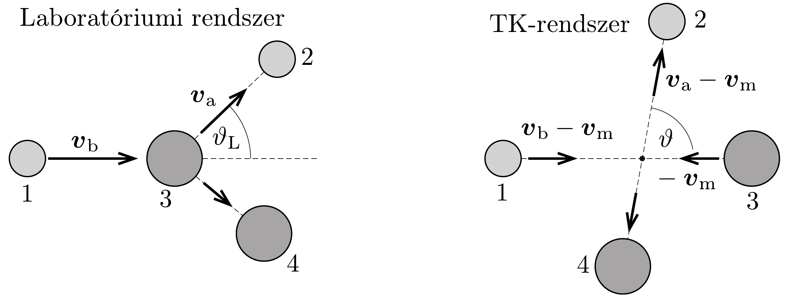

## Megoldás 3

3.A.1. A magreakció során felszabaduló energiát a tömegdefektusból számolhatjuk:
\[
\Delta E=\left[m\left({ }^{235} \mathrm{U}\right)+m\left({ }^{1} \mathrm{n}\right)-m\left({ }^{94} \mathrm{Zr}\right)-m\left({ }^{140} \mathrm{Ce}\right)-2 m\left({ }^{1} \mathrm{n}\right)\right] c^{2} .
\]
Összevonás után, a tömegek felhasználásával kapjuk:
\[
\Delta E=\left[m\left({ }^{235} \mathrm{U}\right)-m\left({ }^{94} \mathrm{Zr}\right)-m\left({ }^{140} \mathrm{Ce}\right)-m\left({ }^{1} \mathrm{n}\right)\right] c^{2}=208,7 \mathrm{MeV} .
\]
3.A.2. $\mathrm{Az}_{2} \mathrm{U}_{2} \mathrm{O}$ (feladatban megadott) súrúsége a térfogategységre esó molekulák össztömegét jelenti, így ezt elosztva a moláris tömeggel, majd megszorozva az $N_{\mathrm{A}}$ Avogadro-állandóval, megkapjuk az $1 \mathrm{~m}^{3}$-nyi anyagban található $\mathrm{U}_{2} \mathrm{O}$ molekulák $N_{1}$ számát:
\[
N_{1}=\frac{\varrho N_{\mathrm{A}}}{M}=2,364 \cdot 10^{28} \mathrm{~m}^{-3} .
\]
Az urán-dioxid molekuláknak azonban csak 0,72\%-a tartalmazza a 235-ös uránizotópot, így a feladat kérdésére a válasz:
\[
N=0,0072 \cdot N_{1}=1,702 \cdot 10^{26} \mathrm{~m}^{-3} .
\]
3.A.3. Az üzemanyagrúd egységnyi térfogatában $N$ hasadó uránatom van, ezek teljes hatáskeresztmetszete $N \sigma_{\mathrm{f}}$. Ha ezt megszorozzuk a $\varphi$ neutronfluxussal, az időegység alatt (köbméterenként) bekövetkező hasadások számát kapjuk: $\varphi N \sigma_{\mathrm{f}}$. Minden magreakcióban a 3.A.1. részben kiszámolt $\Delta E$ energia szabadul fel, melynek 80\%-a alakul hóvé, így a hőfejlődés $Q$ üteme:
\[
Q=0,8 \varphi N \sigma_{\mathrm{f}} \Delta E=4,92 \cdot 10^{8} \mathrm{~W} / \mathrm{m}^{3} .
\]
3.A.4. A $T_{\mathrm{c}}-T_{\mathrm{s}}$ hómérséklet-különbség K dimenziójú, így az $F(Q, a, \lambda)$ mennyiség mértékegysége is kelvin kell legyen. Keressük az ismeretlen függvényt $F(Q, a, \lambda)=Q^{\alpha} a^{\beta} \lambda^{\gamma}$ alakban, és vizsgáljuk meg, mekkorának kell választanunk az $\alpha, \beta, \gamma$ számokat, hogy kelvin dimenziójú mennyiséget kapjunk. A jobb oldalon szereplő mennyiségek mértékegysége:
\[
[Q]=\mathrm{W} \mathrm{~m}^{-3}=\mathrm{kg} \mathrm{~s}^{-3} \mathrm{~m}^{-1}, \quad[a]=\mathrm{m}, \quad[\lambda]=\mathrm{W} \mathrm{~m}^{-1} \mathrm{~K}^{-1}=\mathrm{kg} \mathrm{~s}^{-3} \mathrm{~m} \mathrm{~K}^{-1} .
\]
Ezek felhasználásával az alábbi egyenletet kapjuk a kitevőkre:
\[
\mathrm{K}=\left(\mathrm{kg} \mathrm{~s}^{-3} \mathrm{~m}^{-1}\right)^{\alpha} \mathrm{m}^{\beta}\left(\mathrm{kg} \mathrm{~s}^{-3} \mathrm{~m} \mathrm{~K}^{-1}\right)^{\gamma},
\]
amiből $\alpha=1, \beta=2, \gamma=-1$ adódik. Tehát az üzemanyagrúd közepének és felületének hőmérséklet-különbségét megadó formula (a feladatban megadott 1/4es faktort is visszaírva):
\[
T_{\mathrm{c}}-T_{\mathrm{s}}=\frac{Q a^{2}}{4 \lambda} .
\]
3.A.5. Az üzemanyagrúd közepének a hőmérséklete nem érheti el az $\mathrm{U}_{2} \mathrm{O}$ olvadási hőmérsékletét, míg a külső felületének hőmérséklete a hútőközeg hőmérsékletével egyezik meg. Így a 3.A.4. részfeladatban kapott összefüggés szerint az üzemanyagrúd sugarának lehetséges legnagyobb $a_{\mathrm{u}}$ értéke
\[
a_{\mathrm{u}}=\sqrt{\frac{4 \lambda\left(T_{\mathrm{c}}-T_{\mathrm{s}}\right)}{Q}},
\]
ahol most $T_{\mathrm{c}}=T_{\text {olv }}=3138 \mathrm{~K}, T_{\mathrm{s}}=577 \mathrm{~K}$. A megadott adatokat és $Q$ fentebb kiszámolt értékét behelyettesítve $a_{\mathrm{u}}=8,27 \cdot 10^{-3} \mathrm{~m}$.
3.B.1. A 372. ábrán láthatóak a sebességviszonyok a tömegközépponti koordináta-rendszerben. Fontos megjegyezni, hogy a $\vartheta$ szög nagyobb, mint $\vartheta_{\mathrm{L}}$, hiszen a $\boldsymbol{v}_{\mathrm{a}}$ vektorhoz adjuk hozzá a $-\boldsymbol{v}_{\mathrm{m}}$ vektort.

372. ábra.
3.B.2. A tömegközéppont sebessége a rendszer impulzusának és a teljes tömegének hányadosa:
\[
v_{\mathrm{m}}=\frac{v_{\mathrm{b}}}{A+1} .
\]

Ugyanekkora sebességgel mozog a TK-rendszerből nézve a laboratóriumi rendszerben kezdetben álló moderátoratom is. A neutron sebességének nagysága az ütközés előtt a TK-rendszerben:
\[
v_{\mathrm{b}}-v_{\mathrm{m}}=\frac{A}{A+1} v_{\mathrm{b}} .
\]

Az ütközésre felírható az impulzusmegmaradás. Mivel az ütközés előtt TKrendszerben a teljes impulzus nulla, így ütközés után is nulla marad, azaz $v=A V$. Valamint az energiamegmaradás:
\[
\frac{1}{2}\left(\frac{A}{A+1} v_{\mathrm{b}}\right)^{2}+\frac{1}{2} A\left(\frac{v_{\mathrm{b}}}{A+1}\right)^{2}=\frac{1}{2} v^{2}+\frac{1}{2} A V^{2}
\]
Megoldva $v$-re és $V$-re az egyenletrendszert, elmondható, hogy a TK-rendszerben a rugalmas ütközés során az energia- és impulzusmegmaradás úgy teljesül, hogy a neutron és a moderátoratom is megőrzi az ütközés előtti sebességének nagyságát (rendre $v$ és $V$ ), csupán a sebesség iránya változik meg:
\[
v=\frac{A}{A+1} v_{\mathrm{b}}, \quad \text { és } \quad V=\frac{v_{\mathrm{b}}}{A+1} .
\]
3.B.3. Ütközés után a neutron sebességvektora a laboratóriumi rendszerben $\boldsymbol{v}_{\mathrm{a}}=\boldsymbol{v}+\boldsymbol{v}_{\mathrm{m}}$, így a sebességnégyzetének nagysága (a vektorháromszögben felírható koszinusztételből):
\[
v_{\mathrm{a}}^{2}=v^{2}+v_{\mathrm{m}}^{2}+2 v v_{\mathrm{m}} \cos \vartheta .
\]
Behelyettesítve $v$ és $v_{\mathrm{m}}$ előző részfeladatban kiszámolt értékét:
\[
v_{\mathrm{a}}^{2}=\frac{A^{2} v_{\mathrm{b}}^{2}}{(A+1)^{2}}+\frac{v_{\mathrm{b}}^{2}}{(A+1)^{2}}+\frac{2 A v_{\mathrm{b}}^{2}}{(A+1)^{2}} \cos \vartheta,
\]
amiből
\[
G(\alpha, \vartheta)=\frac{E_{\mathrm{a}}}{E_{\mathrm{b}}}=\frac{v_{\mathrm{a}}^{2}}{v_{\mathrm{b}}^{2}}=\frac{A^{2}+2 A \cos \vartheta+1}{(A+1)^{2}} .
\]
Ez kis átalakítással felírható $\alpha$ segítségével is:
\[
G(\alpha, \vartheta)=\frac{A^{2}+1}{(A+1)^{2}}+\frac{2 A}{(A+1)^{2}} \cos \vartheta=\frac{1}{2}[(1+\alpha)+(1-\alpha) \cos \vartheta] .
\]
3.B.4. Az energiaveszteség akkor a legnagyobb, ha a $G(\alpha, \vartheta)$ mennyiség a lehető legkisebb. Ez (akár intuícióval, akár az előző részben kapott kifejezést vizsgálva) akkor következik be, ha $\vartheta=180^{\circ}=\pi$, azaz ha az ütközés lineáris. Ekkor $G(\alpha, \pi)=\alpha$, a legnagyobb relatív energiaveszteség pedig
\[
f_{\mathrm{v}}=\left(\frac{E_{\mathrm{b}}-E_{\mathrm{a}}}{E_{b}}\right)_{\max }=1-G(\alpha, \pi)=1-\alpha .
\]
$\mathrm{D}_{2} \mathrm{O}$-ra $\alpha=(19 / 21)^{2}$, így $f_{\mathrm{v}} \approx 0,181$.
3.C.1. A reaktor térfogata adott: $V=\pi R^{2} H$. Kérdés, hogyan kell megválasztani az $R: H$ arányt, hogy az elszökő neutronfluxusban szereplő
\[
x=\left(\frac{2,405}{R}\right)^{2}+\left(\frac{\pi}{H}\right)^{2}
\]
kifejezés minimális legyen. Fejezzük ki $R^{2}$ értékét a térfogattal:
\[
x=\frac{2,405^{2} \pi H}{V}+\left(\frac{\pi}{H}\right)^{2} .
\]
Bontsuk az elsó tagot két egyenlő kifejezés összegére, majd alkalmazzuk a számtani és mértani közepek között fennálló egyenlőtlenséget:
\[
x=\frac{2,405^{2} \pi H}{2 V}+\frac{2,405^{2} \pi H}{2 V}+\frac{\pi^{2}}{H^{2}} \geq \sqrt[3]{\frac{2,405^{2} \pi H}{2 V} \cdot \frac{2,405^{2} \pi H}{2 V} \cdot \frac{\pi^{2}}{H^{2}}} .
\]
A jobb oldalon láthatóan kiesik $H$, így egy konstans értéket kapunk. Ezt a bal oldali kifejezés akkor veszi fel, ha a benne szereplő három tag értéke megegyezik, azaz
\[
\frac{2,405^{2}}{2 R^{2}}=\frac{\pi^{2}}{H^{2}}, \quad \text { valamint } \quad x=\frac{3 \pi^{2}}{H^{2}} .
\]
Használjuk még fel, hogy stacionárius állapotban az időegység alatt kiszökő és a láncreakcióban termelődő (többlet)neutronok száma megegyezik, vagyis $k_{1} x \psi=$ $k_{2} \psi$, amiból
\[
H=\sqrt{\frac{3 \pi^{2}}{x}}=\sqrt{\frac{3 \pi^{2} k_{1}}{k_{2}}} \approx 5,87 \mathrm{~m}, \quad \text { és } \quad R=\frac{2,405 H}{\sqrt{2} \pi} \approx 3,18 \mathrm{~m} \text {. }
\]
3.C.2. A $d=0,287 \mathrm{~m}$ oldalélú négyzetrácsba rendezett üzemanyag-kazetták mindegyikére $d^{2}$ nagyságú keresztmetszet-terület jut a reaktorban (a négyzet közepén van a kazetta). Mivel a reaktor teljes keresztmetszete $\pi R^{2}$ (ahol $R$ az előző feladatrészben meghatározott érték), így a reaktorban elférő kazetták száma legfeljebb
\[
F_{n}=\frac{\pi R^{2}}{d^{2}} \approx 387 .
\]

Egyetlen (henger alakú) fútőkazetta térfogata $\pi r_{\text {kazetta }} H$, így a fútőelemek össztömege
\[
M=F_{n} \pi r_{\text {kazetta }} H \varrho \approx 9,90 \cdot 10^{4} \mathrm{~kg} .
\]

\title{
