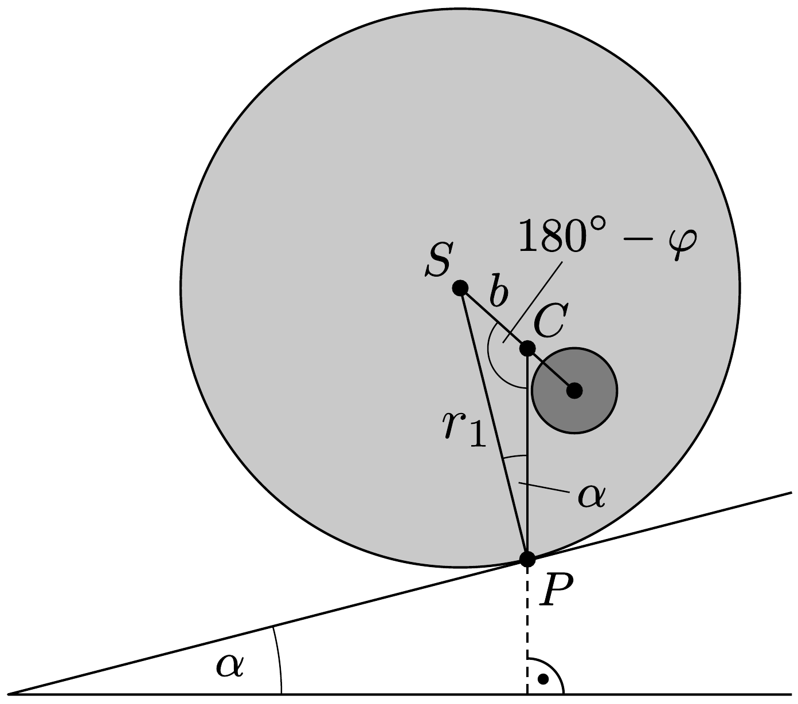
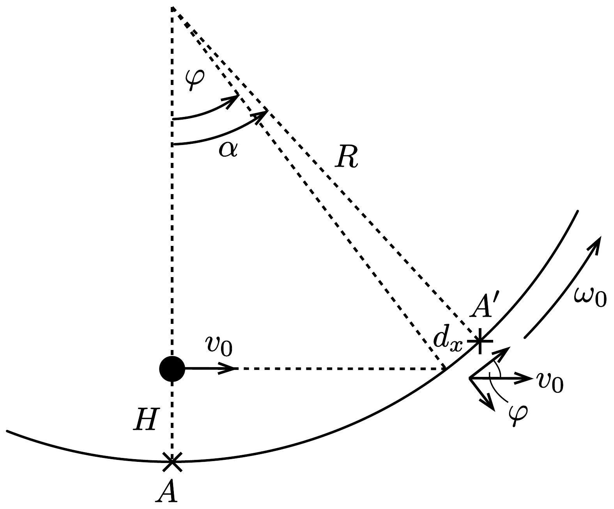
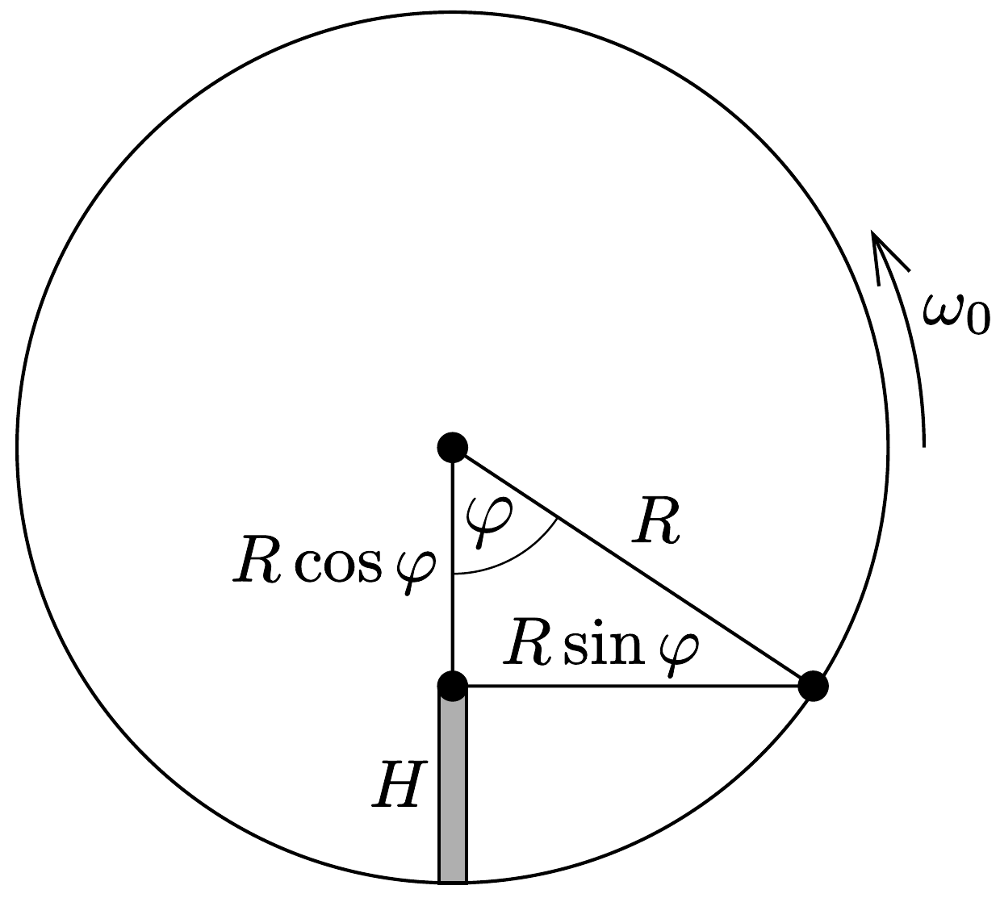

## Megoldás 1

1.A.1. Egyensúlyban a testre ható erók és forgatónyomatékok eredője nulla. Az utóbbi feltétel a lejtóvel való $P$ érintkezési pontra nézve úgy teljesíthető, ha a rendszer $C$ tömegközéppontja éppen a $P$ pont felett helyezkedik el (385, ábra). Alkalmazzuk a $P C S$ háromszögre a szinusztételt:
\[
\frac{\sin \left(180^{\circ}-\varphi\right)}{\sin \alpha}=\frac{r_{1}}{b},
\]
ebből
\[
b=\frac{r_{1} \sin \alpha}{\sin \varphi} .
\]

1.A.2. A korong $\varphi$ kitérésekor a nehézségi eró forgatónyomatéka $M g b \sin \varphi$, iránya pedig olyan, hogy a kitérést csökkenteni igyekszik. A forgómozgás egyenlete tehát a következő alakot ölti:
\[
\Theta_{S} \ddot{\varphi}=-M g b \sin \varphi .
\]
Kis szögekre $\sin \varphi \approx \varphi$, így egy harmonikus rezgőmozgás (fizikai inga) mozgásegyenletét kapjuk:
\[
\ddot{\varphi}=-\omega^{2} \varphi, \quad \text { ahol } \quad \omega=\sqrt{\frac{M g b}{\Theta_{S}}} .
\]
A rezgés periódusideje a körfrekvenciával $T=2 \pi / \omega$ kapcsolatban áll, így a tehetetlenségi nyomaték kifejezhető:
\[
\Theta_{S}=\frac{T^{2}}{4 \pi^{2}} M g b .
\]
1.A.3. Gondolkozhatunk úgy, hogy egy $\varrho_{1}$ sürúségú, $r_{1}$ sugarú tömör (tehát lyuk nélküli) korong és egy $\varrho_{2}-\varrho_{1}$ súrúségú, $r_{2}$ sugarú korong közös tömegközéppontjának helyét kell meghatároznunk. A távolságokat a nagyobb korong $S$ középpontjától mérve a tömegközéppont helyét megadó egyenlet:
\[
b=\frac{\left(\varrho_{2}-\varrho_{1}\right) r_{2}^{2} \pi h_{2}}{M} d, \quad \text { amiből } \quad d=\frac{M b}{\left(\varrho_{2}-\varrho_{1}\right) r_{2}^{2} \pi h_{2}} .
\]
1.A.4. Egy $m$ tömegü, $r$ sugarú korong tehetetlenségi nyomatéka $\frac{1}{2} m R^{2}$. Ennek és a Steiner-tételnek a felhasználásával írhatjuk, hogy
\[
\Theta_{S}=\underbrace{\frac{1}{2} \varrho_{1} r_{1}^{4} \pi h_{1}}_{\text {nagy korong }}+\underbrace{\left(\varrho_{2}-\varrho_{1}\right) r_{2}^{2} \pi h_{2}\left(\frac{r_{2}^{2}}{2}+d^{2}\right)}_{\text {kis korong a Steiner-tétellel }} .
\]

A $d$-re az előző részfeladatban kapott eredményt felhasználva:
\[
\Theta_{S}=\frac{1}{2} \varrho_{1} r_{1}^{4} \pi h_{1}+\frac{1}{2}\left(\varrho_{2}-\varrho_{1}\right) r_{2}^{4} \pi h_{2}+\frac{M^{2} b^{2}}{\left(\varrho_{2}-\varrho_{1}\right) r_{2}^{2} \pi h_{2}}
\]
1.A.5. Írjuk fel a teljes rendszer tömegét:
\[
M=\varrho_{1} r_{1}^{2} \pi h_{1}+\left(\varrho_{2}-\varrho_{1}\right) r_{2}^{2} \pi h_{2} .
\]
Ebből kifejezhetjük a $\left(\varrho_{2}-\varrho_{1}\right) r_{2}^{2} \pi h_{2}$ tagot, és beírhatjuk az 1.A.4. részfeladat végeredményébe. A $\Theta_{S}$-re korábban kapott formulát is felhasználva:
\[
\frac{T^{2}}{4 \pi^{2}} M g b=\frac{1}{2} \varrho_{1} r_{1}^{4} \pi h_{1}+\frac{1}{2}\left(M-\varrho_{1} r_{1}^{2} \pi h_{1}\right) r_{2}^{2}+\frac{M^{2} b^{2}}{M-\varrho_{1} r_{1}^{2} \pi h_{1}} .
\]
Ebből kifejezhető $r_{2}$ :
\[
r_{2}=\sqrt{\frac{2}{M-\varrho_{1} r_{1}^{2} \pi h_{1}}\left(\frac{T^{2}}{4 \pi^{2}} M g b-\frac{M^{2} b^{2}}{M-\varrho_{1} r_{1}^{2} \pi h_{1}}-\frac{1}{2} \varrho_{1} r_{1}^{4} \pi h_{1}\right)} .
\]
Ennek ismeretében az össztömegből $h_{2}$ megkapható:
\[
h_{2}=\frac{M-\varrho_{1} r_{1}^{2} \pi h_{1}}{\left(\varrho_{2}-\varrho_{1}\right) r_{2}^{2} \pi} .
\]
1.B.1. A forgó úrhajó padlóján álló, $m$ tömegú testre az $m R \omega_{0}^{2}$ centrifugális eró hat. Ez akkor egyezik meg a test $m g_{\mathrm{F}}$ földi súlyával, ha az úrállomás szögsebessége $\omega_{0}=\sqrt{g_{\mathrm{F}} / R}$.
1.B.2. Egy rugón rezgő test körfrekvenciája $\omega_{\mathrm{F}}=\sqrt{k / m}$.
1.B.3. Az úrhajón a mesterséges gravitáció egyenesen arányos a forgástengelytől mért távolsággal: $g(r)=r \omega_{0}^{2}$. A rugóra akasztott testet az egyensúlyi helyzetéből sugárirányban kifelé $x$ távolsággal kitérítve, arra nemcsak a rugóerő növekménye, hanem az effektív gravitációs tér megváltozásából származó eró is hat:
\[
-k x+m x \omega_{0}^{2}=m \ddot{x},
\]
ami éppen olyan, mint egy $k^{*}=k-m \omega_{0}^{2}$ effektív direkciós erejú rugón rezgő test mozgásegyenlete, a rezgés körfrekvenciája tehát $\omega=\sqrt{k / m-\omega_{0}^{2}}$.
1.B.4. Az $M_{\mathrm{F}}$ tömegú, $R_{\mathrm{F}}$ sugarú Föld felszíne felett $h$ magasságban a gravitációs gyorsulás:
\[
g_{\mathrm{F}}(h)=\gamma \frac{M_{\mathrm{F}}}{\left(R_{\mathrm{F}}+h\right)^{2}}=\gamma \frac{M_{\mathrm{F}}}{R_{\mathrm{F}}^{2}}\left(1+\frac{h}{R_{\mathrm{F}}}\right)^{-2}=g_{\mathrm{F}}(0)\left(1+\frac{h}{R_{\mathrm{F}}}\right)^{-2} .
\]
Mivel $h / R_{\mathrm{F}} \ll 1$, alkalmazhatjuk a kis $\varepsilon$ mennyiségekre érvényes $(1+\varepsilon)^{n} \approx 1+n \varepsilon$ lineáris közelítést:
\[
g_{\mathrm{F}}(h) \approx g_{\mathrm{F}}(0)\left(1-\frac{2 h}{R_{\mathrm{F}}}\right) .
\]

A földi gravitációs mezőben tehát az egyensúlyi helyzetéből $x$ távolságra kitérített test mozgásegyenlete
\[
-k x+m g_{\mathrm{F}} \frac{2 x}{R_{\mathrm{F}}}=m \ddot{x},
\]
amiből a rezgés körfrekvenciája
\[
\widetilde{\omega_{\mathrm{F}}}=\sqrt{\frac{k}{m}-\frac{2 g_{\mathrm{F}}}{R_{\mathrm{F}}}} .
\]
1.B.5. Az előző két részfeladat eredményéből látszik, hogy $\omega$ és $\widetilde{\omega_{\mathrm{F}}}$ akkor egyezik meg, ha $\omega_{0}^{2}=2 g_{\mathrm{F}} / R_{\mathrm{F}}$. Az 1.B.1. kérdés eredményét felhasználva ez azt jelenti, hogy az úrállomás sugarának hossza éppen a földsugár fele: $R=R_{\mathrm{F}} / 2$.
1.B.6. I. megoldás. Forgó koordináta-rendszerben.

A $H \ll R$ magasságból elengedett test „függőlegesen lefelé” (azaz sugárirányban kifelé) mutató sebessége $t$ idejú esés után jó közelítéssel $v_{y}=R \omega_{0}^{2} t$. Az emiatt „vízszintes" (érintő)irányban ható Coriolis-erón nagysága tehát $F_{\mathrm{C}}=2 m v_{y} \omega_{0}=$ $=2 m R \omega_{0}^{3} t$, a gyorsulás pedig $F_{\mathrm{C}} / m$. A $v_{x}$ vízszintes sebességkomponenst az idő függvényében ennek a gyorsulásnak az integrálásával lehet meghatározni:
\[
v_{x}(t)=\int_{0}^{t} 2 R \omega_{0}^{3} t^{\prime} \mathrm{d} t^{\prime}=R \omega_{0}^{3} t^{2}
\]
Behelyettesítve az esés $T=\sqrt{2 H /\left(R \omega_{0}^{2}\right)}$ idejét, megkapjuk a vízszintes sebességkomponenst a becsapódáskor:
\[
v_{x}=2 H \omega_{0} .
\]
A vízszintes elmozdulást a $v_{x}(t)$ függvény integrálja adja meg:
\[
d_{x}(t)=\int_{0}^{t} v_{x}\left(t^{\prime}\right) \mathrm{d} t^{\prime}=\frac{1}{3} R \omega_{0}^{3} t^{3} .
\]
A $t=T$ helyettesítéssel kapjuk meg a teljes vízszintes elmozdulást:
\[
d_{x}=\frac{1}{3} \sqrt{\frac{8 H^{3}}{R}} .
\]
II. megoldás. Inerciarendszerben.

Inerciarendszerből nézve a toronyból a test „vízszintes irányba” $v_{0}=\omega_{0}(R-H)$ sebsességgel indul el, és ezt a sebességet megtartva csapódik be az úrállomásba (az úrállomás gravitációs erejét elhanyagolhatjuk), miközben az is elfordul. Ezt a mozgást mutatja a 386, ábra. A torony kezdeti $A$ helye elfordult az $A^{\prime}$ helyre $\alpha$ szöggel. A test ez idő alatt $\varphi$ szöggel fordut el. Becsapódáskor a test torony felé mutató, „vízszintes“ irányú sebességkomponense
\[
v_{0} \cos \varphi=\omega_{0}(R-H) \cdot \frac{R-H}{R} .
\]

Az úrállomáson az ilyen irányú sebességet $v_{x}=v_{0} \cos \varphi-\omega_{0} R$ nagyságúnak látjuk az ürállomás kerületi sebessége miatt. Tehát a vízszintes irányú sebességkomponens becsapódáskor:
\[
v_{x}=\omega_{0} R\left(1-\frac{H}{R}\right)^{2}-\omega_{0} R \approx-2 \omega_{0} H .
\]
A negatív előjel azt mutatja, hogy a sebesség iránya a toronytól elfelé mutat a forgó rendszerben.

A test esési ideje jó közelítéssel
\[
T=\frac{\sqrt{R^{2}-(R-H)^{2}}}{v_{0}}=\frac{\sqrt{2 R H-H^{2}}}{\omega_{0}(R-H)} .
\]
Ez a kifejezés $H \rightarrow 0$ esetén az I. megoldásban kapott idővel egyezik meg. Most viszont nem ezt az alakot tartjuk meg, mert a közelítést óvatosan kell elvégezni. A vízszintes elmozdulás:
\[
d_{x}=R(\alpha-\varphi)=R\left(\omega_{0} T-\arccos \frac{R-H}{R}\right) .
\]
Ez az eredmény már elfogadható végeredménynek, de belátjuk, hogy ez tényleg azonos a korábban megkapott kifejezéssel. Ehhez vezessük be az $x=H / R$ változót:
\[
d_{x}=\left[\frac{\sqrt{2 x-x^{2}}}{1-x}-\arccos (1-x)\right] R .
\]
A különbség két függvényének nincs nulla közepü Taylor-sora, így más módszert
kell választanunk. Megmutatható, hogy a két függvény közelítőalakja $x=0$ körü. ${ }^{27}$
\[
\begin{gathered}
\frac{\sqrt{2 x-x^{2}}}{1-x} \approx \sqrt{2 x}\left(1+\frac{3 x}{4}\right) \\
\arccos (1-x) \approx \sqrt{2 x}\left(1+\frac{x}{12}\right)
\end{gathered}
\]
Ezeket felhasználva $d_{x}$-re valóban az I. megoldásban kapott távolságot kapjuk meg.

Megjegyzés: Ha a $T$ időre megtartjuk a $\sqrt{2 H /\left(R \omega_{0}^{2}\right)}$ kifejezést, ugyanakkor csak az $\arccos (1-x)$-re használjuk a fenti közelítést, akkor (még előjelben is) hibás eredményt kapunk: $-1 / 12 \cdot \sqrt{2 H^{3} / R}$. Ez mutatja, hogy óvatosan kell a közelítéssel eljárnunk, mert $d_{x}$ már maga egy nagyon kicsi érték.
1.B.7. A mozgást inerciarendszerból a legegyszerúbb leírni. A feladat szövege szerint az úrállomás és a test elfordulási szöge azonos, pontosabban különbségük $2 \pi$ egész számú többszöröse, hiszen ha a test közel van a forgástengelyhez és így kicsi a sebessége, akkor az úrállomás többször is körbefordulhat.

A $H=R(1-\cos \varphi)$ magasságú toronyból a test $\omega_{0} R \cos \varphi$ kezdősebességgel érintőirányban indul (387. ábra), és egyenes vonalú egyenletes mozgással halad egészen az úrállomás padlójáig (ahogyan már az előző rész II. megoldásában is megállapítottuk). A mozgás ideje:
\[
t=\frac{R \sin \varphi}{\omega_{0} R \cos \varphi}=\frac{\operatorname{tg} \varphi}{\omega_{0}} .
\]
A test a torony aljához ér, azaz $\varphi=\omega_{0} t$. Ezt felhasználva az előző formulában, a $\varphi=\operatorname{tg} \varphi$ egyenletet kapjuk. Ennek végtelen sok megoldása van: az első a triviális $\varphi=0$, a többi pedig csak numerikusan vagy ábrázolással határozható meg.

\footnotetext{
${ }^{27}$ Ezt a sort Puiseux-sornak nevezik.

A következő gyök ~ 4,493, ami a nem releváns $H>R$ eredményre vezet, mivel $\cos \varphi<0$. A harmadik gyök ~ 7,725, ami a legkisebb lehetséges $H$-t adja meg: $H \approx 0,871 R$.

Az előző rész II. megoldásában kapott (16-2) kifejezésből is megkaphatjuk ugyanezt az eredményt, bár ekkor a sokkal bonyolultabb
\[
\cos \left(\frac{\sqrt{2 x-x^{2}}}{1-x}\right)=1-x
\]
egyenletet kell megoldani. Ebben az $x=0$ megoldástól különböző első gyök $x \approx 0,7924$, viszont ez a $\cos \varphi=\cos (-\varphi)$ miatt adódik, azaz ehhez negatív szög tartozik. A második megoldás az $x \approx 0,871$, ami a fizikailag helyes legkisebb megoldás.
1.B.8. Mivel az $y$ irányú Coriolis-erőt elhanyagolhatjuk, ebben az irányban a test harmonikus rezgőmozgást végez $d$ amplitúdóval. A kezdeti feltételeket is figyelembe véve: $y(t)=-d \cos \omega t$ ( $\omega$ az 1.B.3. részfeladatban kapott körfrekvencia). Az $y$ irányú sebességre ennek deriválásával $v_{y}(t)=d \omega \sin \omega t$ értéket kapunk, amellyel az $x$ irányú Coriolis-eró (az úrállomás szögsebességvektorát a papír síkjába befelé mutatónak választva):
\[
F_{x}(t)=-2 m v_{y}(t) \omega_{0}=-2 m \omega_{0} d \omega \sin \omega t .
\]
A test gyorsulása $x$ irányban tehát éppen olyan, mint egy harmonikus oszcillátoré. Az $x$ irányú elmozdulást a gyorsulás kétszeri integrálásával kapjuk:
\[
x(t)=\frac{2 \omega_{0} d}{\omega} \sin \omega t+c_{1} t+c_{2},
\]
ahol $c_{1}$ és $c_{2}$ integrálási állandók. A $t=0$ időpillanatban a test $x$ irányú sebessége és $x$ koordinátája is nulla, ebből $c_{1}=-2 \omega_{0} d$ és $c_{2}=0$ adódik, tehát:
\[
x(t)=\frac{2 \omega_{0} d}{\omega}(\sin \omega t-\omega t) .
\]
A pálya vázlatos rajza a 388. ábrán látható. Egy periódus $(t=2 \pi / \omega)$ alatt az $x$ irányú elmozdulás $-4 \pi \omega_{0} d / \omega$.
