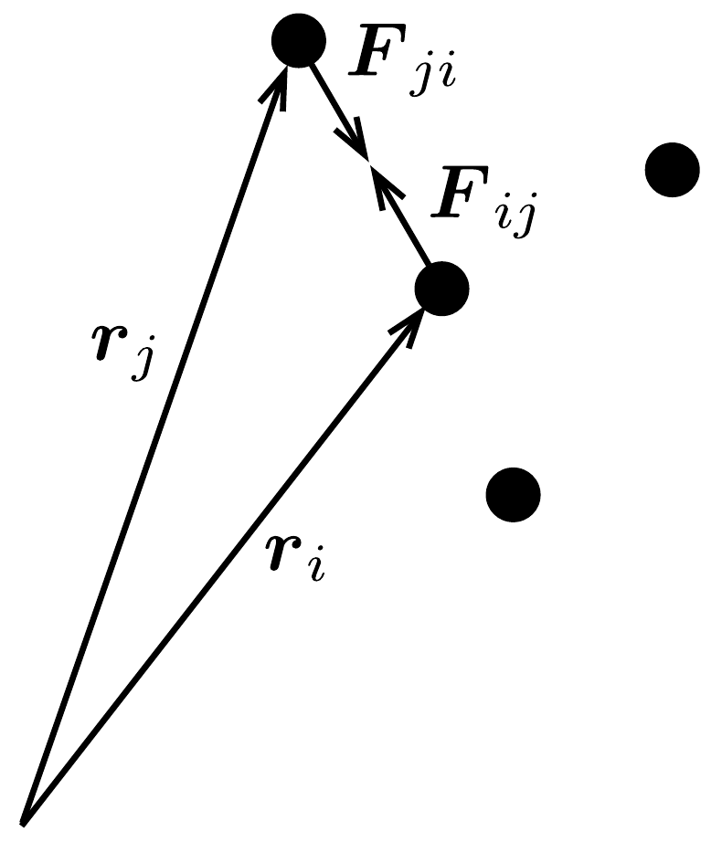
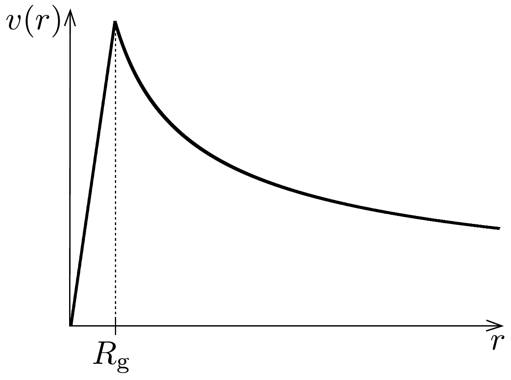
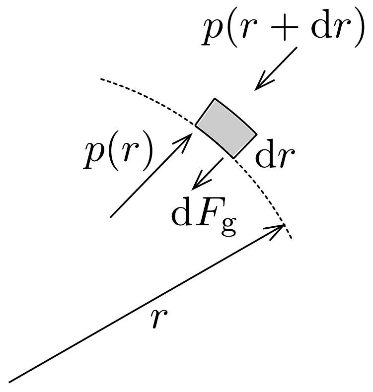

## Megoldás 1

1.A.1. A gömb gravitációs potenciális energiája abszolút értékben azzal a munkával egyezik meg, amit akkor végzünk, amikor az $R$ sugarú, $\varrho$ súrúségú gömböt vékony gömbhéjakból - lassan mozgatva - összerakunk (a távoli gömbhéjakat szimmetrikusan „húzzuk rá" a már meglévő gömbre). Az $r$ sugarú, homogén gömb tömege $m(r)=\varrho \cdot \frac{4}{3} r^{3} \pi$, az $r$ sugarú, $\mathrm{d} r$ vastagságú gömbhéj tömege pedig $\mathrm{d} m=\varrho \cdot 4 r^{2} \pi \mathrm{~d} r$. A gömbhéj gravitációs potenciális energiája
\[
\mathrm{d} U=-\frac{G m(r) \mathrm{d} m}{r}=-\frac{16 G \varrho^{2} \pi^{2}}{3} r^{4} \mathrm{~d} r .
\]
A teljes gömb gravitáciüs potenciális energiája:
\[
U=-\frac{16 G \varrho^{2} \pi^{2}}{3} \int_{0}^{R} r^{4} \mathrm{~d} r=-\frac{16}{15} G \varrho^{2} \pi^{2} R^{5} .
\]
Felhasználva, hogy $\varrho=M /\left(\frac{4}{3} R^{3} \pi\right)$ :
\[
U=-\frac{3}{5} \frac{G M^{2}}{R}
\]
1.A.2. A nemrelativisztikus Doppler-jelenség szerint a (sugárirányban) $v_{i}$ sebességgel távolódó galaxisból érkező fény frekvenciája kisebb:
\[
f_{i}=f_{0} \frac{c}{c+v_{i}},
\]
amiből a galaxis sebessége
\[
v_{i}=c\left(\frac{f_{0}}{f_{i}}-1\right) .
\]
A galaxishalmazban az összes galaxis távolodik, a galaxishalmaz átlagos sebessége:
\[
V_{\text {cr }}=\frac{1}{N} \sum_{i=1}^{N} v_{i}=\frac{c}{N} \sum_{i=1}^{N}\left(\frac{f_{0}}{f_{i}}-1\right) .
\]
1.A.3. Az előzó részben meghatározott $v_{i}$ sebesség csak a galaxis sebességvektorának egyik komponense. Mivel a tömegközépponthoz képesti relatív sebesség izotróp, mindhárom komponens négyzetes középértéke azonos. Azaz
\[
\begin{aligned}
v_{\mathrm{rms}}=\sqrt{\frac{1}{N} \sum_{i=1}^{N}\left(\boldsymbol{v}_{i}-\boldsymbol{V}_{\mathrm{cr}}\right)^{2}} & =\sqrt{\frac{3}{N} \sum_{i=1}^{N}\left(v_{i}-V_{\mathrm{cr}}\right)^{2}}= \\
& =\sqrt{\frac{3}{N} \sum_{i=1}^{N}\left(v_{i}^{2}-2 v_{i} V_{\mathrm{cr}}+V_{\mathrm{cr}}^{2}\right)} .
\end{aligned}
\]

Felhasználva, hogy $\sum_{i=1}^{N} v_{i}=N V_{\mathrm{cr}}$ :
\[
v_{\mathrm{rms}}=\sqrt{\frac{3}{N}} \sqrt{\sum_{i=1}^{N} v_{i}^{2}-2 N V_{\mathrm{cr}}^{2}+N V_{\mathrm{cr}}^{2}}=\sqrt{\frac{3}{N}} \sqrt{\sum_{i=1}^{N} v_{i}^{2}-N V_{\mathrm{cr}}^{2}} .
\]
Az 1.A.2. feladat sebességekre vonatkozó egyenleteivel
\[
v_{\mathrm{rms}}=c \sqrt{\frac{3}{N}} \sqrt{\sum_{i=1}^{N}\left(\frac{f_{0}}{f_{i}}-1\right)^{2}-\frac{1}{N}\left(\sum_{i=1}^{N}\left(\frac{f_{0}}{f_{i}}-1\right)\right)^{2}} .
\]
Hozzuk egyszerúbb alakra ezt a kifejezést. A kifejezés elsó tagja:
\[
\sum_{i=1}^{N}\left(\frac{f_{0}}{f_{i}}-1\right)^{2}=f_{0}^{2}\left(\sum_{i=1}^{N}\left(\frac{1}{f_{i}}\right)^{2}-\frac{2}{f_{0}} \sum_{i=1}^{N} \frac{1}{f_{i}}+\frac{N}{f_{0}^{2}}\right),
\]
a második tag:
\[
\begin{aligned}
\frac{1}{N}\left(\sum_{i=1}^{N}\left(\frac{f_{0}}{f_{i}}-1\right)\right)^{2} & =\frac{f_{0}^{2}}{N}\left(\frac{1}{f_{1}}+\frac{1}{f_{2}}+\ldots+\frac{1}{f_{N}}-\frac{N}{f_{0}}\right)^{2}= \\
& =\frac{f_{0}^{2}}{N}\left[\left(\sum_{i=1}^{N} \frac{1}{f_{i}}\right)^{2}-\frac{2 N}{f_{0}} \sum_{i=1}^{N} \frac{1}{f_{i}}+\frac{N^{2}}{f_{0}^{2}}\right] .
\end{aligned}
\]
Beírva ezeket a (17-5) egyenletbe, az eredmény
\[
v_{\mathrm{rms}}=c f_{0} \sqrt{\frac{3}{N}} \sqrt{\sum_{i=1}^{N}\left(\frac{1}{f_{i}}\right)^{2}-\frac{1}{N}\left(\sum_{i=1}^{N} \frac{1}{f_{i}}\right)^{2}} .
\]

Egy galaxis átlagos mozgási energiája a tömegközépponthoz képest
\[
K_{\text {átl. }}=\frac{\sum_{i=1}^{N} \frac{1}{2} m\left(\boldsymbol{v}_{i}-\boldsymbol{V}_{\mathrm{cr}}\right)^{2}}{N}=\frac{1}{2} m v_{\mathrm{rms}}^{2} .
\]
1.A.4. Vizsgáljuk a $\mathrm{d} \Gamma / \mathrm{d} t$ kifejezést:
\[
\frac{\mathrm{d} \Gamma}{\mathrm{~d} t}=\sum_{i} \frac{\mathrm{~d} \boldsymbol{p}_{i}}{\mathrm{~d} t} \boldsymbol{r}_{i}+\sum_{i} \boldsymbol{p}_{i} \frac{\mathrm{~d} \boldsymbol{r}_{i}}{\mathrm{~d} t}=\sum_{i} \boldsymbol{F}_{i} \boldsymbol{r}_{i}+\sum_{i} m_{i} \boldsymbol{v}_{i}^{2},
\]
ahol $\boldsymbol{F}_{i}$ az $i$-edik részecskére a többi által kifejtett eredő erő. A második tag a rendszer kinetikus energiát jelenti: $\sum_{i} m_{i} \boldsymbol{v}_{i}^{2}=2 K$. Az első tagban $\boldsymbol{F}_{i}=\sum_{j} \boldsymbol{F}_{i j}$ (399. ábra), ahol $\boldsymbol{F}_{i j}=-\frac{G m_{i} m_{j}}{\left|\boldsymbol{r}_{i}-\boldsymbol{r}_{j}\right|^{3}} \cdot\left(\boldsymbol{r}_{i}-\boldsymbol{r}_{j}\right)$. Mivel $\boldsymbol{F}_{i j}=-\boldsymbol{F}_{j i}$, így az első tag

\[
\begin{aligned}
\sum_{i} \boldsymbol{F}_{i} \boldsymbol{r}_{i} & =\sum_{i, j \neq i} \boldsymbol{F}_{i j} \boldsymbol{r}_{i}=\boldsymbol{F}_{12} \boldsymbol{r}_{1}+\boldsymbol{F}_{13} \boldsymbol{r}_{1}+\ldots+\boldsymbol{F}_{21} \boldsymbol{r}_{2}+\boldsymbol{F}_{23} \boldsymbol{r}_{2}+\ldots+ \\
& +\boldsymbol{F}_{N 1} \boldsymbol{r}_{N}+\ldots \boldsymbol{F}_{N, N-1} \boldsymbol{r}_{N-1}=\boldsymbol{F}_{12}\left(\boldsymbol{r}_{1}-\boldsymbol{r}_{2}\right)+\boldsymbol{F}_{13}\left(\boldsymbol{r}_{1}-\boldsymbol{r}_{3}\right)+\ldots+ \\
& +\boldsymbol{F}_{N, N-1}\left(\boldsymbol{r}_{N}-\boldsymbol{r}_{N-1}\right)=\sum_{i<j} \boldsymbol{F}_{i j}\left(\boldsymbol{r}_{i}-\boldsymbol{r}_{j}\right)
\end{aligned}
\]
Tehát
\[
\sum_{i} \boldsymbol{F}_{i} \boldsymbol{r}_{i}=-\sum_{i<j} \frac{G m_{i} m_{j}}{\left|\boldsymbol{r}_{i}-\boldsymbol{r}_{j}\right|}=U,
\]
azaz ez a tag a rendszer gravitációs potenciális energiáját adja meg.
Időátagolva:
\[
\left\langle\frac{\mathrm{d} \Gamma}{\mathrm{~d} t}\right\rangle_{t}=\langle U\rangle_{t}+2\langle K\rangle_{t}=0
\]
ahonnan
\[
\langle K\rangle_{t}=-\frac{1}{2}\langle U\rangle_{t} \rightarrow \gamma=\frac{1}{2} .
\]
1.A.5. Mivel a sötétanyag sebességének négyzetes középértéke a galaxisokéval egyezik meg, így
\[
\langle K\rangle_{t}=\frac{1}{2} M v_{\mathrm{rms}}^{2} \quad \text { és } \quad\langle U\rangle_{t}=\frac{3}{5} \frac{G M^{2}}{R},
\]
és felhasználva a viriáltételt:
\[
\frac{1}{2} M v_{\mathrm{rms}}^{2}=\frac{1}{2} \cdot \frac{3}{5} \frac{G M^{2}}{R} \rightarrow M=\frac{5 v_{\mathrm{rms}}^{2} R}{3 G},
\]
vagyis a sötétanyag tömege:
\[
M_{\mathrm{d}}=M-N m_{\mathrm{g}}=\frac{5 v_{\mathrm{rms}}^{2} R}{3 G}-N m_{\mathrm{g}} .
\]
1.B.1. A középpont körül $r$ sugarú körpályán keringő $m_{\mathrm{s}}$ tömegü csillag a többi, homogén módon elhelyezkedő csillag hatására mozog körpályán, azonban
csak a pályán belüli csillagok adnak nemnulla járulékot:
\[
\frac{G m(r) m_{\mathrm{s}}}{r^{2}}=m_{\mathrm{s}} \frac{v(r)^{2}}{r},
\]
ahol $m(r)=\frac{4}{3} r^{3} \pi \cdot n \cdot m_{\mathrm{s}}$. Ezzel a keringési sebesség $r<R_{\mathrm{g}}$ esetén:
\[
v(r)=\sqrt{\frac{4 \pi G n m_{\mathrm{s}}}{3}} \cdot r .
\]
A peremen kívül pedig ( $r \geq R_{\mathrm{g}}$ ):
\[
\frac{G\left(\frac{4}{3} R_{\mathrm{g}}^{3} \pi n m_{\mathrm{s}}\right) m_{\mathrm{s}}}{r^{2}}=m_{\mathrm{s}} \frac{v(r)^{2}}{r} \rightarrow v(r)=\sqrt{\frac{4 \pi G n m_{\mathrm{s}} R_{\mathrm{g}}^{3}}{3}} \cdot \sqrt{\frac{1}{r}} .
\]
A vázlatos $v(r)$ függvény a 400. ábrán látható.

400. ábra.
1.B.2. Az $r=R_{\mathrm{g}}$ sugár esetén
\[
\frac{G m_{R} m_{\mathrm{s}}}{R_{\mathrm{g}}^{2}}=m_{\mathrm{s}} \frac{v_{0}^{2}}{R_{\mathrm{g}}} \rightarrow m_{R}=\frac{v_{0}^{2} R_{\mathrm{g}}}{G} .
\]
1.B.3. Ha $r<R_{\mathrm{g}}$, akkor a forgási görbe lineáris: $v(r)=v_{0} / R_{\mathrm{g}} \cdot r$, így
\[
\frac{G m_{\mathrm{t}}(r) m_{\mathrm{s}}}{r^{2}}=m_{\mathrm{s}} \frac{v_{0}^{2} r^{2}}{R_{\mathrm{g}}^{2} r},
\]
innen a teljes tömeg a peremen belül $m_{\mathrm{t}}(r)=v_{0}^{2} /\left(G R_{\mathrm{g}}^{2}\right) \cdot r^{3}$. A teljes tömegsürúséget megkapjuk, ha az
\[
m_{\mathrm{t}}(r)=\int_{0}^{r} \varrho_{\mathrm{t}}\left(r^{\prime}\right) 4 \pi r^{\prime 2} \mathrm{~d} r^{\prime}=\frac{v_{0}^{2}}{G R_{\mathrm{g}}^{2}} r^{3}
\]
egyenletet deriváljuk:
\[
\varrho_{\mathrm{t}}(r) 4 \pi r^{2}=\frac{3 v_{0}^{2}}{G R_{\mathrm{g}}^{2}} r^{2} \rightarrow \varrho_{\mathrm{t}}(r)=\frac{3 v_{0}^{2}}{4 \pi G R_{\mathrm{g}}^{2}}
\]
A sötétanyag sürúsége ebben a tartományban:
\[
\varrho_{\mathrm{d}}(r)=\varrho_{\mathrm{t}}(r)-n m_{\mathrm{s}}=\frac{3 v_{0}^{2}}{4 \pi G R_{\mathrm{g}}^{2}}-n m_{\mathrm{s}} .
\]

Az 1.B.1. rész eredménye szerint $v(r) \sim \sqrt{1 / r}$, ha $r \geq R_{\mathrm{g}}$ akkor, ha csak a látható tömeget vesszük figyelembe. A sötétanyaggal együtt viszont $v(r)=v_{0}$, tehát a
\[
\frac{G m_{\mathrm{t}}(r) m_{\mathrm{s}}}{r^{2}}=m_{\mathrm{s}} \frac{v_{0}^{2}}{r}
\]
egyenlettel állandó sebességet kapunk a peremen kívül, vagyis teljes tömeg $m_{\mathrm{t}}(r)=v_{0}^{2} / G \cdot r$. A teljes tömegsürúséget ebben a tartományban az előzőhöz hasonlóan kapjuk meg:
\[
m_{\mathrm{t}}(r)=\underbrace{\int_{0}^{R_{\mathrm{g}}} \frac{3 v_{0}^{2}}{4 \pi G R_{\mathrm{g}}^{2}} 4 \pi r^{\prime 2} \mathrm{~d} r^{\prime}}_{=\frac{v_{0}^{2} R_{\mathrm{g}}}{G}=m_{R}}+\int_{R_{\mathrm{g}}}^{r} \varrho_{\mathrm{t}}\left(r^{\prime}\right) 4 \pi r^{\prime 2} \mathrm{~d} r^{\prime}=\frac{v_{0}^{2}}{G} r,
\]
deriválva:
\[
\varrho_{\mathrm{t}}(r) 4 \pi r^{2}=\frac{v_{0}^{2}}{G} \rightarrow \varrho_{\mathrm{t}}(r)=\frac{v_{0}^{2}}{4 \pi G} \frac{1}{r^{2}} .
\]
A sötétanyag súrúsége ebben a tartományban:
\[
\varrho_{\mathrm{d}}(r) \approx \varrho_{\mathrm{t}}(r)=\frac{v_{0}^{2}}{4 \pi G r^{2}},
\]
hiszen a peremen kívül csak nagyon kevés csillag található.
1.C.1. Tekintsünk egy $\mathrm{d} r$ vastag, $A$ keresztmetszet-területü, $\mathrm{d} m=\varrho(r) A \mathrm{~d} r$ tömegü, kis tömegelemet a galaxis középpontjától $r$ távolságban (401. ábra). Ez a kis darab egyensúlyban van, ezért
\[
\mathrm{d} F_{\mathrm{g}}=p(r) A-p(r+\mathrm{d} r) A,
\]
ahol $\mathrm{d} F_{\mathrm{g}}=G m^{\prime}(r) \mathrm{d} m / r^{2}$ a darabra ható gravitációs erő.
Felhasználva, hogy $p(r+\mathrm{d} r)=p(r)+\frac{\mathrm{d} p}{\mathrm{~d} r} \cdot \mathrm{~d} r$, az egyenletet átalakíthatjuk:
\[
\frac{G m^{\prime}(r) \varrho(r) A \mathrm{~d} r}{r^{2}}=-\frac{\mathrm{d} p}{\mathrm{~d} r} A,
\]
amiből a nyomásgradiens:
\[
\frac{\mathrm{d} p}{\mathrm{~d} r}=-\frac{G m^{\prime}(r) \cdot n(r) m_{\mathrm{p}}}{r^{2}} .
\]

1.C.2. Az ideális gáz állapotegyenlete $p(r)=n(r) k_{\mathrm{B}} T(r)$. Ezt beírva a nyomásgradiensre kapott eredménybe:
\[
k_{\mathrm{B}} T(r) \frac{\mathrm{d} n(r)}{\mathrm{d} r}+n(r) k_{\mathrm{B}} \frac{\mathrm{~d} T(r)}{\mathrm{d} r}=-\frac{G m^{\prime}(r) \cdot n(r) m_{\mathrm{p}}}{r^{2}},
\]
ahonnan
\[
m^{\prime}(r)=-\frac{k_{\mathrm{B}} T(r)}{G m_{\mathrm{p}}}\left[\frac{r^{2}}{n(r)} \frac{\mathrm{d} n(r)}{\mathrm{d} r}+\frac{r^{2}}{T(r)} \frac{\mathrm{d} T(r)}{\mathrm{d} r}\right]
\]
1.C.3. Ha a csillagközi gáz hómérséklete állandó, akkor $\mathrm{d} T(r) / \mathrm{d} r=0$. Ezzel és $n(r)$ megadott formulájával az előző feladat eredményére az
\[
m^{\prime}(r)=\frac{k_{\mathrm{B}} T_{0} r}{G m_{\mathrm{p}}} \frac{3 r+\beta}{r+\beta}
\]
alakot nyerjük.
A csillagközi gáz súrúsége
\[
\varrho_{\mathrm{g}}(r)=n(r) m_{\mathrm{p}}=\frac{\alpha m_{\mathrm{p}}}{r(r+\beta)^{2}} .
\]
A teljes tömeg:
\[
m^{\prime}(r)=\int_{0}^{r}\left(\varrho_{\mathrm{g}}\left(r^{\prime}\right)+\varrho_{\mathrm{d}}\left(r^{\prime}\right)\right) 4 \pi r^{\prime 2} \mathrm{~d} r^{\prime}=\frac{k_{\mathrm{B}} T_{0} r}{G m_{\mathrm{p}}} \frac{3 r+\beta}{r+\beta},
\]
ahol $\varrho_{\mathrm{d}}$ a sötétanyag súrúsége. Deriválva az egyenletet a sötétanyag súrúsége meghatározható:
\[
\left(\varrho_{\mathrm{g}}(r)+\varrho_{\mathrm{d}}(r)\right) 4 \pi r^{2}=\frac{k_{\mathrm{B}} T_{0}}{G m_{\mathrm{p}}} \frac{3 r^{2}+6 \beta r+\beta^{2}}{(r+\beta)^{2}},
\]
ahonnan
\[
\varrho_{\mathrm{d}}(r)=\frac{k_{\mathrm{B}} T_{0}}{4 \pi G m_{\mathrm{p}}} \frac{3 r^{2}+6 \beta r+\beta^{2}}{r^{2}(r+\beta)^{2}}-\frac{\alpha m_{\mathrm{p}}}{r(r+\beta)^{2}} .
\]
