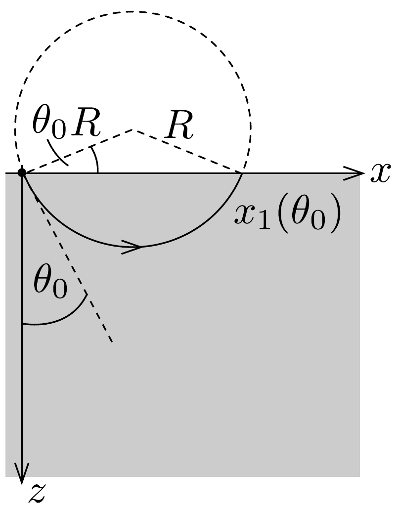
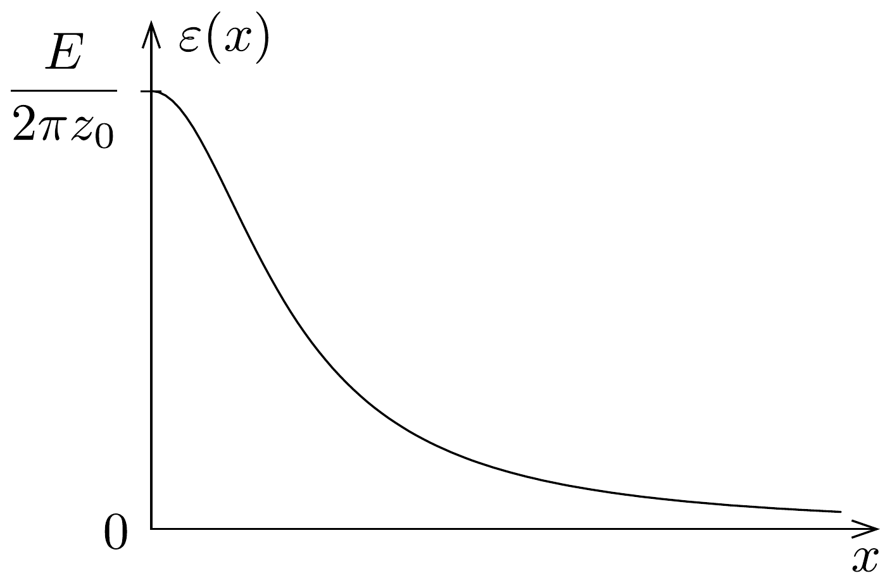
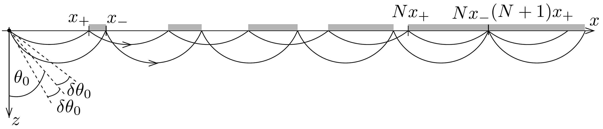

## Megoldás 1

1.A.1. Legyen $h^{\prime}$ a lemezek közötti olajoszlop magassága. Egyensúly miatt a vízfelszín alatt $h$ magasságban a víz és az olaj hidrosztatikai nyomása azonos: $\varrho_{0} g h=\varrho_{\text {olaj }} g h^{\prime}$, ahonnan $h^{\prime}=\varrho_{0} / \varrho_{\text {olaj }} \cdot h$. A lemezre ható vízszintes irányú eró $F_{x}=F_{1}-F_{0}$, ahol $F_{1}=\frac{1}{2} \varrho_{\text {olaj }} g h^{\prime} \cdot h^{\prime} w$ az olajtól, $F_{0}=\frac{1}{2} \varrho_{0} g h \cdot h w$ pedig a víztől származó nyomóerő. (Az 1/2-es faktor onnan származik, hogy a hidrosztatikai nyomás a mélységgel lineárisan növekszik, így számolhatunk átlagos nyomással.) Tehát a jobb oldali lemezre ható eró nagysága ezek alapján
\[
F_{x}=\left(\frac{\varrho_{0}}{\varrho_{\text {olaj }}}-1\right) \frac{\varrho_{0} g h^{2} w}{2},
\]
irányát tekintve pedig jobbra mutat.
1.A.2. Tekintsük a kéreg egy téglatest alakú elemi darabját. Mivel a (21-01) egyenlet érvényes a szilárd test mindhárom térbeli irányú kiterjedésére, térfogata eleget tesz a
\[
V=V_{1}\left(1-k_{\ell} \frac{T_{1}-T}{T_{1}-T_{0}}\right)^{3}
\]
kifejezésnek, ahol $V_{1}$ a $T=T_{1}$ hőmérséklethez tartozó térfogat. Ha a kéregdarab tömege $m$, akkor
\[
\varrho(T)=\frac{m}{V}=\frac{m}{V_{1}}\left(1-k_{\ell} \frac{T_{1}-T}{T_{1}-T_{0}}\right)^{-3}=\varrho_{1}\left(1-k_{\ell} \frac{T_{1}-T}{T_{1}-T_{0}}\right)^{-3} .
\]
Mivel $k_{\ell} \ll 1$, ezért ezt a
\[
\varrho(T) \approx \varrho_{1}\left(1+3 k_{\ell} \frac{T_{1}-T}{T_{1}-T_{0}}\right)
\]
kifejezéssel közelíthetjük. Innen leolvashatjuk, hogy $k=3 k_{\ell}$.
1.A.3. Mivel a köpeny egyensúlyban lévó folyadéknak tekinthető, a nyomás a $z=h+D$ mélységben minden $x$-re azonos, ezért
\[
p(0, h+D)=p(\infty, h+D) .
\]
Hasonlóan $p(0,0)=p(\infty, 0)$. Tehát a nyomásváltozás $z=0$ és $z \rightarrow \infty$ között ugyanakkora $x=0$ és $x \rightarrow \infty$ esetén is. A hátság tengelye mentén
\[
p(0, h+D)-p(0,0)=\varrho_{1} g(h+D),
\]
míg a tengelytől messze
\[
p(\infty, h+D)-p(\infty, 0)=\varrho_{0} g h+\int_{h}^{h+D} \varrho(T(\infty, z)) g \mathrm{~d} z .
\]

A tengelytől távol a kéreg hőmérséklete a mélységtől lineárisan függ, így a határfeltételeknek megfelelően
\[
T(\infty, z)=T_{0}+\left(T_{1}-T_{0}\right) \frac{z-h}{D} .
\]
Ezek alapján, valamint felhasználva a (21-05) eredményt felírhatjuk, hogy
\[
\varrho_{1} g(h+D)=\varrho_{0} g h+\int_{h}^{h+D} \varrho_{1}\left(1+k \frac{T_{1}-T_{0}-\left(T_{1}-T_{0}\right) \frac{z-h}{D}}{T_{1}-T_{0}}\right) g \mathrm{~d} z,
\]
ahonnan az integrálás elvégzése, majd egyszerúsítések után megkapjuk a választ:
\[
D=\frac{2}{k}\left(1-\frac{\varrho_{0}}{\varrho_{1}}\right) h .
\]
1.A.4. A kéreg jobb oldali felére ható vízszintes irányú eró az $x=0$ és az $x \rightarrow \infty$ helyen fellépő nyomások különbségébő̌l származik:
\[
F=\int_{0}^{h+D} p(0, z) L \mathrm{~d} z-\int_{0}^{h} p(\infty, z) L \mathrm{~d} z .
\]
Az előző rész alapján a nyomások
\[
\begin{gathered}
p(0, z)=p(0,0)+\varrho_{1} g z \\
p(\infty, z)=p(\infty, 0)+\varrho_{0} g z=p(0,0)+\varrho_{0} g z .
\end{gathered}
\]
Ezek segítségével az eró
\[
F=p(0,0) L D+\varrho_{1} g L \frac{(h+D)^{2}}{2}-\varrho_{0} g L \frac{h^{2}}{2} .
\]
Mivel $D \sim k^{-1}$, és ha $k \ll 1$, akkor az erő kifejezésében a $D^{2}$-et tartalmazó tag lesz a vezetó rendú. A (21-06) eredmény felhasználásával
\[
F \approx \varrho_{1} g L \frac{D^{2}}{2}=\frac{2 g L h^{2}\left(\varrho_{1}-\varrho_{0}\right)^{2}}{k^{2} \varrho_{1}} .
\]
1.A.5. A dimenzióanalízis módszerében elsóként meg kell gondolni, hogy a kérdéses mennyiség milyen más paraméterektől függhet. A $\tau$ idő feltehetően függ a kéreg $\varrho_{1}$ sürúségétől, a $c$ fajhőjétől, a $D$ vastagságától és a $\kappa$ hővezetési együtthatótól. Ezért legyen
\[
\tau \sim \varrho_{1}^{\alpha} c^{\beta} \kappa^{\gamma} D^{\delta} .
\]
Az egyes mértékegységek: $\left[\varrho_{1}\right]=\mathrm{kg} / \mathrm{m}^{3},[c]=\mathrm{J} /(\mathrm{kg} \mathrm{K})=\mathrm{m}^{2} /\left(\mathrm{K} \mathrm{s}^{2}\right),[\kappa]=$ $=\mathrm{W} /(\mathrm{Km})=\mathrm{kg} \mathrm{m} /\left(\mathrm{K} \mathrm{s}^{3}\right)$. Rendre megvizsgálva a mértékegységek kitevőit a bal és a jobb oldalon, felírhatjuk, hogy
\[
\begin{gathered}
\mathrm{kg}: \alpha+\gamma=0, \\
\mathrm{~m}:-3 \alpha+2 \beta+\gamma+\delta=0, \\
\mathrm{~K}:-\beta-\gamma=0, \\
\mathrm{~s}:-2 \beta-3 \gamma=1 .
\end{gathered}
\]

Az egyenletrendszer megoldása: $\alpha=\beta=1, \gamma=-1$ és $\delta=2$, vagyis
\[
\tau \sim \frac{c \varrho_{1} D^{2}}{\kappa} .
\]

Nagyságrendi becsléssel is ugyanezt az eredményt kapjuk. Ehhez tekintsünk egy $A$ felszínú kéregdarabot. Ezen a darabon átmenő hő nagyságrendben $Q \sim$ $\sim c \varrho_{1} A D\left(T_{1}-T_{0}\right)$. Másrészt a hóvezetés egyenlete szerint $Q / \tau \sim \kappa A\left(T_{1}-T_{0}\right) / D$. A két kifejezés összehasonlításával a $\tau \sim c \varrho_{1} D^{2} / \kappa$ eredményt kapjuk.
1.B.1. A szeizmikus hullámra érvényes a Snellius-Descartes-törvény:
\[
n(0) \sin \theta_{0}=n(z) \sin \theta,
\]
ahol a törésmutató
\[
n(z)=\frac{c}{v(z)}=\frac{c}{v_{0}\left(1+\frac{z}{z_{0}}\right)},
\]
$c$ a hullám terjedési sebessége az $n=1$ törésmutatójú anyagban. Ebből a két egyenletból
\[
\left(1+\frac{z}{z_{0}}\right) \sin \theta_{0}=\sin \theta
\]
adódik.
I. megoldás. Mivel a sugár körpályán halad, ezért $\theta=\pi / 2$, ha $z=R-R \sin \theta_{0}$ (432. ábra). Ezt beírva a (21-07) egyenletbe, a körpálya sugara $R=z_{0} / \sin \theta_{0}$.

432. ábra.

Másrészt $x_{1}\left(\theta_{0}\right)=2 R \cos \theta_{0}=2 z_{0} \operatorname{ctg} \theta_{0}$. Tehát $A=2 z_{0}$ és $b=1$.
A kör sugarát úgy is megkaphatjuk, ha a (21-07) egyenletet $\theta$ szerint deriváljuk. Ekkor kapjuk, hogy
\[
\frac{\mathrm{d} z}{z_{0}} \sin \theta_{0}=\cos \theta \mathrm{d} \theta .
\]

A sugár pályája mentén egy kicsiny $\mathrm{d} \ell$ út $z$ irányban $\mathrm{d} z=\mathrm{d} \ell \cos \theta$ elmozdulást jelent, amit beírva az előző kifejezésbe a
\[
\mathrm{d} \ell=\frac{z_{0}}{\sin \theta_{0}} \mathrm{~d} \theta
\]
adódik, ami egy $R=z_{0} / \sin \theta_{0}$ sugarú körvonalat ír le.
II. megoldás. A sugár pályának adott pontjába húzott érintő́jének meredeksége
\[
\frac{\mathrm{d} z}{\mathrm{~d} x}=\frac{\mathrm{d} z}{\mathrm{~d} \theta} \frac{\mathrm{~d} \theta}{\mathrm{~d} x}=\operatorname{ctg} \theta
\]
amibe a (21-08) egyenletből kifejezett $\mathrm{d} z / \mathrm{d} \theta$ hányadost behelyettesítve a
\[
\frac{\sin \theta_{0}}{z_{0}} \mathrm{~d} x=\sin \theta \mathrm{d} \theta
\]
kifejezést kapjuk. Ezt integrálva, és ismerve, hogy az $x_{1}$ helyet elérve (21-07) szerint $\theta=\pi-\theta_{0}(z=0)$ :
\[
\begin{gathered}
\frac{\sin \theta_{0}}{z_{0}} \int_{0}^{x_{1}} \mathrm{~d} x=\int_{\theta_{0}}^{\theta} \sin \theta^{\prime} \mathrm{d} \theta^{\prime}=-\left[\cos \theta^{\prime}\right]_{\theta_{0}}^{\theta} \\
\frac{\sin \theta_{0}}{z_{0}} x_{1}=-\cos \theta+\cos \theta_{0}=2 \cos \theta_{0}
\end{gathered}
\]
Tehát $x_{1}\left(\theta_{0}\right)=2 z_{0} \operatorname{ctg} \theta_{0}$.
1.B.2. Mivel a forrás egységnyi hosszából induló $E$ energia $\pi$ szögben egyenletesen oszlik szét, ezért a $\theta_{0}$ irány körüli kicsiny $\mathrm{d} \theta_{0}$ szögben kiinduló energia
\[
\mathrm{d} E=E \cdot \frac{\mathrm{~d} \theta_{0}}{\pi} .
\]
Ez az energiamennyiség éri el a felszínt az $x$ hely körüli $\mathrm{d} x$ hosszú részen. Ezt a felületi energiasúrúséggel kifejezve $\mathrm{d} E=\varepsilon(x) \mathrm{d} x$. Tehát
\[
\varepsilon(x)=\frac{E}{\pi}\left|\frac{\mathrm{~d} \theta_{0}}{\mathrm{~d} x}\right| .
\]
A deriváltat az előző rész eredményéből kapjuk meg:
\[
\frac{\mathrm{d} x}{\mathrm{~d} \theta_{0}}=-\frac{A b}{\sin ^{2}\left(b \theta_{0}\right)}=-A b\left(1+\operatorname{ctg}^{2}\left(b \theta_{0}\right)\right)=-\frac{b\left(A^{2}+x^{2}\right)}{A} .
\]
Ezért
\[
\varepsilon(x)=\frac{E A}{b \pi\left(A^{2}+x^{2}\right)}=\frac{2 E z_{0}}{\pi\left(4 z_{0}^{2}+x^{2}\right)} .
\]
A vázlatos $\varepsilon(x)$ függvény a 433. ábrán látható.

1.B.3. A $\theta_{0}-\frac{1}{2} \delta \theta_{0}$ és a $\theta_{0}+\frac{1}{2} \delta \theta_{0}$ irányokban kiinduló sugarak a felszínen visszaveródnek. Az első visszaverődés hely origótól mért $x_{1}$ távolsága ctg $\theta_{0}$-lal arányos, ezért a nagyobb szög alatt kiinduló sugár előbb éri el a felszínt, mint a kisebb szög alatt kiinduló. Tehát az a tartomány, ahova a hullám eljuthat szélesebb lesz, ahogy növekszik a visszaverődések száma, és bizonyos számú visszaverődést követően ezek a tartományok összeérnek, átlapolnak. Vagyis ezt követően a jel már minden $x$-re eléri a felszínt (434. ábra szürke sávjai).

Legyen $x_{-}=x_{1}\left(\theta_{0}-\delta \theta_{0} / 2\right)$ és $x_{+}=x_{1}\left(\theta_{0}+\delta \theta_{0} / 2\right)\left(x_{+}<x_{-}\right)$. A felszínnek az a tartománya, ahova a jel eljut
\[
x_{-}-x_{+}=2 z_{0}\left[\operatorname{ctg}\left(\theta_{0}-\frac{\delta \theta_{0}}{2}\right)-\operatorname{ctg}\left(\theta_{0}+\frac{\delta \theta_{0}}{2}\right)\right] .
\]
Felhasználva, hogy $\delta \theta_{0} \ll \theta_{0}$, és a $\delta \theta_{0}^{2}$-es tagokat elhanyagolva, átalakítás után kapjuk, hogy
\[
x_{-}-x_{+}=\frac{\delta \theta_{0}}{\sin ^{2} \theta_{0}} \cdot 2 z_{0} .
\]
$N$ darab visszaverődés esetén annak a tartománynak a vastagsága, ahova a jel eljut $N\left(x_{-}-x_{+}\right)$. Két tartomány akkor ér össze, amikor az $N$-edik taromány vége az $(N+1)$-edik tartomány elejének helyére esik (434. ábra), azaz
\[
N x_{-}=(N+1) x_{+},
\]
ahonnan
\[
N=\frac{x_{+}}{x_{-}-x_{+}}=\frac{\operatorname{ctg}\left(\theta_{0}+\frac{\delta \theta_{0}}{2}\right)}{\frac{\delta \theta_{0}}{\sin ^{2} \theta_{0}}} \approx \frac{\operatorname{ctg} \theta_{0} \cdot \sin ^{2} \theta_{0}}{\delta \theta_{0}}=\frac{\sin \theta_{0} \cos \theta_{0}}{\delta \theta_{0}} .
\]
A legnagyobb távolság ahova jel nem jut el:
\[
x_{\max }=N x_{+} \approx \frac{2 z_{0} \cos ^{2} \theta_{0}}{\delta \theta_{0}} .
\]
