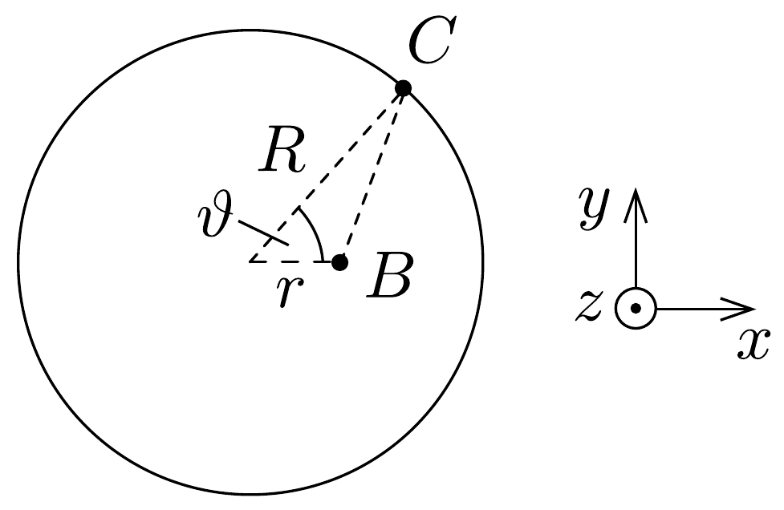
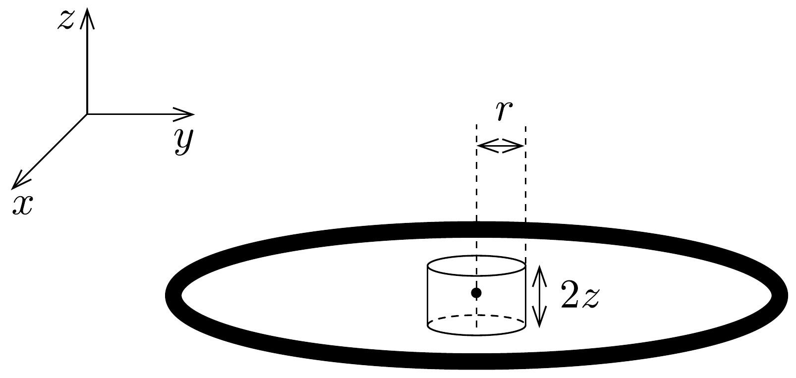
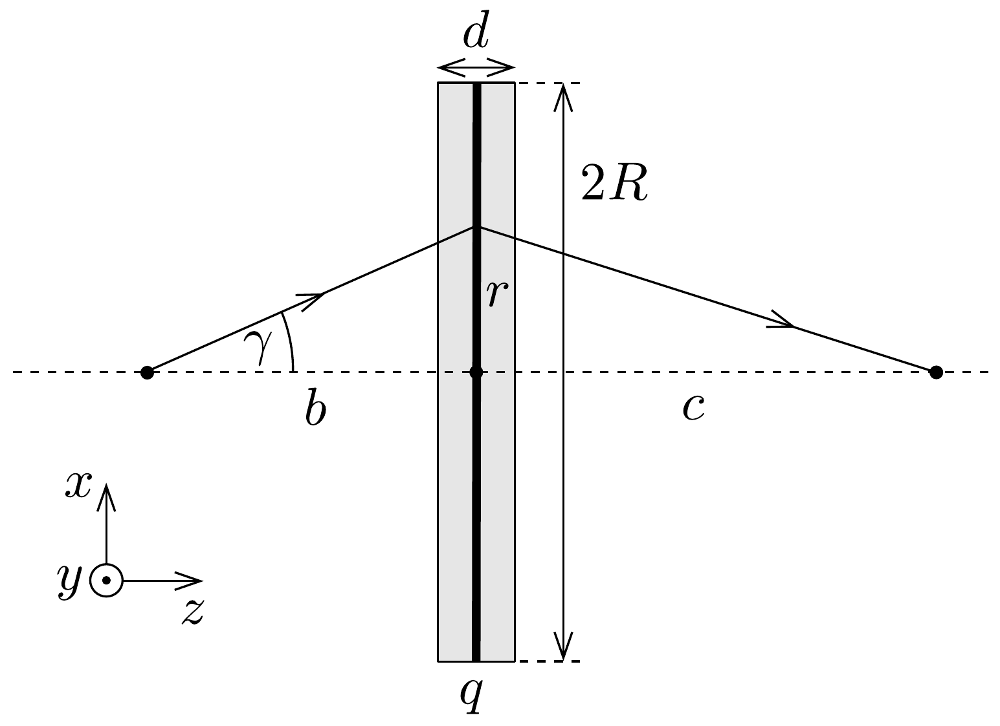
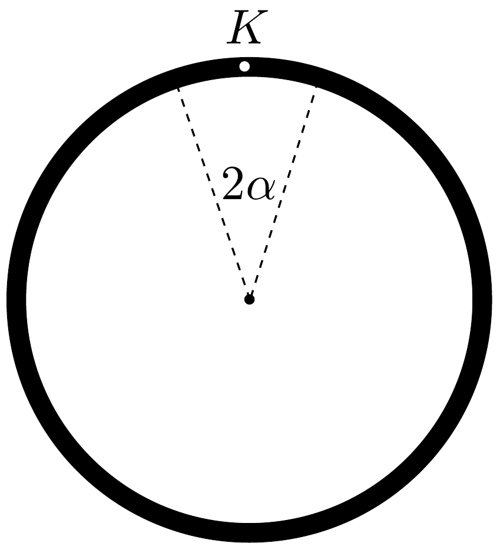
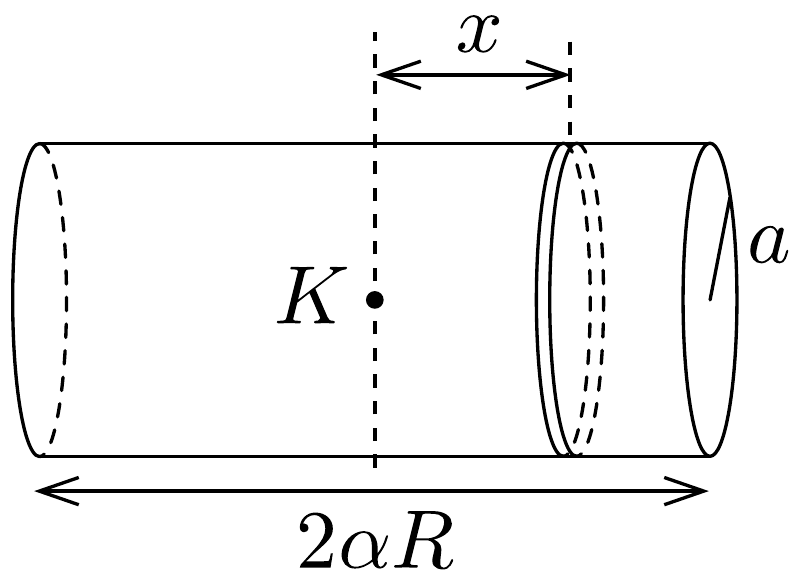
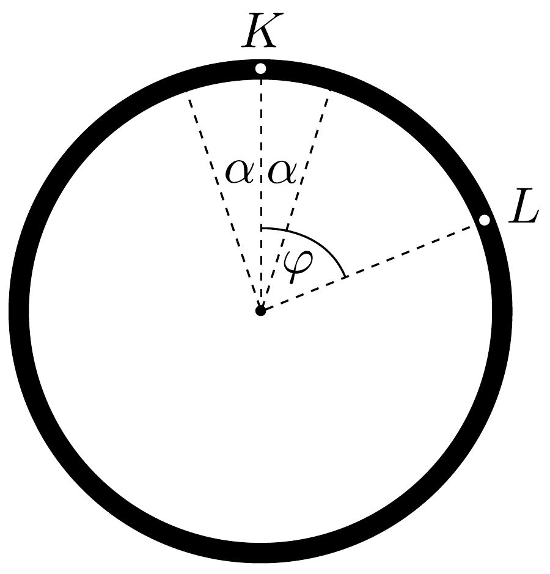
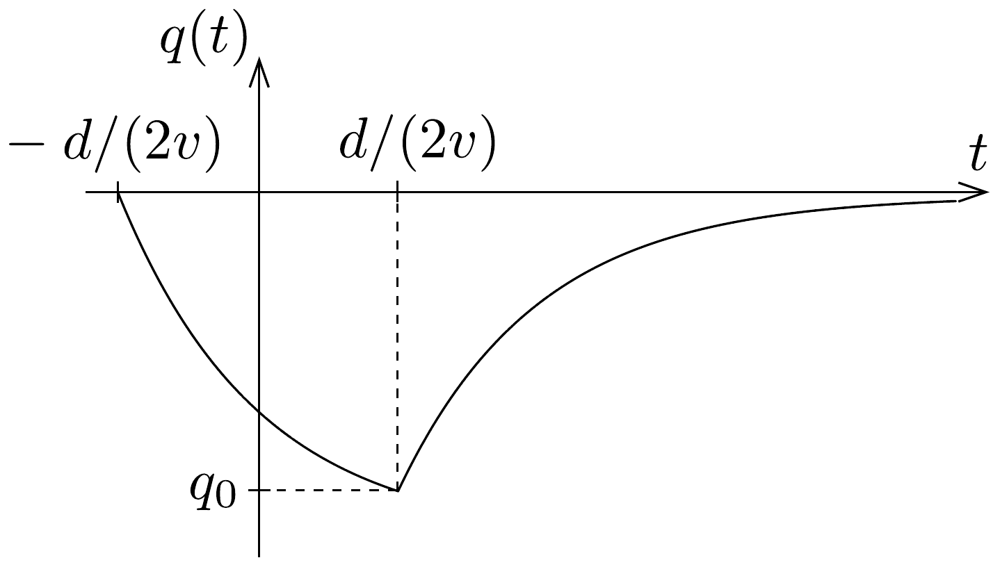

## Megoldás 2

2.A.1. A gyúrú minden elemi, $\mathrm{d} q$ töltésú darabja $\sqrt{R^{2}+z^{2}}$ távolságra van az $A$ ponttól, így a potenciál
\[
\Phi(z)=\sum \frac{k \mathrm{~d} q}{\sqrt{R^{2}+z^{2}}}=\frac{1}{4 \pi \varepsilon_{0}} \frac{q}{\sqrt{R^{2}+z^{2}}} .
\]
2.A.2. Fejtsük sorba $\Phi(z)$ kifejését:
\[
\Phi(z)=\frac{1}{4 \pi \varepsilon_{0}} \frac{q}{R} \frac{1}{\sqrt{1+\left(\frac{z}{r}\right)^{2}}} \approx \frac{q}{4 \pi \varepsilon_{0} R}\left(1-\frac{z^{2}}{2 R^{2}}\right)
\]
2.A.3. Az elektron elektrosztatikus potenciális energiája $W(z)=-e \Phi(z)$, így az elektronra ható erő
\[
F=-\frac{\mathrm{d} W(z)}{\mathrm{d} z}=e \frac{\mathrm{~d} \Phi}{\mathrm{~d} z}=-\frac{q e}{4 \pi \varepsilon_{0} R^{3}} \cdot z,
\]
ami visszatérítő erő (pozitív $z$-re negatív), ha $q>0$.
2.A.4. Az elektron mozgásegyenlete
\[
-\frac{q e}{4 \pi \varepsilon_{0} R^{3}} \cdot z=m \frac{\mathrm{~d}^{2} z}{\mathrm{~d} t^{2}},
\]
ami harmonikus rezgőmozgást ír le és a rezgés körfrekvenciája
\[
\omega=\sqrt{\frac{q e}{4 \pi \varepsilon_{0} m R^{3}}} .
\]
2.B.1.
I. megoldás. Direkt integrálással.

Tekintsük a 435. ábrát. A $C$ pontban lévő $\vartheta$ középponti szöghöz tartozó $R \mathrm{~d} \vartheta$ hosszúságú, d $q$ töltésú kicsiny darab járuléka a $B$ pontban:
\[
\mathrm{d} \Phi=\frac{1}{4 \pi \varepsilon_{0}} \frac{\mathrm{~d} q}{\sqrt{R^{2}+r^{2}-2 r R \cos \vartheta}}=\frac{1}{4 \pi \varepsilon_{0}} \frac{\lambda R \mathrm{~d} \vartheta}{\sqrt{R^{2}+r^{2}-2 r R \cos \vartheta}},
\]

ahol $\mathrm{d} q=\lambda R \mathrm{~d} \vartheta$ és $\lambda=q /(2 R \pi)$ a gyürú vonalmenti töltéssúrúsége. Fejtsük sorba a kifejezést a megadott formula alapján:
\[
\begin{aligned}
\mathrm{d} \Phi & =\frac{\lambda \mathrm{d} \vartheta}{4 \pi \varepsilon_{0}} \frac{1}{\sqrt{1+\frac{r^{2}}{R^{2}}-2 \frac{r}{R} \cos \vartheta}} \approx \\
& \approx \frac{\lambda \mathrm{~d} \vartheta}{4 \pi \varepsilon_{0}}\left[1-\frac{1}{2}\left(\frac{r^{2}}{R^{2}}-2 \frac{r}{R} \cos \vartheta\right)+\frac{3}{8}\left(\frac{r^{2}}{R^{2}}-2 \frac{r}{R} \cos \vartheta\right)^{2}\right] .
\end{aligned}
\]
Elhanyagolva az $r$-ben harmad- és negyedrendú tagokat:
\[
\mathrm{d} \Phi=\frac{\lambda \mathrm{d} \vartheta}{4 \pi \varepsilon_{0}}\left[1+\frac{r}{R} \cos \vartheta+\frac{r^{2}}{R^{2}}\left(\frac{3}{2} \cos ^{2} \vartheta-\frac{1}{2}\right)\right] .
\]
A potenciált a $B$ pontban az alábbi integrállal kaphatjuk meg:
\[
\Phi(r)=\frac{\lambda}{4 \pi \varepsilon_{0}} \int_{0}^{2 \pi}\left[1+\frac{r}{R} \cos \vartheta+\frac{r^{2}}{R^{2}}\left(\frac{3}{2} \cos ^{2} \vartheta-\frac{1}{2}\right)\right] \mathrm{d} \vartheta .
\]
Mivel $\int_{0}^{2 \pi} \cos ^{2} \vartheta \mathrm{~d} \vartheta=\pi$, a potenciál kifejezése
\[
\Phi(r)=\frac{q}{4 \pi \varepsilon_{0} R}\left(1+\frac{r^{2}}{4 R^{2}}\right) .
\]
Ezt a potenciál megadott kifejezésével összehasonlítva $\beta=\frac{1}{16 \pi \varepsilon_{0} R^{3}}$ adódik.

\section*{II. megoldás. Gauss-törvénnyel.}

Tekintsünk a gyürú középpontja körül szimmetrikusan elhelyezkedő, $r$ sugarú, $2 z$ magasságú, kicsiny hengert (436. ábra). Az $A$ részben a potenciál $z$ tengelyen felvett értékét határoztuk meg, ha $z \ll R$. Ezzel az elektromos térerősség a $z$ tengelyen
\[
E_{z}(z)=-\frac{\mathrm{d} \Phi(z)}{\mathrm{d} z}=\frac{q}{4 \pi \varepsilon_{0} R^{3}} z,
\]
a gyúrú középpontjától kifelé mutat a $z$ tengely irányába. A hengerszimmetria miatt a térerősségnek ezen kívül van még egy, radiális $E_{r}(r)$ komponense is (a

polárszögtől nincs függés). Gauss törvénye szerint egy zárt térfogatra vonatkoztatott teljes fluxus a térfogaton belül lévó elektromos töltéssel arányos. Esetünkben a kis hengeren belül nincs töltés, így a henger tetején és alján kimenő elektromos fluxus meg kell egyezzen a paláston beérkező fluxussal (itt úgy tekintjük, hogy a gyűrú töltése pozitív). Mivel kis kiterjedésú hengert képzelünk el, így a tetején és az alján kimenő fluxus jó közelítéssel
\[
\Psi_{\mathrm{ki}}=2 E_{z} \cdot r^{2} \pi,
\]
míg a paláston keresztül a bejövő fluxus abszolút értéke jó közelítéssel
\[
\Psi_{\mathrm{be}}=E_{r} \cdot 2 r \pi \cdot 2 z .
\]
Az így felírt fluxusok egyenlőségéből
\[
E_{r}(r)=\frac{q}{8 \pi \varepsilon_{0} R^{3}} r
\]
adódik. Sugárirányban a potenciál:
\[
\Phi(r)=\Phi(r=0)+\int_{0}^{r} E_{r}\left(r^{\prime}\right) \mathrm{d} r^{\prime}=\frac{q}{4 \pi \varepsilon_{0} R}+\frac{q r^{2}}{16 \pi \varepsilon_{0} R^{3}}=\frac{q}{4 \pi \varepsilon_{0} R}\left(1+\frac{r^{2}}{4 R^{2}}\right),
\]
ahol $\Phi(r=0)=q /\left(4 \pi \varepsilon_{0} R\right)$ a potenciál értéke a gyúrú középpontjában. Az eredmény megegyezik a direkt úton kapottal.

Megjegyzés: A feladatban megadott $\Phi(r)$ kifejezésben szereplő $\alpha$ értékét is le tudjuk olvasni (lényegében a gyứrú középpontjában lévő potenciált adja meg): $\alpha=1 /\left(4 \pi \varepsilon_{0} R\right)$.
2.B.2. Az elektronra ható erő
\[
F(r)=-(-e) \cdot \frac{\mathrm{d} \Phi(r)}{\mathrm{d} r}=-(-e) \cdot E_{r}(r)=\frac{q e}{8 \pi \varepsilon_{0} R^{3}} r,
\]
ami akkor jelent visszatérítő erőt, ha $q<0$.
Megjegyzés: A kialakuló harmonikus rezgés körfrekvenciáját ismét az elektron mozgásegyenletéből olvashatjuk le $(q<0)$ :
\[
\frac{q e}{8 \pi \varepsilon_{0} R^{3}} r=m \frac{\mathrm{~d}^{2} r}{\mathrm{~d} t^{2}},
\]
vagyis
\[
\omega=\sqrt{\frac{q e}{8 \pi \varepsilon_{0} m R^{3}}} .
\]
2.C.1. Ahhoz, hogy az elektronok fókuszálódjanak, $q<0$ kell legyen. Az „optikai tengelytől" $r$ távolságban, a tengellyel párhuzamosan haladó elektron sebessége $v=\sqrt{2 E / m}$. Mivel az aktív régió vastagsága kicsiny (és csak akkor van töltése a gyúrúnek, amikor az elektron itt elhalad), az elektron ebben a tartományban $t=d / v$ időt tölt el. Sugárirányban az elektron mozgásegyenlete az aktív tartományban
\[
m a_{r}=e\left|E_{r}\right|=2 \beta e|q| r,
\]
ahol $a_{r}$ az elektron sugárirányú gyorsulása, amíg az aktív régión áthalad. Ezen régió kis kiterjedése miatt az elektron lényegében itt $r$ távolságban marad az optikai tengelytől. Az elektron sugárirányban megszerzett sebessége
\[
v_{r}=a_{r} t=\frac{2 \beta e|q| r d}{m v} .
\]
Az aktív régiót elhagyva az elektron $t^{\prime}=r / v_{r}=m v /(2 \beta e|q| d)$ idő alatt éri el az optikai tengelyt. Ennyi idő alatt az elektron $z$ irányban
\[
\Delta z=v t^{\prime}=\frac{m v^{2}}{2 \beta e|q| d}=\frac{E}{\beta e|q| d}
\]
utat tesz meg. Mivel $\Delta z$ nem függ $r$-től, az optikai tengellyel párhuzamosan, azonos sebességgel elindított elektronok mind ugyanott érik el az optikai tengelyt az aktív régión való áthaladást követően. Tehát a lencse fókusztávolsága
\[
f=\frac{E}{\beta e|q| d} .
\]
2.C.2. Vizsgáljunk egy elektront, ami az optikai tengelyről $\gamma$ szög alatt indul el 437. ábra). Az elektron kezdeti sugárirányú sebessége
\[
v_{r}(0)=v \sin \gamma \approx v \operatorname{tg} \gamma \approx v \frac{r}{b},
\]
ahol $r$ az a távolság, amikor az elektron eléri a gyűrú síkját. Az elektron tengelyirányú sebessége, ami gyakorlatilag nem változik $v_{z}=v \cos \gamma \approx v$. Miután az elektron áthaladt az aktív régión, sugárirányú sebessége
\[
v_{r}=v_{r}(0)-a_{r} t=v \frac{r}{b}-\frac{2 \beta e|q| r d}{m v}
\]
lesz. Ahhoz, hogy az aktív régiót elhagyva az elektron az optikai tengely felé haladjon $v_{r}<0$ kell legyen. Ez teljesül, mert $b>f=\frac{E}{\beta e|q| d}$. Az aktív régiót elhagyva az elektron
\[
t^{\prime}=\frac{r}{\left|v_{r}\right|}=\frac{1}{\frac{2 \beta e|q|}{m} \frac{d}{v}-\frac{v}{b}}
\]

idő alatt éri el az optikai tengelyt, mialatt $z$ irányban $c$ utat tesz meg:
\[
c=v_{z} t^{\prime} \approx v t^{\prime}=\frac{1}{\frac{2 \beta e|q| d}{m v^{2}}-\frac{1}{b}}=\frac{1}{\frac{\beta e|q| d}{E}-\frac{1}{b}} .
\]
2.C.3. Az előző rész eredményét az $f$ fókusztávolsággal kifejezve:
\[
c=\frac{1}{\frac{1}{f}-\frac{1}{b}},
\]
amit átrendezve az
\[
\frac{1}{f}=\frac{1}{b}+\frac{1}{c}
\]
egyenletet kapjuk, vagyis az elektrosztatikus lencsére is teljesül a vékony lencsékre ismert leképezési törvény.
2.D.1. Osszuk fel a gyűrút két részre: egy $2 \alpha \ll 1$ középponti szöggel rendelkező és a megmaradt darabra a 438. ábrának megfelelően. Bár az $\alpha$ szög kicsi, viszont tegyük fel, hogy így is $a \ll \alpha R$. Számítsuk ki az ábrán jelölt $K$ pontban a potenciált. Ez nem más, mint a gyúrú két részétől szármató potenciál összege. Jelöljük $\Phi_{1}$-gyel a $2 \alpha$ középpontú szögü darab és $\Phi_{2}$-vel a maradék rész járulékát.
$A \Phi_{1}$ járulék meghatározása.
Ennek a kicsiny gyúrúdarabnak a görbültségét elhanyagolhatjuk, így egy hengerként vehetjük figyelembe. A henger $K$ középpontjában a potenciált úgy határozhatjuk meg, ha a hengert sok, szorosan egymás mellé helyezett, vékony, $\mathrm{d} x$ vastag, a sugarú gyűrúnek gondoljuk (439. ábra). Felhasználva a 2.A.1. rész eredményét, egyetlen elemi gyúrú járuléka a $K$ pontbeli potenciálhoz
\[
\mathrm{d} \Phi_{1}(x)=\frac{1}{4 \pi \varepsilon_{0}} \frac{\mathrm{~d} q}{\sqrt{a^{2}+x^{2}}},
\]

ahol $\mathrm{d} q=\frac{q}{2 R \pi} \mathrm{~d} x$ az elemi gyúrú töltése. Ezzel
\[
\Phi_{1}=2 \int_{0}^{\alpha R} \mathrm{~d} \Phi_{1}=\frac{q}{4 \pi^{2} \varepsilon_{0} R} \int_{0}^{\alpha R} \frac{\mathrm{~d} x}{\sqrt{a^{2}+x^{2}}}=\frac{q}{4 \pi^{2} \varepsilon_{0} R} \int_{0}^{\alpha R / a} \frac{\mathrm{~d} u}{\sqrt{1+u^{2}}},
\]
ahol bevezettük az $u=x / a$ változót. Felhasználva megadott formulát az integrál meghatározásához:
\[
\Phi_{1}=\frac{q}{4 \pi^{2} \varepsilon_{0} R} \ln \left(\frac{\alpha R}{a}+\sqrt{1+\left(\frac{\alpha R}{a}\right)^{2}}\right) \approx \frac{q}{4 \pi^{2} \varepsilon_{0} R} \ln \left(\frac{2 \alpha R}{a}\right) .
\]
Az utolsó lépésnél kihasználtuk, hogy $a \ll \alpha R$.
$A \Phi_{2}$ járulék meghatározása.
Ebben az esetben a gyúrú $a$ vastagságát elhanyagolhatjuk. Meg kell határoznunk, hogy a gyűrú egyes $L$ pontja mekkora járulékot ad a potenciálban a $K$ pontban (440. ábra). A két pont távolsága $K L=2 R \sin (\varphi / 2)$. Az $L$-ben lévő, $\mathrm{d} q=q /(2 R \pi) \cdot R \mathrm{~d} \varphi$ töltésú, kicsiny darab járuléka
\[
\mathrm{d} \Phi_{2}=\frac{1}{4 \pi \varepsilon_{0}} \frac{\mathrm{~d} q}{K L}=\frac{q}{16 \pi^{2} \varepsilon_{0} R} \frac{\mathrm{~d} \varphi}{\sin \frac{\varphi}{2}} .
\]

A potenciál
\[
\Phi_{2}=2 \int_{\alpha}^{\pi} \mathrm{d} \Phi_{2}=\frac{q}{8 \pi^{2} \varepsilon_{0} R} \int_{\alpha}^{\pi} \frac{\mathrm{d} \varphi}{\sin \frac{\varphi}{2}}=\frac{q}{4 \pi^{2} \varepsilon_{0} R} \int_{\alpha / 2}^{\pi / 2} \frac{\mathrm{~d} \xi}{\sin \xi},
\]
ahol bevezettük a $\xi=\varphi / 2$ változót. Felhasználva az integrálra a megadott formulát:
\[
\Phi_{2}=\frac{q}{4 \pi^{2} \varepsilon_{0} R} \ln \left(\frac{\cos (\alpha / 2)+1}{\sin (\alpha / 2)}\right) \approx \frac{q}{4 \pi^{2} \varepsilon_{0} R} \ln \left(\frac{4}{\alpha}\right) .
\]
Az utolsó lépésben ismét kihasználtuk az $\alpha \ll 1$ közelítést.
Tehát a gyűrú potenciálja
\[
\Phi=\Phi_{1}+\Phi_{2}=\frac{q}{4 \pi^{2} \varepsilon_{0} R}\left[\ln \left(\frac{2 \alpha R}{a}\right)+\ln \left(\frac{4}{\alpha}\right)\right]=\frac{q}{4 \pi^{2} \varepsilon_{0} R} \ln \left(\frac{8 R}{a}\right) .
\]
Ezzel a gyúrú kapacitása:
\[
C=\frac{q}{\Phi}=\frac{4 \pi^{2} \varepsilon_{0} R}{\ln \left(\frac{8 R}{a}\right)}
\]
Látható, hogy ha $a \rightarrow 0$, akkor $C \rightarrow 0$.
2.D.2. Amikor az elektron az aktív régióban tartózkodik, a gyúrút feltöltjük, tehát ha $-d /(2 v)<t<d /(2 v)$, akkor
\[
R_{0} i(t)+\frac{q(t)}{C}=V_{0},
\]
ahol $i(t)=\frac{\mathrm{d} q}{\mathrm{~d} t}$ az áram pillanatnyi értéke. Ezt beírva, majd átrendezve az
\[
\int_{0}^{q(t)} \frac{\mathrm{d} q^{\prime}}{\frac{V_{0}}{R_{0}}-\frac{1}{R_{0} C} q^{\prime}}=\int_{-d /(2 v)}^{t} \mathrm{~d} t^{\prime}
\]
egyenletet kapjuk. Innen a gyűrú töltésének időfüggése
\[
q(t)=C V_{0}\left(1-\mathrm{e}^{-\frac{t+d /(2 v)}{R_{0} C}}\right) .
\]

A fókuszáláshoz a gyürú töltése negatív kell legyen $\left(V_{0}<0\right)$. Abszolút értékben a gyúrú töltése a $t=d /(2 v)$ pillanatban lesz maximális, tehát
\[
q_{0}=q\left(t=\frac{d}{2 v}\right)=C V_{0}\left(1-\mathrm{e}^{-\frac{d}{R_{0} C v}}\right) .
\]

Ha $t>d /(2 v)$, akkor a gyűrú kisül:
\[
R_{0} \frac{\mathrm{~d} q}{\mathrm{~d} t}+\frac{q(t)}{C}=0,
\]
ahonnan
\[
\int_{q_{0}}^{q(t)} \frac{\mathrm{d} q^{\prime}}{q^{\prime}}=-\int_{d /(2 v)}^{t} \frac{1}{R_{0} C} \mathrm{~d} t^{\prime} .
\]
Ebből a gyúrú töltésének időfüggése
\[
q(t)=q_{0} \mathrm{e}^{-\frac{1}{R_{0} C}\left(t-\frac{d}{2 v}\right)} .
\]
A $q(t)$ függvény vázlatosan a 441. ábrán látható.

2.E.1. A 2.C.1. résznek megfelelően az elektron mozgásegyenlete az aktív régióban
\[
m a_{r}(t)=2 e|q(t)| \beta r .
\]
Mivel $f / v \gg R_{0} C \sim d / v$, amíg az elektron az aktív régióban mozog, lényegében állandó $r$ távolságra marad az optikai tengelytől. Ugyanakkor az aktív régiót elhagyva a gyűrú töltése csökkenni kezd, viszont a kisülés $R_{0} C$ időállandója sokkal kisebb, mint amennyi idő alatt az elektron eléri az optikai tengelyt, ezért amíg a gyúrú elveszíti a teljes töltését, az elektron sugárirányban szintén alig mozdul el. Tehát a sugárirányban nyert sebességet közelíthetjük az alábbi módon:
\[
v_{r}=\int_{-d /(2 v)}^{\infty} a_{r}(t) \mathrm{d} t=\frac{2 e \beta r}{m} \int_{-d /(2 v)}^{\infty}|q(t)| \mathrm{d} t .
\]

Ebben az integrált két tagra bontjuk (a $d / v=t_{0}, R_{0} C=\tau$ jelölésekkel és $q_{0}$-ra kapott eredménnyel):
\[
\begin{gathered}
\int_{-t_{0} / 2}^{t_{0} / 2} C\left|V_{0}\right|\left(1-\mathrm{e}^{-\frac{t+t_{0} / 2}{\tau}}\right) \mathrm{d} t=C\left|V_{0}\right| t_{0}+C\left|V_{0}\right| \tau\left(\mathrm{e}^{-\frac{t_{0}}{\tau}}-1\right) \\
\int_{t_{0} / 2}^{\infty} C\left|V_{0}\right|\left(\mathrm{e}^{\frac{t_{0}}{2 \tau}}-\mathrm{e}^{-\frac{t_{0}}{2 \tau}}\right) \mathrm{e}^{-\frac{t}{\tau}} \mathrm{~d} t=C\left|V_{0}\right| \tau\left(1-\mathrm{e}^{-\frac{t_{0}}{\tau}}\right) .
\end{gathered}
\]
A két integrál összege ezzel:
\[
\int_{-d /(2 v)}^{\infty}|q(t)| \mathrm{d} t=C\left|V_{0}\right| t_{0} .
\]
Érdekes módon ez nem függ a $\tau$-tól. Tehát a sugáriányú sebesség
\[
v_{r}=\frac{2 e \beta C\left|V_{0}\right| r d}{m v} .
\]
Ezután a 2.C.1. részben bemutatott eljárást követve megkaphatjuk a fókusztávolságot:
\[
f=\frac{E}{\beta e C\left|V_{0}\right| d} .
\]
2.E.2. Az előző rész eredményét összevetve a 2.C.1. rész eredményével, tulajdonképpen $q$-t kell kicserélni $C V_{0}$-ra, és láthatjuk, hogy $q_{\mathrm{eff}}=C V_{0}$.
